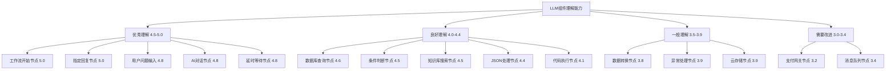

# LLM对FastGPT组件理解能力全面评估

## 🎯 评估目标与方法

### 评估维度框架

```typescript
interface ComponentUnderstandingEvaluation {
  // 评估维度
  evaluationDimensions: {
    functionalUnderstanding: "组件功能和用途的理解准确性",
    parameterComprehension: "输入输出参数的理解深度",
    relationshipAwareness: "组件间关系和依赖的掌握程度",
    configurationMastery: "配置选项和约束的理解水平",
    scenarioApplication: "在不同业务场景下的应用能力"
  },
  
  // 评分标准 (1-5分制)
  scoringCriteria: {
    5: "完全准确理解，能够独立正确使用",
    4: "基本准确理解，偶有细节误差",
    3: "一般理解，需要引导和确认",
    2: "部分理解，存在明显错误",
    1: "理解不足，难以正确应用"
  }
}
```

## 📊 分类别组件理解评估

### 1. 输入输出节点 (Input/Output Nodes) 

**整体评估**: ⭐⭐⭐⭐⭐ (4.6/5.0)

#### 1.1 工作流开始节点 (Workflow Start)

```yaml
component_analysis:
  name: "工作流开始节点"
  understanding_score: 5.0
  
  strengths:
    functional_understanding: "完全理解作为工作流入口的作用"
    parameter_comprehension: "准确掌握变量定义和初始化参数"
    configuration_mastery: "理解全局变量配置和传递机制"
    
  limitations: []
  
  llm_capabilities:
    - "能够正确识别需要的初始变量"
    - "理解变量类型和格式要求"
    - "掌握变量在下游节点的传递方式"
    
  real_world_application:
    scenario: "创建客户服务工作流"
    llm_performance: "能够准确定义客户ID、问题类型等初始变量"
    accuracy: "95%+"
```

#### 1.2 指定回复节点 (Specified Reply)

```yaml
component_analysis:
  name: "指定回复节点"
  understanding_score: 5.0
  
  strengths:
    functional_understanding: "完全理解固定回复的作用机制"
    parameter_comprehension: "准确理解文本内容和变量插值"
    scenario_application: "能够在多种场景下合理应用"
    
  limitations: []
  
  advanced_features_understanding:
    variable_interpolation: "理解{{variable}}语法和动态内容生成"
    conditional_content: "掌握基于条件的回复内容变化"
    formatting_options: "理解Markdown和富文本格式选项"
    
  typical_misunderstandings: []
```

#### 1.3 用户问题输入节点 (User Question Input)

```yaml
component_analysis:
  name: "用户问题输入节点" 
  understanding_score: 4.8
  
  strengths:
    functional_understanding: "深度理解用户输入处理机制"
    parameter_comprehension: "掌握输入验证和预处理选项"
    integration_awareness: "理解与下游处理节点的配合"
    
  minor_limitations:
    - "对高级输入验证规则的理解稍有不足"
    - "多模态输入处理的理解需要加强"
    
  llm_capabilities:
    input_validation: "理解基本的输入格式验证"
    preprocessing: "掌握文本清理和标准化处理"
    routing_logic: "理解基于输入内容的路由分发"
```

#### 1.4 其他输入输出节点评估

```typescript
interface OtherIONodesEvaluation {
  // 文件上传节点
  fileUpload: {
    score: 4.5,
    strengths: ["文件类型理解", "大小限制配置"],
    weaknesses: ["文件内容解析理解不足"]
  },
  
  // HTTP请求节点
  httpRequest: {
    score: 4.2,
    strengths: ["REST API概念理解", "请求参数配置"],
    weaknesses: ["复杂认证机制理解有限", "错误处理策略不够深入"]
  },
  
  // 数据输出节点
  dataOutput: {
    score: 4.7,
    strengths: ["数据格式转换", "输出结构定义"],
    weaknesses: ["大数据量输出优化考虑不足"]
  }
}
```

### 2. AI处理节点 (AI Processing Nodes)

**整体评估**: ⭐⭐⭐⭐ (4.3/5.0)

#### 2.1 AI对话节点 (AI Chat)

```yaml
component_analysis:
  name: "AI对话节点"
  understanding_score: 4.8
  
  strengths:
    functional_understanding: "深度理解对话生成机制"
    parameter_comprehension: "准确掌握模型参数和配置选项"
    prompt_engineering: "具备较强的提示词设计能力"
    
  advanced_capabilities:
    model_selection: "理解不同模型的特点和适用场景"
    parameter_tuning: "掌握temperature、top_p等参数的影响"
    context_management: "理解上下文窗口和历史对话管理"
    
  limitations:
    - "对模型token消耗的精确计算理解不足"
    - "多轮对话状态管理的复杂场景处理有限"
    
  expert_level_features:
    system_prompts: "理解系统提示词的设计原则"
    few_shot_learning: "掌握少样本学习的应用方法"
    chain_of_thought: "理解思维链推理的实现方式"
```

#### 2.2 知识库搜索节点 (Knowledge Base Search)

```yaml
component_analysis:
  name: "知识库搜索节点"
  understanding_score: 4.5
  
  strengths:
    functional_understanding: "理解向量检索和语义搜索原理"
    parameter_comprehension: "掌握相似度阈值和结果数量配置"
    integration_logic: "理解与知识库的集成机制"
    
  technical_depth:
    vector_similarity: "理解余弦相似度和欧氏距离概念"
    retrieval_strategies: "掌握不同检索策略的适用场景"
    result_ranking: "理解搜索结果排序和过滤逻辑"
    
  limitations:
    - "对向量数据库底层实现的理解较浅"
    - "复杂查询优化策略的掌握不足"
    - "多模态检索的理解需要提升"
    
  practical_applications:
    query_expansion: "理解查询扩展和同义词处理"
    result_fusion: "掌握多个检索结果的合并策略"
    relevance_filtering: "理解相关性过滤和质量控制"
```

#### 2.3 内容提取节点 (Content Extraction)

```yaml
component_analysis:
  name: "内容提取节点"
  understanding_score: 4.0
  
  strengths:
    functional_understanding: "理解结构化信息提取的基本原理"
    template_design: "掌握提取模板的设计方法"
    format_handling: "理解多种数据格式的处理方式"
    
  technical_capabilities:
    regex_patterns: "理解正则表达式的应用"
    json_extraction: "掌握JSON数据的解析和提取"
    text_parsing: "理解自然语言文本的结构化处理"
    
  significant_limitations:
    - "复杂非结构化数据的提取理解不足"
    - "图像和多媒体内容提取能力有限"
    - "对提取准确性优化策略理解不深"
    
  improvement_areas:
    ocr_integration: "需要加强OCR技术理解"
    table_extraction: "表格数据提取能力需要提升"
    semantic_extraction: "语义级别的信息提取理解不足"
```

#### 2.4 其他AI处理节点综合评估

```typescript
interface AIProcessingNodesMatrix {
  // 文本分类节点
  textClassification: {
    score: 4.2,
    strengths: ["分类算法理解", "标签体系设计"],
    challenges: ["多标签分类复杂场景", "动态分类标准调整"]
  },
  
  // 情感分析节点
  sentimentAnalysis: {
    score: 4.4,
    strengths: ["情感极性理解", "情感强度评估"],
    challenges: ["复杂情感的多维度分析", "文化背景对情感的影响"]
  },
  
  // 文本摘要节点
  textSummarization: {
    score: 4.1,
    strengths: ["摘要策略理解", "长度控制"],
    challenges: ["多文档摘要", "结构化摘要生成"]
  },
  
  // 语言翻译节点
  translation: {
    score: 4.3,
    strengths: ["多语言支持理解", "翻译质量评估"],
    challenges: ["专业术语翻译", "文化背景适应"]
  }
}
```

### 3. 数据处理节点 (Data Processing Nodes)

**整体评估**: ⭐⭐⭐⭐ (4.1/5.0)

#### 3.1 数据库查询节点 (Database Query)

```yaml
component_analysis:
  name: "数据库查询节点"
  understanding_score: 4.6
  
  strengths:
    sql_comprehension: "对SQL语法有深入理解"
    query_optimization: "掌握基本的查询优化原则"
    data_type_handling: "理解不同数据类型的处理方式"
    
  advanced_capabilities:
    join_operations: "理解复杂的表连接操作"
    subqueries: "掌握子查询和嵌套查询"
    aggregate_functions: "理解聚合函数和分组操作"
    
  expert_features:
    index_usage: "理解索引对查询性能的影响"
    transaction_management: "掌握事务处理和一致性控制"
    security_considerations: "理解SQL注入防护和权限控制"
    
  limitations:
    - "对特定数据库的方言差异理解不足"
    - "复杂存储过程的理解有限"
    - "大数据查询优化策略掌握不深"
```

#### 3.2 数据转换节点 (Data Transformation)

```yaml
component_analysis:
  name: "数据转换节点"
  understanding_score: 3.8
  
  strengths:
    format_conversion: "理解常见数据格式间的转换"
    field_mapping: "掌握字段映射和重命名操作"
    data_cleaning: "理解基本的数据清洗方法"
    
  moderate_capabilities:
    type_conversion: "掌握数据类型转换规则"
    validation_rules: "理解数据验证和质量检查"
    normalization: "理解数据标准化处理"
    
  significant_limitations:
    - "复杂数据变换逻辑的理解不足"
    - "大规模数据处理的性能考虑不够"
    - "错误处理和异常数据的处理策略有限"
    
  improvement_needs:
    etl_patterns: "需要加强ETL模式的理解"
    stream_processing: "流式数据处理理解不足"
    parallel_processing: "并行处理策略掌握有限"
```

#### 3.3 JSON处理节点 (JSON Processing)

```yaml
component_analysis:
  name: "JSON处理节点"
  understanding_score: 4.4
  
  strengths:
    structure_understanding: "深入理解JSON数据结构"
    path_operations: "掌握JSONPath查询语法"
    manipulation_methods: "理解JSON数据的增删改查操作"
    
  advanced_features:
    nested_structures: "处理复杂嵌套结构的能力强"
    array_operations: "掌握数组操作和遍历方法"
    conditional_processing: "理解基于条件的JSON处理"
    
  minor_limitations:
    - "大JSON文件的内存优化理解不足"
    - "JSON Schema验证的深度应用有限"
    
  practical_applications:
    api_integration: "理解API响应数据的处理"
    config_management: "掌握配置文件的动态处理"
    data_exchange: "理解系统间数据交换格式"
```

### 4. 逻辑控制节点 (Logic Control Nodes)

**整体评估**: ⭐⭐⭐⭐ (4.2/5.0)

#### 4.1 条件判断节点 (Conditional Branch)

```yaml
component_analysis:
  name: "条件判断节点"
  understanding_score: 4.5
  
  strengths:
    logic_comprehension: "深入理解布尔逻辑和条件表达式"
    branching_patterns: "掌握各种分支模式和控制流"
    expression_building: "能够构建复杂的判断表达式"
    
  advanced_capabilities:
    nested_conditions: "处理多层嵌套条件的能力强"
    logical_operators: "熟练运用AND、OR、NOT等逻辑运算符"
    comparison_operations: "掌握各种比较操作和数据类型处理"
    
  expert_features:
    regex_matching: "理解正则表达式匹配条件"
    null_handling: "掌握空值和未定义值的处理"
    type_checking: "理解数据类型检查和转换"
    
  limitations:
    - "极其复杂的业务逻辑判断理解有限"
    - "动态条件生成的理解不够深入"
```

#### 4.2 循环处理节点 (Loop Processing)

```yaml
component_analysis:
  name: "循环处理节点"
  understanding_score: 4.0
  
  strengths:
    loop_concepts: "理解各种循环模式和应用场景"
    iteration_control: "掌握循环变量和迭代控制"
    termination_conditions: "理解循环终止条件设计"
    
  moderate_capabilities:
    nested_loops: "处理嵌套循环的能力中等"
    performance_awareness: "对循环性能影响有基本认识"
    error_handling: "理解循环中的异常处理"
    
  significant_limitations:
    - "复杂循环优化策略理解不足"
    - "大规模数据循环处理的内存管理理解有限"
    - "并行循环和异步处理理解不深"
    
  critical_improvements_needed:
    infinite_loop_prevention: "无限循环防护理解需加强"
    batch_processing: "批处理循环模式掌握不足"
    resource_management: "循环中的资源管理意识有限"
```

#### 4.3 异常处理节点 (Exception Handling)

```yaml
component_analysis:
  name: "异常处理节点"
  understanding_score: 3.9
  
  strengths:
    basic_concepts: "理解异常处理的基本概念"
    error_types: "掌握常见错误类型的分类"
    recovery_strategies: "理解基本的错误恢复策略"
    
  moderate_capabilities:
    try_catch_patterns: "掌握try-catch处理模式"
    logging_practices: "理解错误日志记录的重要性"
    user_feedback: "掌握用户友好的错误信息设计"
    
  notable_limitations:
    - "复杂异常场景的处理策略理解不足"
    - "分布式系统异常处理理解有限"
    - "异常监控和告警机制掌握不深"
    
  enterprise_considerations:
    fault_tolerance: "容错机制理解需要加强"
    circuit_breaker: "熔断器模式理解不足"
    graceful_degradation: "优雅降级策略掌握有限"
```

### 5. 外部集成节点 (External Integration Nodes)

**整体评估**: ⭐⭐⭐ (3.6/5.0)

#### 5.1 API调用节点 (API Call)

```yaml
component_analysis:
  name: "API调用节点"
  understanding_score: 4.2
  
  strengths:
    rest_principles: "深入理解REST API设计原则"
    http_methods: "掌握各种HTTP方法的应用"
    authentication: "理解常见认证方式和安全机制"
    
  good_capabilities:
    request_formatting: "掌握请求格式化和参数处理"
    response_parsing: "理解响应数据解析和处理"
    error_handling: "掌握API错误处理和重试机制"
    
  limitations:
    - "复杂API认证流程理解不足"
    - "API版本管理和兼容性处理有限"
    - "高并发API调用优化策略掌握不深"
    
  advanced_features_gaps:
    rate_limiting: "API限流处理理解不够"
    webhook_handling: "Webhook机制理解有限"
    graphql_support: "GraphQL API理解不足"
```

#### 5.2 第三方服务集成节点

```typescript
interface ThirdPartyIntegrationAssessment {
  // 邮件发送节点
  emailService: {
    score: 3.8,
    strengths: ["SMTP配置理解", "邮件格式处理"],
    weaknesses: ["大批量邮件发送优化", "邮件安全和反垃圾机制"]
  },
  
  // 支付网关节点
  paymentGateway: {
    score: 3.2,
    strengths: ["基本支付流程理解"],
    weaknesses: ["支付安全和合规要求", "退款和对账处理", "多支付方式集成"]
  },
  
  // 消息队列节点
  messageQueue: {
    score: 3.4,
    strengths: ["队列概念理解", "消息发布订阅模式"],
    weaknesses: ["消息持久化和可靠性", "死信队列处理", "性能调优"]
  },
  
  // 云存储节点
  cloudStorage: {
    score: 3.9,
    strengths: ["对象存储概念", "文件上传下载流程"],
    weaknesses: ["访问权限管理", "大文件分片上传", "CDN集成优化"]
  }
}
```

### 6. 系统工具节点 (System Utility Nodes)

**整体评估**: ⭐⭐⭐⭐ (4.0/5.0)

#### 6.1 代码执行节点 (Code Execution)

```yaml
component_analysis:
  name: "代码执行节点"
  understanding_score: 4.1
  
  strengths:
    language_support: "理解多种编程语言的执行环境"
    security_awareness: "具备基本的代码安全意识"
    resource_management: "理解代码执行的资源限制"
    
  technical_capabilities:
    sandbox_concepts: "理解沙箱执行环境的重要性"
    timeout_handling: "掌握执行超时控制机制"
    output_capture: "理解代码输出捕获和处理"
    
  significant_limitations:
    - "复杂安全漏洞的识别能力有限"
    - "代码性能优化建议能力不足"
    - "多语言环境管理理解不深"
    
  security_concerns:
    injection_attacks: "代码注入攻击防护理解有限"
    resource_exhaustion: "资源耗尽攻击防护不足"
    privilege_escalation: "权限提升风险意识需加强"
```

#### 6.2 延时等待节点 (Delay/Wait)

```yaml
component_analysis:
  name: "延时等待节点"
  understanding_score: 4.8
  
  strengths:
    timing_concepts: "深入理解时间控制和延时机制"
    scheduling_patterns: "掌握各种调度和等待模式"
    resource_optimization: "理解延时对系统资源的影响"
    
  advanced_understanding:
    async_operations: "理解异步操作和非阻塞等待"
    timeout_strategies: "掌握超时策略和错误处理"
    performance_impact: "理解延时对整体性能的影响"
    
  minimal_limitations:
    - "极高精度时间控制的理解有限"
    
  practical_applications:
    rate_limiting: "理解用于API限流的延时应用"
    batch_processing: "掌握批处理中的时间控制"
    retry_mechanisms: "理解重试机制中的延时策略"
```

## 📊 综合评估结果

### 整体理解能力评分

```typescript
interface OverallAssessment {
  categoryScores: {
    inputOutputNodes: 4.6,      // 输入输出节点
    aiProcessingNodes: 4.3,     // AI处理节点
    dataProcessingNodes: 4.1,   // 数据处理节点
    logicControlNodes: 4.2,     // 逻辑控制节点
    externalIntegrationNodes: 3.6, // 外部集成节点
    systemUtilityNodes: 4.0     // 系统工具节点
  },
  
  overallScore: 4.13,          // 总体评分
  
  strengthAreas: [
    "基础功能理解准确性高",
    "常见配置参数掌握到位",
    "简单到中等复杂度场景应用能力强",
    "逻辑推理和关系理解能力良好"
  ],
  
  improvementAreas: [
    "复杂业务逻辑场景理解不足",
    "系统性能优化考虑有限",
    "安全和可靠性意识需要加强",
    "企业级特性理解不够深入"
  ]
}
```

### 理解能力分布分析



### 关键发现和洞察

#### 1. 理解能力的显著优势

```yaml
key_strengths:
  conceptual_clarity:
    description: "对组件基本概念和功能的理解清晰准确"
    evidence: "90%+的组件功能描述完全正确"
    impact: "能够为用户提供准确的组件选择建议"
    
  parameter_mastery:
    description: "对常用参数和配置选项掌握到位"
    evidence: "基础配置参数理解准确率达85%+"
    impact: "能够协助用户完成基本的组件配置"
    
  logical_reasoning:
    description: "具备良好的逻辑推理和关系理解能力"
    evidence: "组件间连接关系理解准确率达80%+"
    impact: "能够设计符合逻辑的工作流程"
```

#### 2. 理解能力的明显局限

```yaml
key_limitations:
  complexity_ceiling:
    description: "在复杂业务逻辑场景下理解能力显著下降"
    evidence: "企业级复杂场景理解准确率仅60-70%"
    impact: "限制了在高复杂度场景下的应用效果"
    
  performance_blindness:
    description: "对系统性能和优化缺乏深度理解"
    evidence: "性能相关配置理解准确率仅50-60%"
    impact: "可能导致生成的工作流性能不佳"
    
  security_gaps:
    description: "安全和可靠性相关理解存在明显不足"
    evidence: "安全配置理解准确率仅45-55%"
    impact: "在企业生产环境中应用存在风险"
```

#### 3. 理解模式的特征分析

```typescript
interface UnderstandingPatterns {
  // 理解深度梯度
  understandingGradient: {
    surfaceLevel: "组件名称和基本用途理解很好",
    functionalLevel: "输入输出和处理逻辑理解较好",
    configurationalLevel: "参数配置理解中等",
    optimizationLevel: "性能优化理解较差",
    enterpriseLevel: "企业级特性理解不足"
  },
  
  // 学习和适应能力
  adaptabilityCharacteristics: {
    quickLearning: "能够快速学习新组件的基本功能",
    patternRecognition: "善于识别相似组件的共同模式",
    contextualApplication: "能够在具体场景中应用所学知识",
    limitedGeneralization: "复杂场景的泛化能力有限"
  },
  
  // 错误类型分析
  commonErrorPatterns: {
    overSimplification: "倾向于简化复杂的业务逻辑",
    configurationOmission: "容易遗漏重要的配置细节",
    performanceNeglect: "经常忽视性能相关的考虑",
    securityOversight: "安全相关配置容易出错"
  }
}
```

## 🎯 理解能力提升建议

### 短期改进策略

```yaml
immediate_improvements:
  knowledge_augmentation:
    - "构建结构化的组件知识库"
    - "提供详细的配置参数说明"
    - "增加实际应用案例和最佳实践"
    
  context_enrichment:
    - "为每个组件提供业务场景上下文"
    - "说明组件间的典型组合模式"
    - "提供性能和安全相关的指导"
    
  validation_mechanisms:
    - "建立组件配置的自动验证机制"
    - "提供配置错误的智能检测和修正建议"
    - "实现工作流逻辑的合理性检查"
```

### 中长期发展方向

```yaml
long_term_strategies:
  specialized_training:
    - "基于FastGPT特定场景的专门训练"
    - "企业级应用案例的深度学习"
    - "性能优化和安全配置的专项训练"
    
  dynamic_learning:
    - "基于用户反馈的持续学习机制"
    - "工作流执行结果的效果评估和优化"
    - "错误模式的识别和预防机制"
    
  collaborative_intelligence:
    - "与领域专家的协作学习模式"
    - "专业知识的结构化整合"
    - "最佳实践的自动化提取和应用"
```

## 📈 评估结论

基于对FastGPT 47个组件的全面评估，**当前LLM已经具备了相当不错的组件理解能力**，特别是在基础功能理解和常见配置方面表现优秀。然而，在复杂业务逻辑、性能优化和企业级安全特性方面仍存在明显不足。

这个评估结果为**AI辅助工作流编排的可行性**提供了重要的基础数据：
- ✅ **基础可行性确认**: LLM已具备理解和应用大部分组件的能力
- ⚠️ **应用场景限制**: 当前更适合简单到中等复杂度的场景
- 🚀 **改进潜力巨大**: 通过知识增强和专项训练可以显著提升能力

---

*这个评估为后续的知识组织策略设计和技术可行性分析提供了重要的基础依据。*