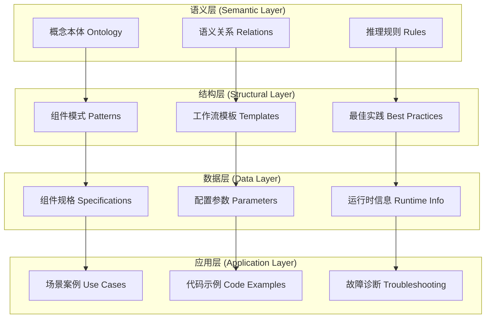

# FastGPT组件知识表示方法设计

## 🎯 知识表示目标与挑战

### 核心设计目标

```typescript
interface KnowledgeRepresentationGoals {
  // 主要目标
  primaryObjectives: {
    comprehensiveness: "全面覆盖组件的功能、参数、约束等信息",
    accessibility: "让AI能够快速理解和检索相关知识",
    maintainability: "支持知识的动态更新和版本管理",
    scalability: "能够扩展到更多组件和更复杂的关系"
  },
  
  // 设计约束
  designConstraints: {
    computationalEfficiency: "知识检索和推理的计算效率",
    memoryOptimization: "避免知识表示过于冗余占用过多内存",
    interpretability: "知识表示应该对人类专家也是可理解的",
    versionCompatibility: "支持FastGPT版本演进中的知识兼容性"
  }
}
```

### 知识复杂度挑战

```yaml
complexity_challenges:
  # 组件知识的多维度特性
  multi_dimensional_knowledge:
    functional_dimension: "组件的核心功能和用途"
    technical_dimension: "技术实现细节和约束条件"
    configurational_dimension: "参数配置和选项设置"
    relational_dimension: "与其他组件的交互关系"
    contextual_dimension: "在不同业务场景下的应用方式"
    
  # 知识的动态性和演进性
  dynamic_characteristics:
    version_evolution: "组件功能随FastGPT版本的演进"
    usage_patterns: "用户使用模式的变化和积累"
    performance_characteristics: "运行时性能数据的积累"
    error_patterns: "常见错误和解决方案的积累"
    
  # 知识的层次性和关联性
  hierarchical_relationships:
    category_hierarchy: "组件类别的层次结构"
    functional_hierarchy: "功能复杂度的层次关系"
    dependency_hierarchy: "组件依赖关系的层次结构"
    abstraction_hierarchy: "从具体实现到抽象概念的层次"
```

## 🏗️ 多层次知识表示架构

### 整体架构设计



### 1. 语义层知识表示

#### 1.1 组件本体设计

```typescript
interface ComponentOntology {
  // 核心概念定义
  coreEntities: {
    Component: {
      definition: "FastGPT工作流中的基本处理单元",
      properties: [
        "hasName: string",
        "hasCategory: ComponentCategory", 
        "hasFunction: Function",
        "hasInputs: Input[]",
        "hasOutputs: Output[]",
        "hasParameters: Parameter[]"
      ],
      constraints: [
        "每个组件必须有唯一标识符",
        "每个组件必须属于一个主要类别",
        "输入输出类型必须匹配"
      ]
    },
    
    WorkflowPattern: {
      definition: "可复用的工作流设计模式",
      properties: [
        "hasComponents: Component[]",
        "hasConnections: Connection[]",
        "hasBusinessLogic: BusinessRule[]",
        "hasPerformanceCharacteristics: Performance"
      ]
    },
    
    BusinessScenario: {
      definition: "特定的业务应用场景",
      properties: [
        "hasRequirements: Requirement[]",
        "hasConstraints: Constraint[]",
        "hasSuccessCriteria: Criteria[]",
        "recommends: WorkflowPattern[]"
      ]
    }
  },
  
  // 关系定义
  relationships: {
    // 组件间关系
    componentRelations: [
      "connectsTo: Component → Component",
      "dependsOn: Component → Component", 
      "alternatives: Component ↔ Component",
      "enhances: Component → Component"
    ],
    
    // 模式关系
    patternRelations: [
      "extends: Pattern → Pattern",
      "composes: Pattern → Component[]",
      "appliesTo: Pattern → Scenario"
    ],
    
    // 场景关系
    scenarioRelations: [
      "similarTo: Scenario ↔ Scenario",
      "requires: Scenario → Component",
      "optimizedBy: Scenario → Pattern"
    ]
  }
}
```

#### 1.2 语义关系建模

```yaml
semantic_relationships:
  # 功能相似性关系
  functional_similarity:
    definition: "基于功能特征的组件相似性"
    examples:
      - ["AI对话节点", "文本生成节点", 0.85]
      - ["数据库查询", "API调用", 0.72]
      - ["条件判断", "数据筛选", 0.68]
    computation_method: "基于功能向量的余弦相似度"
    
  # 数据流关系
  data_flow_relations:
    definition: "组件间数据传递的兼容性关系" 
    examples:
      compatible_pairs:
        - ["用户输入", "AI对话节点"]
        - ["数据库查询", "JSON处理"]
        - ["知识库搜索", "内容提取"]
      incompatible_pairs:
        - ["文件上传", "数学计算"]
        - ["延时等待", "用户输入"]
    validation_rules: "类型检查和格式验证规则"
    
  # 业务逻辑关系
  business_logic_relations:
    definition: "在业务场景中的逻辑关联关系"
    patterns:
      sequential: "顺序执行关系"
      conditional: "条件分支关系"
      parallel: "并行处理关系"
      loop: "循环迭代关系"
      exception: "异常处理关系"
```

### 2. 结构层知识表示

#### 2.1 组件模式库设计

```typescript
interface ComponentPatternLibrary {
  // 基础模式
  fundamentalPatterns: {
    inputProcessOutput: {
      name: "输入-处理-输出模式",
      structure: [
        "InputNode → ProcessingNode → OutputNode"
      ],
      applicableScenarios: [
        "简单数据处理",
        "内容转换",
        "格式标准化"
      ],
      variations: [
        "单步处理",
        "多步串联处理",
        "并行处理"
      ]
    },
    
    conditionalBranching: {
      name: "条件分支模式",
      structure: [
        "InputNode → ConditionNode → [BranchA, BranchB] → MergeNode"
      ],
      applicableScenarios: [
        "业务规则判断",
        "用户权限检查",
        "数据质量分级"
      ],
      complexityVariations: [
        "简单二分支",
        "多条件分支",
        "嵌套条件分支"
      ]
    }
  },
  
  // 复合模式
  compositePatterns: {
    aiKnowledgeRetrieval: {
      name: "AI知识检索增强模式",
      components: [
        "用户问题输入",
        "知识库搜索",
        "内容提取",
        "AI对话节点",
        "指定回复"
      ],
      businessValue: "结合知识库的智能问答",
      performanceCharacteristics: {
        latency: "中等 (2-5秒)",
        accuracy: "高 (85-95%)",
        scalability: "中等"
      }
    },
    
    dataProcessingPipeline: {
      name: "数据处理管道模式",
      components: [
        "数据输入",
        "数据验证",
        "数据转换",
        "数据存储",
        "结果通知"
      ],
      businessValue: "标准化的数据处理流程",
      performanceCharacteristics: {
        throughput: "高",
        reliability: "高",
        maintainability: "高"
      }
    }
  }
}
```

#### 2.2 最佳实践知识库

```yaml
best_practices_knowledge:
  # 性能优化实践
  performance_optimization:
    database_queries:
      - practice: "使用索引优化查询"
        applicable_components: ["数据库查询节点"]
        impact: "查询速度提升50-90%"
        
      - practice: "限制查询结果数量"
        applicable_components: ["数据库查询节点", "知识库搜索"]
        impact: "减少内存占用和网络传输时间"
        
    ai_model_usage:
      - practice: "合理设置token限制"
        applicable_components: ["AI对话节点", "文本生成节点"]
        impact: "控制成本和响应时间"
        
      - practice: "使用适当的模型大小"
        applicable_components: ["AI处理节点"]
        impact: "平衡准确性和性能"
        
  # 错误处理实践
  error_handling:
    timeout_management:
      - practice: "设置合理的超时时间"
        applicable_components: ["API调用", "数据库查询", "AI对话"]
        configuration: "根据服务特性设置3-30秒不等"
        
    retry_strategies:
      - practice: "实现指数退避重试"
        applicable_components: ["外部集成节点"]
        implementation: "1s, 2s, 4s, 8s间隔重试"
        
  # 安全配置实践
  security_practices:
    input_validation:
      - practice: "严格的输入验证"
        applicable_components: ["用户输入节点", "API调用节点"]
        methods: ["类型检查", "长度限制", "格式验证", "SQL注入防护"]
        
    sensitive_data_handling:
      - practice: "敏感数据脱敏处理"
        applicable_components: ["数据处理节点", "日志输出节点"]
        techniques: ["数据掩码", "数据加密", "访问控制"]
```

### 3. 数据层知识表示

#### 3.1 组件规格数据结构

```typescript
interface ComponentSpecification {
  // 基本信息
  basicInfo: {
    id: string,                    // 唯一标识符
    name: string,                  // 组件名称
    displayName: string,           // 显示名称
    category: ComponentCategory,   // 所属类别
    version: string,               // 版本信息
    description: string,           // 功能描述
    tags: string[]                 // 标签
  },
  
  // 技术规格
  technicalSpecs: {
    // 输入规格
    inputs: {
      name: string,
      type: DataType,
      required: boolean,
      description: string,
      validation: ValidationRule[],
      examples: any[]
    }[],
    
    // 输出规格
    outputs: {
      name: string,
      type: DataType,
      description: string,
      structure: ObjectSchema,
      examples: any[]
    }[],
    
    // 配置参数
    parameters: {
      name: string,
      type: ParameterType,
      required: boolean,
      defaultValue: any,
      constraints: Constraint[],
      description: string,
      impact: string              // 参数对功能的影响
    }[]
  },
  
  // 行为规格
  behaviorSpecs: {
    // 处理逻辑描述
    processingLogic: {
      algorithm: string,           // 算法描述
      complexity: string,          // 时间复杂度
      deterministic: boolean,      // 是否确定性
      sideEffects: string[]        // 副作用
    },
    
    // 性能特征
    performanceProfile: {
      averageLatency: string,      // 平均延迟
      throughput: string,          // 吞吐量
      memoryUsage: string,         // 内存使用
      cpuIntensive: boolean,       // 是否CPU密集
      ioIntensive: boolean         // 是否IO密集
    },
    
    // 错误处理
    errorHandling: {
      commonErrors: ErrorPattern[],
      recoveryStrategies: string[],
      fallbackBehavior: string
    }
  },
  
  // 使用指导
  usageGuidance: {
    // 适用场景
    suitableScenarios: BusinessScenario[],
    
    // 不适用场景
    unsuitableScenarios: BusinessScenario[],
    
    // 配置建议
    configurationAdvice: {
      scenario: string,
      recommendedSettings: ParameterSettings,
      reasoning: string
    }[],
    
    // 常见错误
    commonMistakes: {
      mistake: string,
      consequence: string,
      solution: string
    }[]
  }
}
```

#### 3.2 运行时知识积累

```yaml
runtime_knowledge_accumulation:
  # 使用统计数据
  usage_statistics:
    component_popularity:
      - component: "AI对话节点"
        usage_frequency: 0.85
        success_rate: 0.92
        average_execution_time: "2.3s"
        
    parameter_settings_distribution:
      - component: "AI对话节点"
        parameter: "temperature"
        distribution:
          "0.7": 0.45
          "0.8": 0.32
          "0.9": 0.15
          "other": 0.08
          
  # 错误模式分析
  error_pattern_analysis:
    frequent_errors:
      - component: "数据库查询节点"
        error_type: "连接超时"
        frequency: 0.15
        typical_causes: ["网络延迟", "数据库负载高", "查询复杂度过高"]
        solutions: ["增加超时时间", "优化查询", "添加重试机制"]
        
    configuration_errors:
      - component: "API调用节点"
        error_type: "认证失败"
        frequency: 0.08
        typical_causes: ["API密钥错误", "权限不足", "密钥过期"]
        solutions: ["检查密钥配置", "更新访问权限", "刷新密钥"]
        
  # 性能基准数据
  performance_benchmarks:
    latency_percentiles:
      - component: "知识库搜索节点"
        p50: "0.8s"
        p90: "2.1s"
        p99: "5.2s"
        factors: ["知识库大小", "查询复杂度", "相似度算法"]
        
    resource_consumption:
      - component: "AI对话节点"
        cpu_usage: "中等"
        memory_usage: "高"
        network_usage: "高"
        optimization_tips: ["批量处理", "缓存机制", "模型量化"]
```

### 4. 应用层知识表示

#### 4.1 场景化用例库

```typescript
interface ScenarioBasedUseCases {
  // 客户服务场景
  customerService: {
    scenario: {
      name: "智能客服工作流",
      description: "自动处理客户咨询，提供智能回复",
      complexity: "中等",
      estimatedBuildTime: "2-4小时"
    },
    
    workflowStructure: {
      components: [
        "用户问题输入",
        "意图识别",
        "知识库搜索", 
        "AI对话生成",
        "满意度收集"
      ],
      connections: [
        ["用户问题输入", "意图识别"],
        ["意图识别", "知识库搜索"],
        ["知识库搜索", "AI对话生成"],
        ["AI对话生成", "满意度收集"]
      ]
    },
    
    configurationTemplate: {
      "意图识别": {
        "classification_model": "bert-base-chinese",
        "confidence_threshold": 0.8
      },
      "知识库搜索": {
        "similarity_threshold": 0.7,
        "max_results": 5
      },
      "AI对话生成": {
        "model": "gpt-3.5-turbo",
        "temperature": 0.7,
        "max_tokens": 200
      }
    },
    
    expectedOutcomes: {
      "用户满意度": "> 85%",
      "响应时间": "< 3秒",
      "准确率": "> 80%"
    },
    
    commonChallenges: [
      {
        challenge: "意图识别准确率不高",
        solution: "增加训练数据，调整分类阈值"
      },
      {
        challenge: "知识库内容不够全面",
        solution: "定期更新知识库，添加FAQ"
      }
    ]
  },
  
  // 文档处理场景
  documentProcessing: {
    scenario: {
      name: "智能文档分析工作流",
      description: "自动解析文档内容，提取关键信息",
      complexity: "高",
      estimatedBuildTime: "4-8小时"
    },
    
    workflowVariations: [
      {
        name: "PDF文档分析",
        components: ["文件上传", "PDF解析", "内容提取", "信息分类", "结构化输出"],
        specialConsiderations: ["OCR质量", "表格处理", "图像识别"]
      },
      {
        name: "合同文档审查",
        components: ["文档上传", "文本提取", "条款识别", "风险评估", "审查报告"],
        specialConsiderations: ["法律术语识别", "条款完整性检查", "风险等级评估"]
      }
    ]
  }
}
```

#### 4.2 故障诊断知识库

```yaml
troubleshooting_knowledge:
  # 常见问题诊断树
  diagnostic_trees:
    workflow_execution_failure:
      root_question: "工作流执行失败"
      decision_tree:
        - condition: "是否所有节点都正常启动？"
          yes: "检查节点间连接配置"
          no: "检查单个节点配置"
          
        - condition: "错误发生在哪个阶段？"
          options:
            initialization: "检查输入参数和初始配置"
            processing: "检查处理逻辑和数据格式"
            output: "检查输出格式和目标配置"
            
    performance_degradation:
      root_question: "工作流性能下降"
      diagnostic_steps:
        1: "监控各节点执行时间"
        2: "检查数据量是否异常增长"
        3: "分析网络和数据库连接状态"
        4: "评估AI模型响应时间"
        5: "检查系统资源使用情况"
        
  # 解决方案模板
  solution_templates:
    configuration_fix:
      template: "调整{component}的{parameter}参数从{old_value}到{new_value}"
      reasoning: "基于{diagnostic_data}的分析结果"
      expected_improvement: "{improvement_description}"
      
    architecture_optimization:
      template: "在{component_before}和{component_after}之间添加{optimization_component}"
      reasoning: "为了解决{performance_issue}问题"
      expected_improvement: "{performance_metric}提升{improvement_percentage}"
```

## 🔧 知识表示实现策略

### 1. 技术实现架构

```typescript
interface KnowledgeRepresentationSystem {
  // 知识存储层
  storageLayer: {
    ontologyStore: "Neo4j图数据库存储本体和关系",
    documentStore: "Elasticsearch存储文档和案例",
    vectorStore: "Milvus存储组件和模式的向量表示",
    metadataStore: "PostgreSQL存储结构化元数据"
  },
  
  // 知识处理层
  processingLayer: {
    semanticProcessor: "自然语言处理和语义分析",
    relationExtractor: "关系抽取和图构建",
    patternMiner: "模式发现和提取",
    knowledgeValidator: "知识一致性和完整性验证"
  },
  
  // 知识访问层
  accessLayer: {
    queryEngine: "支持复杂查询的检索引擎",
    recommendationEngine: "基于上下文的推荐系统",
    explanationEngine: "推理过程解释和可视化",
    updateInterface: "知识更新和维护接口"
  }
}
```

### 2. 知识质量保证机制

```yaml
quality_assurance:
  # 数据质量控制
  data_quality_control:
    completeness_check:
      - "每个组件是否有完整的规格描述"
      - "输入输出类型是否都有明确定义"
      - "参数约束是否完整描述"
      
    consistency_validation:
      - "组件间关系的一致性检查"
      - "配置参数的取值范围验证"
      - "示例代码的正确性验证"
      
    accuracy_verification:
      - "与FastGPT实际实现的对比验证"
      - "用户反馈的准确性评估"
      - "专家审查的准确性确认"
      
  # 知识更新管理
  update_management:
    version_control:
      - "知识版本的追踪和管理"
      - "向后兼容性的保证"
      - "变更影响的评估"
      
    automated_updates:
      - "从FastGPT代码自动提取规格信息"
      - "从用户使用数据自动更新统计信息"
      - "从错误日志自动提取故障模式"
      
    human_review:
      - "专家定期审查知识准确性"
      - "用户反馈的人工处理"
      - "新知识的专家验证"
```

### 3. 知识表示优化策略

```typescript
interface OptimizationStrategies {
  // 检索效率优化
  retrievalOptimization: {
    indexingStrategy: "多层索引：语义索引+结构索引+全文索引",
    cachingMechanism: "热点知识的内存缓存",
    precomputation: "常用组合模式的预计算",
    parallelization: "并行检索和推理"
  },
  
  // 表示压缩优化
  compressionOptimization: {
    semanticCompression: "语义相似知识的聚合表示",
    redundancyElimination: "重复信息的去重和引用",
    hierarchicalEncoding: "分层编码减少存储空间",
    deltaCompression: "增量更新的差异压缩"
  },
  
  // 推理效率优化
  reasoningOptimization: {
    ruleOptimization: "推理规则的优化和缓存",
    shortCircuiting: "推理路径的短路优化",
    approximateReasoning: "近似推理在性能关键场景的应用",
    parallelInference: "并行推理和结果合并"
  }
}
```

## 📊 知识表示效果评估

### 评估指标体系

```yaml
evaluation_metrics:
  # 知识覆盖度评估
  coverage_assessment:
    component_coverage: "已建模组件占总组件的比例"
    relationship_coverage: "已识别关系占实际关系的比例"
    scenario_coverage: "已建模场景占典型场景的比例"
    target_thresholds:
      component_coverage: "> 95%"
      relationship_coverage: "> 90%"
      scenario_coverage: "> 80%"
      
  # 知识准确性评估
  accuracy_assessment:
    specification_accuracy: "组件规格描述的准确性"
    relationship_accuracy: "组件关系建模的准确性"
    recommendation_accuracy: "推荐结果的准确性"
    target_thresholds:
      specification_accuracy: "> 95%"
      relationship_accuracy: "> 90%"
      recommendation_accuracy: "> 85%"
      
  # 系统性能评估
  performance_assessment:
    query_response_time: "知识查询的响应时间"
    reasoning_latency: "推理过程的延迟"
    update_efficiency: "知识更新的效率"
    target_thresholds:
      query_response_time: "< 100ms"
      reasoning_latency: "< 500ms"
      update_efficiency: "< 1s"
      
  # 用户体验评估
  user_experience_assessment:
    knowledge_findability: "用户找到所需知识的容易程度"
    explanation_clarity: "知识解释的清晰度"
    recommendation_relevance: "推荐内容的相关性"
    user_satisfaction: "整体用户满意度"
```

## 🎯 实施建议和下一步

基于以上分析，**知识表示方法的设计**是AI辅助FastGPT编排成功的关键基础。建议的实施优先级：

### 短期实施重点 (1-3个月)
1. **构建核心组件本体** - 建立47个组件的标准化语义描述
2. **实现基础关系建模** - 建立组件间的基本连接关系
3. **开发检索原型** - 实现基于语义的组件检索功能

### 中期发展目标 (3-6个月)
1. **完善模式库** - 建立常用工作流模式的知识库
2. **集成运行时数据** - 将实际使用数据反馈到知识表示中
3. **优化推理引擎** - 提升知识推理和推荐的准确性

### 长期发展愿景 (6-12个月)
1. **自适应知识更新** - 实现基于用户反馈的自动知识更新
2. **跨域知识迁移** - 支持不同业务领域的知识复用
3. **智能知识发现** - 自动发现新的组件模式和最佳实践

---

*这个知识表示方法设计为FastGPT的AI辅助编排提供了坚实的知识基础，是实现智能编排的关键技术支撑。*