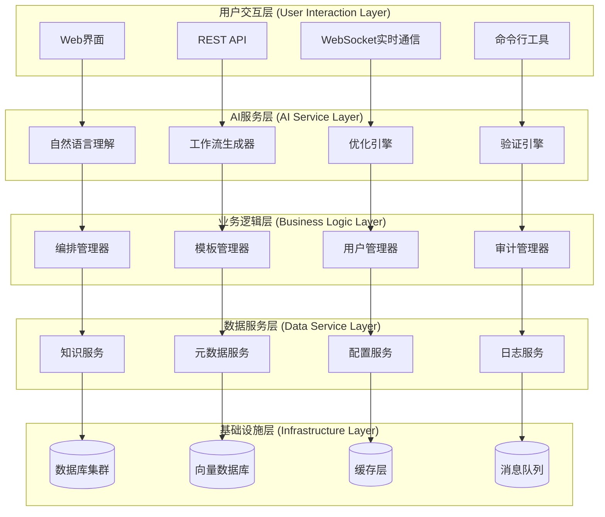

# AI辅助FastGPT编排技术架构设计

## 🎯 架构设计目标

### 核心设计原则

```typescript
interface ArchitectureDesignPrinciples {
  // 系统性原则
  systematicPrinciples: {
    modularization: "模块化设计，组件可插拔和独立演进",
    scalability: "水平扩展能力，支持用户规模和功能复杂度增长",
    reliability: "高可用性设计，故障隔离和快速恢复能力",
    performance: "低延迟响应，高并发处理能力"
  },
  
  // AI特化原则
  aiSpecificPrinciples: {
    knowledgeDriven: "知识驱动的AI决策，可解释和可验证",
    contextAware: "上下文感知，基于用户历史和环境优化",
    continuousLearning: "持续学习机制，基于反馈不断改进",
    humanInTheLoop: "人机协作设计，AI辅助而非替代人类决策"
  },
  
  // 企业级原则
  enterprisePrinciples: {
    security: "数据安全和隐私保护，满足企业合规要求",
    auditability: "完整的审计追踪，操作可回溯和验证",
    integration: "与现有系统无缝集成，最小化部署复杂度",
    maintainability: "代码质量和文档完善，便于长期维护"
  }
}
```

### 技术架构愿景

```yaml
architecture_vision:
  # 总体愿景
  overall_vision: "构建智能、可靠、可扩展的AI辅助工作流编排平台"
  
  # 核心能力目标
  core_capabilities:
    intelligent_orchestration:
      description: "基于自然语言理解的智能工作流生成"
      target_metrics:
        - "简单场景成功率 > 90%"
        - "中等复杂场景成功率 > 75%"
        - "平均响应时间 < 5秒"
        
    adaptive_optimization:
      description: "基于运行时数据的自适应优化建议"
      target_metrics:
        - "性能优化建议准确率 > 80%"
        - "用户采纳率 > 60%"
        - "实际性能提升 > 20%"
        
    collaborative_intelligence:
      description: "人机协作的工作流设计和调试"
      target_metrics:
        - "协作效率提升 > 50%"
        - "错误检测率 > 85%"
        - "学习曲线缩短 > 60%"
        
    enterprise_integration:
      description: "企业级部署和管理能力"
      target_metrics:
        - "部署成功率 > 95%"
        - "系统可用性 > 99.5%"
        - "安全合规 100%"
```

## 🏗️ 系统总体架构

### 1. 分层架构设计



### 2. 核心组件架构

#### 2.1 AI服务层详细设计

```typescript
interface AIServiceLayerArchitecture {
  // 自然语言理解服务
  naturalLanguageUnderstanding: {
    components: {
      intentClassifier: {
        purpose: "识别用户意图类型",
        technology: "Fine-tuned BERT/RoBERTa",
        inputFormat: "自然语言描述",
        outputFormat: "意图类别 + 置信度",
        supportedIntents: [
          "CREATE_WORKFLOW", "MODIFY_WORKFLOW", "OPTIMIZE_WORKFLOW",
          "DEBUG_WORKFLOW", "EXPLAIN_WORKFLOW", "SUGGEST_COMPONENTS"
        ]
      },
      
      entityExtractor: {
        purpose: "提取业务实体和参数",
        technology: "Named Entity Recognition + 规则引擎",
        inputFormat: "自然语言 + 意图类别",
        outputFormat: "结构化实体列表",
        supportedEntities: [
          "数据源", "处理目标", "业务规则", "性能要求", "集成系统"
        ]
      },
      
      contextManager: {
        purpose: "管理对话上下文和历史",
        technology: "Graph-based Context Store",
        features: [
          "多轮对话状态跟踪",
          "用户历史偏好学习",
          "项目相关上下文维护"
        ]
      }
    },
    
    performanceTargets: {
      latency: "< 500ms",
      accuracy: "> 85%",
      throughput: "100 requests/second"
    }
  },
  
  // 工作流生成器
  workflowGenerator: {
    components: {
      templateMatcher: {
        purpose: "匹配最相似的工作流模板",
        technology: "Semantic Similarity + 规则匹配",
        algorithm: "向量相似度 + 业务规则评分",
        optimization: "缓存 + 并行计算"
      },
      
      componentSelector: {
        purpose: "选择最适合的组件",
        technology: "Multi-criteria Decision Making",
        selectionCriteria: [
          "功能匹配度", "性能特征", "用户偏好", "历史成功率"
        ],
        fallbackStrategy: "降级到通用组件"
      },
      
      configurationGenerator: {
        purpose: "生成组件配置参数",
        technology: "基于约束的参数生成",
        validationMethods: [
          "类型检查", "范围验证", "依赖关系检查", "最佳实践对比"
        ]
      },
      
      workflowAssembler: {
        purpose: "组装完整的工作流定义",
        technology: "Graph-based Workflow Construction",
        features: [
          "自动连接路由", "数据流验证", "循环检测", "性能估算"
        ]
      }
    },
    
    qualityAssurance: {
      syntaxValidation: "工作流语法正确性检查",
      semanticValidation: "业务逻辑合理性验证",
      performanceEstimation: "预估执行时间和资源消耗",
      securityCheck: "安全风险和权限检查"
    }
  },
  
  // 优化引擎
  optimizationEngine: {
    optimizationStrategies: {
      performanceOptimization: {
        techniques: [
          "节点并行化分析",
          "数据缓存策略优化",
          "API调用批处理",
          "资源使用效率提升"
        ],
        metrics: ["执行时间", "内存使用", "网络调用", "成本评估"]
      },
      
      reliabilityOptimization: {
        techniques: [
          "错误处理路径补全",
          "超时和重试策略",
          "降级和熔断机制",
          "监控和告警配置"
        ],
        metrics: ["成功率", "错误恢复时间", "可用性", "数据一致性"]
      },
      
      maintainabilityOptimization: {
        techniques: [
          "工作流结构简化",
          "命名规范标准化",
          "文档和注释生成",
          "版本控制策略"
        ],
        metrics: ["可读性评分", "维护复杂度", "文档覆盖率", "变更影响范围"]
      }
    }
  },
  
  // 验证引擎
  validationEngine: {
    validationLevels: {
      syntaxLevel: "工作流定义语法检查",
      semanticLevel: "业务逻辑合理性验证",
      runtimeLevel: "运行时行为预测和验证",
      complianceLevel: "企业策略和合规性检查"
    },
    
    validationMethods: {
      staticAnalysis: "静态代码分析技术",
      ruleBasedValidation: "基于规则的验证引擎",
      simulationTesting: "虚拟执行和结果预测",
      expertKnowledgeValidation: "专家知识库对比验证"
    }
  }
}
```

#### 2.2 数据服务层详细设计

```yaml
data_service_layer:
  # 知识服务
  knowledge_service:
    knowledge_graph:
      technology: "Neo4j"
      schema:
        nodes:
          - "Component (组件)"
          - "Parameter (参数)" 
          - "Scenario (场景)"
          - "Pattern (模式)"
          - "User (用户)"
        relationships:
          - "CONNECTS_TO (连接到)"
          - "DEPENDS_ON (依赖于)"
          - "ALTERNATIVE_TO (替代)"
          - "USED_IN (用于)"
          - "OPTIMIZES (优化)"
      
    vector_knowledge_base:
      technology: "Milvus"
      embedding_models:
        - "text-embedding-ada-002 (英文)"
        - "m3e-base (中文)"
      vector_dimensions: 1536
      similarity_search: "余弦相似度"
      index_type: "IVF_FLAT"
      
    component_metadata:
      storage: "MongoDB"
      collections:
        - "components (组件定义)"
        - "templates (工作流模板)"
        - "best_practices (最佳实践)"
        - "error_patterns (错误模式)"
      indexing:
        - "组件名称全文索引"
        - "功能标签复合索引"
        - "更新时间索引"
        
  # 元数据服务
  metadata_service:
    workflow_metadata:
      storage: "PostgreSQL"
      tables:
        workflows:
          fields: ["id", "name", "definition", "creator", "created_at", "version"]
          indexes: ["creator", "created_at", "tags"]
        executions:
          fields: ["id", "workflow_id", "status", "start_time", "end_time", "metrics"]
          indexes: ["workflow_id", "status", "start_time"]
        user_interactions:
          fields: ["id", "user_id", "action", "context", "timestamp"]
          indexes: ["user_id", "timestamp", "action"]
          
    schema_management:
      versioning: "语义化版本控制"
      migration: "自动化数据库迁移"
      backup: "增量备份 + 全量备份"
      
  # 配置服务
  configuration_service:
    configuration_store:
      technology: "Redis + JSON"
      categories:
        system_config: "系统级配置参数"
        user_preferences: "用户个性化偏好"
        ai_model_config: "AI模型配置参数"
        integration_config: "外部系统集成配置"
        
    configuration_management:
      hot_reload: "配置热更新支持"
      validation: "配置参数验证"
      encryption: "敏感配置加密存储"
      audit: "配置变更审计日志"
      
  # 日志服务
  logging_service:
    log_aggregation:
      technology: "ELK Stack (Elasticsearch + Logstash + Kibana)"
      log_levels: ["DEBUG", "INFO", "WARN", "ERROR", "FATAL"]
      structured_logging: "JSON格式结构化日志"
      
    metrics_collection:
      technology: "Prometheus + Grafana"
      metrics_types:
        - "系统性能指标"
        - "AI服务指标"
        - "用户行为指标"
        - "业务指标"
        
    distributed_tracing:
      technology: "Jaeger"
      trace_sampling: "自适应采样策略"
      correlation_id: "请求链路追踪"
```

### 3. 部署架构设计

#### 3.1 容器化部署架构

```yaml
containerized_deployment:
  # 容器编排
  orchestration_platform: "Kubernetes"
  
  # 服务部署清单
  service_deployments:
    ai_services:
      - name: "natural-language-understanding"
        replicas: 3
        resources:
          cpu: "2 cores"
          memory: "4Gi"
          gpu: "1 × T4"
        auto_scaling:
          min_replicas: 2
          max_replicas: 10
          cpu_threshold: "70%"
          
      - name: "workflow-generator"
        replicas: 2
        resources:
          cpu: "4 cores"
          memory: "8Gi"
          gpu: "1 × V100"
        auto_scaling:
          min_replicas: 1
          max_replicas: 5
          memory_threshold: "80%"
          
      - name: "optimization-engine"
        replicas: 2
        resources:
          cpu: "2 cores"
          memory: "4Gi"
        auto_scaling:
          min_replicas: 1
          max_replicas: 8
          
    business_services:
      - name: "orchestration-manager"
        replicas: 3
        resources:
          cpu: "1 core"
          memory: "2Gi"
          
      - name: "template-manager"
        replicas: 2
        resources:
          cpu: "1 core"
          memory: "2Gi"
          
    data_services:
      - name: "knowledge-service"
        replicas: 2
        resources:
          cpu: "2 cores"
          memory: "4Gi"
          
      - name: "metadata-service"
        replicas: 2
        resources:
          cpu: "1 core"
          memory: "2Gi"
          
  # 网络配置
  networking:
    service_mesh: "Istio"
    ingress_controller: "NGINX Ingress"
    load_balancing: "Round Robin + 会话亲和性"
    ssl_termination: "Ingress层SSL终结"
    
  # 存储配置
  storage:
    persistent_volumes:
      - name: "knowledge-graph-pv"
        size: "100Gi"
        storage_class: "ssd"
        access_mode: "ReadWriteOnce"
        
      - name: "vector-db-pv"
        size: "500Gi"
        storage_class: "ssd"
        access_mode: "ReadWriteOnce"
        
      - name: "metadata-db-pv"
        size: "200Gi"
        storage_class: "ssd"
        access_mode: "ReadWriteOnce"
```

#### 3.2 混合云部署策略

```typescript
interface HybridCloudDeployment {
  // 分层部署策略
  deploymentLayers: {
    // 边缘层 - 用户接入
    edgeLayer: {
      deployment: "CDN + 边缘计算节点",
      components: ["Web界面", "API网关", "缓存服务"],
      benefits: ["降低延迟", "改善用户体验", "减少核心负载"],
      challenges: ["数据同步", "一致性保证", "边缘节点管理"]
    },
    
    // 混合云层 - 核心业务
    hybridCloudLayer: {
      publicCloudComponents: [
        "AI模型推理服务",
        "向量数据库", 
        "弹性计算资源"
      ],
      privateCloudComponents: [
        "敏感数据存储",
        "核心业务逻辑",
        "审计和合规服务"
      ],
      dataFlowControl: "严格的数据分类和流向控制"
    },
    
    // 本地部署层 - 企业私有
    onPremiseLayer: {
      deployment: "企业数据中心",
      components: ["完整AI辅助编排平台"],
      benefits: ["数据完全可控", "满足合规要求", "定制化程度高"],
      challenges: ["硬件投入大", "运维复杂度高", "技术支持需求"]
    }
  },
  
  // 部署模式选择矩阵
  deploymentModeMatrix: {
    smallTeam: {
      recommendedMode: "全云部署",
      reasoning: "成本低，运维简单，快速上线",
      estimatedCost: "$500-2000/月"
    },
    
    mediumEnterprise: {
      recommendedMode: "混合云部署",
      reasoning: "平衡成本和控制，满足基本合规需求",
      estimatedCost: "$2000-10000/月"
    },
    
    largeEnterprise: {
      recommendedMode: "私有化部署为主 + 云服务补充",
      reasoning: "满足严格合规要求，保证数据安全",
      estimatedCost: "$50000-200000初始投入 + $10000-30000/月运维"
    }
  }
}
```

## 🔧 关键技术实现方案

### 1. AI模型集成和优化

#### 1.1 多模型融合架构

```yaml
multi_model_fusion:
  # 模型分层策略
  model_layers:
    base_language_model:
      model: "ChatGLM-6B / Baichuan2-13B"
      purpose: "基础语言理解和生成"
      deployment: "本地GPU集群"
      optimization:
        - "模型量化 (INT8/INT4)"
        - "动态批处理"
        - "KV缓存优化"
        
    domain_specific_models:
      intent_classifier:
        model: "Fine-tuned BERT"
        training_data: "10000+ 工作流需求样本"
        accuracy_target: "> 90%"
        
      component_embeddings:
        model: "m3e-base + 领域微调"
        embedding_dimension: 768
        similarity_threshold: 0.75
        
      workflow_validator:
        model: "Graph Neural Network"
        validation_types: ["语法", "语义", "性能", "安全"]
        
  # 模型服务化
  model_serving:
    inference_server: "vLLM / TensorRT-LLM"
    model_parallelism: "Tensor并行 + Pipeline并行"
    dynamic_batching: "自适应批大小"
    model_caching: "热模型内存常驻"
    
    load_balancing:
      strategy: "最少连接 + 模型亲和性"
      health_check: "模型推理延迟监控"
      failover: "自动故障转移"
      
  # 模型优化策略
  optimization_strategies:
    inference_optimization:
      - "模型剪枝和蒸馏"
      - "计算图优化"
      - "内存池管理"
      - "GPU利用率优化"
      
    cost_optimization:
      - "按需模型加载"
      - "模型共享和复用"
      - "预计算结果缓存"
      - "低峰期资源释放"
```

#### 1.2 知识增强检索系统

```typescript
interface KnowledgeEnhancedRetrieval {
  // 多模态知识表示
  multiModalKnowledge: {
    textualKnowledge: {
      sources: [
        "组件官方文档",
        "用户手册和教程",
        "社区问答和讨论",
        "最佳实践案例"
      ],
      preprocessing: [
        "文本清洗和标准化",
        "关键词提取和标注",
        "语义分块和索引",
        "质量评分和过滤"
      ]
    },
    
    structuralKnowledge: {
      sources: [
        "组件依赖关系图",
        "工作流模式库",
        "配置参数约束",
        "性能基准数据"
      ],
      representation: [
        "知识图谱三元组",
        "树形结构层次",
        "网络拓扑关系",
        "统计分布特征"
      ]
    },
    
    experientialKnowledge: {
      sources: [
        "用户使用历史",
        "执行成功案例",
        "错误诊断记录",
        "性能优化经验"
      ],
      extraction: [
        "模式挖掘算法",
        "异常检测方法",
        "关联规则学习",
        "经验知识归纳"
      ]
    }
  },
  
  // 检索策略融合
  retrievalStrategyFusion: {
    denseRetrieval: {
      method: "向量相似度检索",
      embedding: "多语言预训练模型",
      indexing: "FAISS高效索引",
      recall: "高召回率，适合语义匹配"
    },
    
    sparseRetrieval: {
      method: "关键词匹配检索",
      algorithm: "BM25 + TF-IDF",
      indexing: "倒排索引",
      precision: "高精确率，适合精确匹配"
    },
    
    hybridRetrieval: {
      fusion: "线性组合 + 学习排序",
      weights: "自适应权重调整",
      reranking: "Cross-encoder重排序",
      performance: "平衡召回率和精确率"
    }
  },
  
  // 上下文感知检索
  contextAwareRetrieval: {
    userContext: {
      profile: "用户技能水平和偏好",
      history: "历史查询和使用模式",
      project: "当前项目上下文信息",
      team: "团队协作和共享知识"
    },
    
    taskContext: {
      intent: "当前任务意图和目标",
      progress: "任务执行进度状态",
      constraints: "时间、资源、合规约束",
      quality: "质量要求和评估标准"
    },
    
    systemContext: {
      environment: "部署环境和系统配置",
      performance: "当前系统负载和性能",
      availability: "可用组件和服务状态",
      policies: "企业策略和治理规则"
    }
  }
}
```

### 2. 工作流生成算法

#### 2.1 基于图的工作流构建

```yaml
graph_based_workflow_construction:
  # 图表示模型
  graph_representation:
    nodes:
      component_node:
        properties: ["id", "type", "config", "constraints"]
        metadata: ["performance", "reliability", "cost"]
        
      data_node:
        properties: ["schema", "format", "validation"]
        metadata: ["size", "sensitivity", "lifecycle"]
        
      control_node:
        properties: ["condition", "logic", "timeout"]
        metadata: ["complexity", "error_handling"]
        
    edges:
      data_flow:
        properties: ["data_type", "transformation", "validation"]
        constraints: ["compatibility", "volume", "latency"]
        
      control_flow:
        properties: ["condition", "probability", "trigger"]
        constraints: ["causality", "consistency", "deadlock"]
        
  # 图构建算法
  construction_algorithm:
    phase_1_initialization:
      - "解析用户需求和约束"
      - "识别核心功能组件"
      - "建立初始节点集合"
      
    phase_2_expansion:
      - "基于依赖关系扩展图"
      - "添加必要的辅助组件"
      - "补充数据转换节点"
      
    phase_3_optimization:
      - "消除冗余路径和节点"
      - "优化图的拓扑结构"
      - "平衡性能和复杂度"
      
    phase_4_validation:
      - "检查图的连通性"
      - "验证数据类型兼容性"
      - "确保无环和死锁"
      
  # 图优化策略
  optimization_strategies:
    structural_optimization:
      - "节点合并和分解"
      - "路径简化和重组"
      - "并行度分析和优化"
      
    performance_optimization:
      - "关键路径识别"
      - "资源分配优化"
      - "缓存策略配置"
      
    reliability_optimization:
      - "故障点识别"
      - "冗余路径设计"
      - "降级策略配置"
```

#### 2.2 约束满足和优化

```typescript
interface ConstraintSatisfactionOptimization {
  // 约束类型定义
  constraintTypes: {
    // 硬约束 - Must Satisfy
    hardConstraints: {
      functionalConstraints: [
        "组件功能必须满足需求",
        "数据类型必须兼容",
        "必需的输入输出连接"
      ],
      
      systemConstraints: [
        "资源使用不能超过限制",
        "安全策略严格遵守",
        "合规要求完全满足"
      ],
      
      logicalConstraints: [
        "工作流逻辑必须正确",
        "不能存在循环依赖",
        "执行顺序必须合理"
      ]
    },
    
    // 软约束 - Should Optimize  
    softConstraints: {
      performancePreferences: [
        "执行时间尽可能短",
        "资源使用尽可能少",
        "并发度尽可能高"
      ],
      
      qualityPreferences: [
        "可读性尽可能好",
        "维护性尽可能强",
        "扩展性尽可能佳"
      ],
      
      userPreferences: [
        "符合用户使用习惯",
        "遵循团队规范",
        "保持风格一致性"
      ]
    }
  },
  
  // 约束求解算法
  constraintSolvingAlgorithms: {
    backtrackingSearch: {
      algorithm: "回溯搜索",
      application: "硬约束满足",
      optimization: [
        "变量排序启发式",
        "值选择启发式",
        "约束传播"
      ],
      timeComplexity: "指数级，但实际问题可接受"
    },
    
    localSearch: {
      algorithm: "局部搜索",
      application: "软约束优化",
      methods: [
        "模拟退火",
        "遗传算法",
        "禁忌搜索"
      ],
      advantages: "处理大规模问题，找到近似最优解"
    },
    
    hybridApproach: {
      strategy: "先满足硬约束，再优化软约束",
      implementation: "回溯 + 局部搜索",
      fallback: "降级到可行解",
      performance: "平衡解的质量和求解时间"
    }
  },
  
  // 多目标优化
  multiObjectiveOptimization: {
    objectives: {
      performance: {
        metrics: ["执行时间", "吞吐量", "资源使用率"],
        weight: 0.4,
        normalization: "min-max标准化"
      },
      
      reliability: {
        metrics: ["可用性", "容错性", "恢复能力"],
        weight: 0.3,
        normalization: "z-score标准化"
      },
      
      maintainability: {
        metrics: ["可读性", "模块化", "测试覆盖"],
        weight: 0.2,
        normalization: "robustscaler标准化"
      },
      
      usability: {
        metrics: ["学习曲线", "操作复杂度", "错误率"],
        weight: 0.1,
        normalization: "quantile标准化"
      }
    },
    
    solutionMethods: {
      weightedSum: "加权和方法，简单但可能失去帕累托最优解",
      paretoOptimal: "帕累托最优，保留解的多样性",
      scalarization: "标量化方法，转换为单目标问题",
      evolutionaryApproach: "进化算法，适合复杂多目标问题"
    }
  }
}
```

### 3. 人机交互设计

#### 3.1 对话式交互系统

```yaml
conversational_interaction_system:
  # 对话管理
  dialogue_management:
    state_tracking:
      technology: "Finite State Machine + Context Graphs"
      states:
        - "GREETING (欢迎)"
        - "REQUIREMENT_GATHERING (需求收集)"
        - "WORKFLOW_GENERATION (工作流生成)"
        - "REFINEMENT (细化调整)"
        - "VALIDATION (验证确认)"
        - "COMPLETION (完成)"
      
      transitions:
        - "基于用户意图的状态转换"
        - "超时自动回退机制"
        - "错误状态恢复策略"
        
    context_management:
      short_term_memory: "当前会话上下文"
      long_term_memory: "用户历史和偏好"
      working_memory: "当前任务相关信息"
      episodic_memory: "特定场景和经验"
      
  # 自然语言生成
  natural_language_generation:
    response_types:
      informative: "提供信息和说明"
      interrogative: "询问澄清问题"
      suggestive: "提供建议和选项"
      confirmative: "确认和验证信息"
      
    generation_strategies:
      template_based: "预定义模板填充"
      neural_generation: "神经网络生成"
      hybrid_approach: "模板 + 神经生成"
      
    personalization:
      user_level: "根据用户技术水平调整语言"
      domain_context: "使用领域特定术语"
      communication_style: "适应用户沟通风格"
      
  # 多模态交互
  multimodal_interaction:
    input_modalities:
      text: "自然语言文本输入"
      voice: "语音识别和理解"
      visual: "图像和截图分析"
      gesture: "界面操作手势"
      
    output_modalities:
      text: "结构化文本回复"
      visualization: "工作流可视化展示"
      code: "配置代码生成"
      documentation: "说明文档生成"
      
    interaction_patterns:
      guided_conversation: "引导式对话流程"
      free_form_chat: "自由形式聊天"
      mixed_initiative: "混合主动性交互"
      collaborative_editing: "协作式编辑"
```

#### 3.2 可视化编辑器集成

```typescript
interface VisualEditorIntegration {
  // 编辑器架构
  editorArchitecture: {
    // 渲染引擎
    renderingEngine: {
      technology: "Canvas/SVG + React",
      features: [
        "高性能图形渲染",
        "实时视图更新",
        "缩放和平移",
        "选择和高亮"
      ],
      optimization: [
        "虚拟化渲染",
        "增量更新",
        "内存池管理",
        "GPU加速"
      ]
    },
    
    // 交互控制器
    interactionController: {
      dragAndDrop: {
        source: "组件面板",
        target: "画布区域",
        feedback: "实时预览",
        validation: "拖拽约束检查"
      },
      
      nodeEditing: {
        selection: "单选/多选节点",
        manipulation: "移动/缩放/旋转",
        configuration: "参数配置面板",
        deletion: "删除确认机制"
      },
      
      connectionManagement: {
        creation: "拖拽连接线",
        validation: "类型兼容性检查",
        routing: "自动路径优化",
        styling: "视觉状态反馈"
      }
    }
  },
  
  // AI集成点
  aiIntegrationPoints: {
    // 智能建议面板
    suggestionPanel: {
      location: "编辑器右侧",
      content: [
        "下一步建议组件",
        "配置优化建议",
        "性能改进提示",
        "错误修复建议"
      ],
      interaction: [
        "点击采用建议",
        "拖拽应用建议",
        "批量操作选择",
        "自定义调整"
      ]
    },
    
    // 智能连接辅助
    connectionAssistant: {
      autoCompletion: "自动补全连接",
      typeChecking: "实时类型检查",
      pathOptimization: "连接路径优化",
      errorDetection: "连接错误检测"
    },
    
    // 实时验证反馈
    realTimeValidation: {
      syntaxHighlighting: "语法错误高亮",
      semanticWarnings: "语义警告提示",
      performanceHints: "性能优化提示",
      complianceChecks: "合规性检查"
    }
  },
  
  // 协作功能
  collaborationFeatures: {
    // 多用户编辑
    multiUserEditing: {
      conflictResolution: "操作冲突解决",
      realTimeSync: "实时同步更新",
      userAwareness: "用户状态感知",
      versionControl: "版本控制集成"
    },
    
    // 评论和讨论
    commentingSystem: {
      nodeComments: "节点级评论",
      workflowComments: "工作流级讨论",
      threadedDiscussion: "线程式讨论",
      mentionNotification: "@提及通知"
    },
    
    // 权限管理
    permissionManagement: {
      viewPermission: "查看权限控制",
      editPermission: "编辑权限控制",
      sharePermission: "分享权限管理",
      adminPermission: "管理权限设置"
    }
  }
}
```

## 🔒 安全和合规设计

### 1. 数据安全架构

```yaml
data_security_architecture:
  # 数据分类和保护
  data_classification:
    public_data:
      definition: "公开可用的组件文档和示例"
      protection_level: "基础"
      access_control: "无限制访问"
      
    internal_data:
      definition: "企业内部工作流和配置"
      protection_level: "中等"
      access_control: "基于角色的访问控制"
      
    confidential_data:
      definition: "敏感业务逻辑和数据"
      protection_level: "高"
      access_control: "最小权限原则"
      
    restricted_data:
      definition: "高度敏感的企业机密"
      protection_level: "最高"
      access_control: "严格审批和监控"
      
  # 加密策略
  encryption_strategy:
    data_at_rest:
      algorithm: "AES-256-GCM"
      key_management: "Hardware Security Module (HSM)"
      scope: ["数据库", "文件存储", "备份"]
      
    data_in_transit:
      protocol: "TLS 1.3"
      certificate_management: "自动化证书轮换"
      scope: ["API通信", "内部服务", "用户连接"]
      
    data_in_processing:
      method: "同态加密 / 可信执行环境"
      application: "敏感数据处理"
      limitation: "性能影响较大"
      
  # 访问控制
  access_control_system:
    authentication:
      methods: ["OAuth 2.0", "SAML", "LDAP", "多因素认证"]
      token_management: "JWT + 刷新令牌机制"
      session_management: "安全会话控制"
      
    authorization:
      model: "基于属性的访问控制 (ABAC)"
      policy_engine: "开放策略代理 (OPA)"
      dynamic_authorization: "运行时权限检查"
      
    audit_logging:
      scope: "所有敏感操作"
      format: "结构化审计日志"
      retention: "7年审计日志保存"
      monitoring: "实时异常检测"
```

### 2. AI安全和可解释性

```typescript
interface AISecurityExplainability {
  // AI模型安全
  aiModelSecurity: {
    // 输入验证和清洗
    inputValidation: {
      sanitization: "输入内容清洗和过滤",
      validation: "格式和类型验证",
      rateLimiting: "请求频率限制",
      anomalyDetection: "异常输入检测"
    },
    
    // 对抗性攻击防护
    adversarialDefense: {
      inputPerturbation: "输入扰动检测",
      robustnessChecking: "模型鲁棒性验证",
      defensiveDistillation: "防御性蒸馏",
      ensembleMethods: "集成方法增强安全性"
    },
    
    // 模型隐私保护
    privacyPreservation: {
      differentialPrivacy: "差分隐私机制",
      federatedLearning: "联邦学习架构",
      dataMinimization: "数据最小化原则",
      purposeLimitation: "用途限制约束"
    }
  },
  
  // 可解释性设计
  explainabilityDesign: {
    // 决策透明度
    decisionTransparency: {
      reasoningChain: "推理链路追踪",
      confidenceScoring: "置信度评分",
      alternativeOptions: "替代方案展示",
      uncertaintyQuantification: "不确定性量化"
    },
    
    // 解释生成
    explanationGeneration: {
      localExplanation: "单个决策解释",
      globalExplanation: "模型行为解释",
      counterfactualExplanation: "反事实解释",
      featureImportance: "特征重要性分析"
    },
    
    // 用户友好解释
    userFriendlyExplanation: {
      naturalLanguage: "自然语言解释",
      visualExplanation: "可视化解释",
      interactiveExploration: "交互式解释探索",
      contextualizedExplanation: "上下文化解释"
    }
  },
  
  // 公平性和偏见控制
  fairnessBiasControl: {
    // 偏见检测
    biasDetection: {
      statisticalParity: "统计公平性检查",
      equalOpportunity: "机会均等性验证",
      demographicParity: "人口统计均等性",
      individualFairness: "个体公平性评估"
    },
    
    // 偏见缓解
    biasMitigation: {
      preprocessingMethods: "数据预处理去偏",
      inprocessingMethods: "训练过程公平约束",
      postprocessingMethods: "输出结果公平调整",
      continuousMonitoring: "持续公平性监控"
    }
  }
}
```

## 📊 监控和运维设计

### 1. 系统监控架构

```yaml
system_monitoring_architecture:
  # 多层监控体系
  monitoring_layers:
    infrastructure_monitoring:
      metrics:
        - "CPU、内存、磁盘、网络使用率"
        - "容器和Pod资源消耗"
        - "数据库连接和查询性能"
        - "消息队列长度和处理速度"
      tools: ["Prometheus", "Grafana", "Node Exporter"]
      alert_thresholds:
        cpu_usage: "> 80%"
        memory_usage: "> 85%"
        disk_usage: "> 90%"
        
    application_monitoring:
      metrics:
        - "API响应时间和成功率"
        - "工作流生成时间和准确率"
        - "用户会话和活跃度"
        - "错误率和异常分布"
      tools: ["APM工具", "自定义指标", "日志分析"]
      
    business_monitoring:
      metrics:
        - "工作流创建数量和复杂度"
        - "用户满意度和采纳率"
        - "AI建议接受率和效果"
        - "成本效益和ROI指标"
      tools: ["业务仪表板", "数据分析平台"]
      
  # 告警和通知
  alerting_notification:
    alert_rules:
      critical_alerts:
        - "系统不可用或严重性能下降"
        - "数据丢失或安全事件"
        - "AI服务完全失效"
      warning_alerts:
        - "性能指标超过阈值"
        - "资源使用接近限制"
        - "AI准确率下降"
        
    notification_channels:
      immediate: ["短信", "电话", "即时消息"]
      routine: ["邮件", "钉钉群", "Slack"]
      
  # 日志管理
  log_management:
    log_aggregation:
      sources: ["应用日志", "系统日志", "审计日志", "安全日志"]
      processing: ["解析", "结构化", "索引", "聚合"]
      storage: ["Elasticsearch", "对象存储", "归档系统"]
      
    log_analysis:
      real_time_analysis: "实时异常检测和告警"
      batch_analysis: "批量数据挖掘和趋势分析"
      ai_powered_analysis: "AI辅助日志分析和根因分析"
```

### 2. 自动化运维

```typescript
interface AutomatedOperations {
  // 自动化部署
  automatedDeployment: {
    cicdPipeline: {
      stages: [
        "代码检查和测试",
        "构建和打包",
        "安全扫描和合规检查",
        "部署到测试环境",
        "自动化测试验证",
        "生产环境发布",
        "监控和验证"
      ],
      rollbackStrategy: "自动回滚机制",
      blueGreenDeployment: "蓝绿部署减少停机时间",
      canaryRelease: "金丝雀发布降低风险"
    },
    
    configurationManagement: {
      infrastructure: "基础设施即代码 (Terraform)",
      application: "应用配置管理 (Helm Charts)",
      secrets: "密钥管理和轮换",
      compliance: "合规性自动检查"
    }
  },
  
  // 自动化扩缩容
  autoScaling: {
    horizontalScaling: {
      triggers: ["CPU使用率", "内存使用率", "请求队列长度"],
      policies: ["快速扩容", "缓慢缩容", "最小/最大实例数"],
      cooldown: "冷却期避免频繁伸缩"
    },
    
    verticalScaling: {
      resourceAdjustment: "动态调整资源配额",
      predictiveScaling: "基于历史数据预测性扩容",
      costOptimization: "成本感知的资源分配"
    }
  },
  
  // 故障自愈
  selfHealing: {
    healthChecks: {
      livenessProbe: "存活性检查",
      readinessProbe: "就绪性检查", 
      customHealthEndpoints: "自定义健康检查"
    },
    
    automaticRecovery: {
      serviceRestart: "服务自动重启",
      nodeReplacement: "节点自动替换",
      dataRecovery: "数据自动恢复",
      trafficRerouting: "流量自动重路由"
    }
  },
  
  // 性能优化
  performanceOptimization: {
    dynamicOptimization: {
      resourceAllocation: "动态资源分配优化",
      loadBalancing: "负载均衡策略调整",
      caching: "缓存策略动态优化",
      databaseOptimization: "数据库查询自动优化"
    },
    
    predictiveOptimization: {
      capacityPlanning: "容量规划预测",
      performanceForecasting: "性能趋势预测",
      costOptimization: "成本优化建议",
      maintenanceScheduling: "维护计划优化"
    }
  }
}
```

## 🎯 实施路线图

### 阶段性实施计划

```yaml
implementation_roadmap:
  # 第一阶段：基础平台 (3-4个月)
  phase_1_foundation:
    duration: "3-4个月"
    objectives:
      - "建立核心AI服务基础设施"
      - "实现基本工作流生成功能"
      - "完成用户界面基础开发"
      
    key_deliverables:
      technical:
        - "AI模型服务部署和优化"
        - "知识库基础建设"
        - "工作流生成引擎MVP"
        - "Web界面基础功能"
        
      business:
        - "用户需求验证"
        - "技术可行性确认"
        - "初步用户反馈收集"
        
    success_criteria:
      - "简单工作流生成准确率 > 80%"
      - "系统响应时间 < 5秒"
      - "10+ beta用户参与测试"
      
  # 第二阶段：功能增强 (4-6个月)  
  phase_2_enhancement:
    duration: "4-6个月"
    objectives:
      - "增强AI理解和生成能力"
      - "完善用户交互体验"
      - "建立监控和运维体系"
      
    key_deliverables:
      technical:
        - "多模型融合和优化"
        - "对话式交互系统"
        - "可视化编辑器集成"
        - "监控和日志系统"
        
      business:
        - "正式产品版本发布"
        - "用户社区建设"
        - "商业模式验证"
        
    success_criteria:
      - "中等复杂工作流成功率 > 70%"
      - "用户满意度 > 4.0/5.0"
      - "100+ 活跃用户"
      
  # 第三阶段：企业级扩展 (6-8个月)
  phase_3_enterprise:
    duration: "6-8个月"
    objectives:
      - "企业级功能和安全增强"
      - "生态系统和合作伙伴集成"
      - "国际化和规模化部署"
      
    key_deliverables:
      technical:
        - "企业级安全和合规"
        - "多租户和权限管理"
        - "API和集成平台"
        - "多语言和国际化"
        
      business:
        - "企业客户拓展"
        - "合作伙伴生态建设"
        - "收入模式多样化"
        
    success_criteria:
      - "企业客户采用率 > 20%"
      - "平台API调用量 > 1M/月"
      - "收入目标达成"
```

---

**总结**: 这个技术架构设计为AI辅助FastGPT编排提供了**全面、可扩展、企业级**的实现方案。通过分层架构、模块化设计和渐进式实施，确保系统既能满足当前需求，又具备未来发展的灵活性和扩展性。

*这个技术架构将为FastGPT的智能化升级提供坚实的技术基础和清晰的实施路径。*