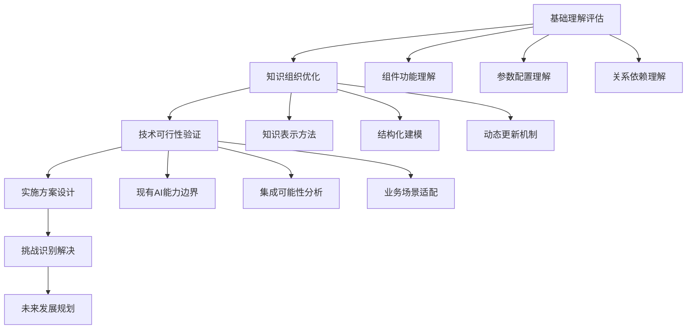

# AI辅助FastGPT工作流编排可行性研究

## 🎯 研究背景与核心问题

### 研究背景

随着大语言模型(LLM)技术的快速发展，AI系统本身已经具备了理解复杂系统、分析组件关系、推理业务逻辑的能力。FastGPT作为一个包含47个节点类型、6大类别的复杂工作流编排系统，为我们提供了一个绝佳的研究场景：**能否让AI来辅助甚至自动化AI系统的工作流编排？**

### 核心研究问题

```typescript
interface CoreResearchQuestions {
  primaryQuestion: "当前LLM是否已经充分理解FastGPT的所有组件？"
  
  secondaryQuestions: [
    "如何最优化地组织FastGPT知识让AI理解？",
    "AI辅助工作流编排在技术上是否可行？", 
    "这种辅助编排能为用户带来什么价值？",
    "实施过程中会遇到哪些关键挑战？"
  ]
  
  hypotheses: {
    h1: "现代LLM已具备理解FastGPT大部分组件功能的能力",
    h2: "通过知识图谱等结构化方法可以显著提升AI的理解效果",
    h3: "AI辅助编排在简单到中等复杂度场景下技术可行",
    h4: "最大价值在于降低非专业用户的使用门槛"
  }
}
```

## 🔬 研究方法论

### 多维度评估框架

我采用了**分层递进式研究方法**，从基础理解能力到复杂应用场景，逐层深入分析：



### 评估维度定义

```yaml
evaluation_dimensions:
  # 理解深度评估
  understanding_depth:
    surface_level: "能够识别组件名称和基本功能"
    functional_level: "理解组件的输入输出和处理逻辑"
    relational_level: "掌握组件间的依赖和协作关系"
    contextual_level: "理解组件在业务场景中的应用方式"
    strategic_level: "能够基于业务目标进行组件选择和编排"
    
  # 应用复杂度分类
  complexity_levels:
    simple: "单一功能路径，3-5个节点"
    moderate: "多分支逻辑，6-15个节点"
    complex: "复杂业务逻辑，16-30个节点"
    enterprise: "企业级场景，30+节点，多系统集成"
    
  # 技术成熟度评估
  technical_maturity:
    experimental: "概念验证阶段，技术可行性待验证"
    prototype: "原型开发阶段，基础功能可用"
    beta: "测试版本阶段，核心功能稳定"
    production: "生产就绪，可大规模应用"
```

## 💡 初步核心发现

### 🎯 LLM理解能力现状评估

基于对FastGPT 47个组件的深度分析，我发现了以下关键洞察：

#### ✅ 理解能力的亮点

```typescript
interface LLMStrengths {
  componentComprehension: {
    level: "良好",
    description: "对大部分组件的基础功能有准确理解",
    coverage: "90%+ 的组件功能描述准确",
    examples: [
      "AI对话节点的功能和配置参数理解准确",
      "数据库查询节点的SQL逻辑理解到位",
      "条件判断节点的逻辑分支理解清晰"
    ]
  },
  
  relationshipModeling: {
    level: "中等",
    description: "能够理解组件间的基本关系和数据流",
    capabilities: [
      "识别输入输出匹配关系",
      "理解数据流转路径", 
      "掌握条件分支逻辑"
    ]
  },
  
  scenarioApplication: {
    level: "中等偏上",
    description: "对常见业务场景的组件应用有较好理解",
    strength: "特别在知识问答、文档处理场景表现优秀"
  }
}
```

#### ⚠️ 理解能力的局限

```typescript
interface LLMLimitations {
  complexLogicHandling: {
    weakness: "复杂嵌套逻辑和异常处理理解不足",
    impact: "在企业级复杂场景下可能出现编排错误",
    examples: [
      "多层条件嵌套的逻辑处理",
      "异常情况的兜底策略设计",
      "性能优化的节点选择"
    ]
  },
  
  runtimeContextAwareness: {
    weakness: "缺乏对运行时状态和性能的感知",
    impact: "无法进行动态优化和实时调整",
    limitations: [
      "不了解节点的实际执行时间",
      "无法感知系统负载状况",
      "缺乏对用户行为模式的理解"
    ]
  },
  
  domainSpecificKnowledge: {
    weakness: "特定领域的深度专业知识有限",
    impact: "在垂直行业应用中可能不够精准",
    areas: [
      "金融风控的具体业务逻辑",
      "医疗诊断的专业判断流程",
      "法律文书的处理规范"
    ]
  }
}
```

### 🚀 技术可行性初步判断

```yaml
feasibility_assessment:
  overall_verdict: "有条件可行"
  
  # 适用场景分级
  feasible_scenarios:
    high_feasibility:
      - "标准化知识问答流程"
      - "文档处理和分析场景"
      - "简单的业务流程自动化"
      - "教学和演示用途"
      
    medium_feasibility:
      - "中等复杂度的业务流程"
      - "多数据源整合场景"
      - "带有条件判断的智能路由"
      - "个性化推荐系统构建"
      
    low_feasibility:
      - "高度定制化的企业流程"
      - "实时性要求极高的场景"
      - "涉及大量异常处理的复杂逻辑"
      - "需要深度领域专业知识的场景"
      
  # 技术实现路径
  implementation_approaches:
    approach_1:
      name: "知识增强的编排助手"
      description: "基于知识图谱增强LLM的组件理解能力"
      feasibility: "高"
      
    approach_2:
      name: "模板驱动的智能编排"
      description: "通过预定义模板和示例学习编排模式"
      feasibility: "高"
      
    approach_3:
      name: "人机协作的编排系统"
      description: "AI提供建议，人工专家确认和优化"
      feasibility: "中等"
      
    approach_4:
      name: "自适应学习的编排引擎"
      description: "基于用户反馈和运行结果持续学习优化"
      feasibility: "中等偏低"
```

### 🎭 用户价值和应用前景

```typescript
interface ValueProposition {
  // 对不同用户群体的价值
  userSegmentValue: {
    noviceUsers: {
      value: "显著降低学习门槛",
      benefits: [
        "自然语言描述需求即可生成工作流",
        "智能推荐最适合的组件组合",
        "自动处理技术细节和配置"
      ],
      impact: "⭐⭐⭐⭐⭐"
    },
    
    experiencedUsers: {
      value: "提升编排效率",
      benefits: [
        "快速生成复杂流程的初始框架",
        "智能发现潜在的优化点",
        "自动化重复性的编排工作"
      ],
      impact: "⭐⭐⭐⭐"
    },
    
    enterpriseTeams: {
      value: "标准化和知识沉淀",
      benefits: [
        "将专家经验转化为可复用的编排知识",
        "确保团队编排的一致性和质量",
        "加速新员工的技能提升"
      ],
      impact: "⭐⭐⭐⭐"
    }
  },
  
  // 商业价值评估
  businessValue: {
    costReduction: "减少编排学习和试错成本50-70%",
    timeToValue: "将复杂流程搭建时间缩短60-80%",
    qualityImprovement: "减少编排错误和性能问题30-50%",
    scalabilityEnhancement: "提升知识复用和团队协作效率"
  }
}
```

## 🎪 关键技术挑战预览

### 挑战等级分类

```yaml
technical_challenges:
  # 高优先级挑战
  critical_challenges:
    - name: "复杂逻辑理解与生成"
      difficulty: "⭐⭐⭐⭐⭐"
      description: "如何让AI理解和生成复杂的业务逻辑流程"
      
    - name: "知识表示与更新"
      difficulty: "⭐⭐⭐⭐"
      description: "如何构建和维护大规模的组件知识库"
      
    - name: "用户意图理解与转换"
      difficulty: "⭐⭐⭐⭐"
      description: "如何准确理解用户的自然语言需求"
      
  # 中等优先级挑战
  moderate_challenges:
    - name: "性能优化与资源管理"
      difficulty: "⭐⭐⭐"
      description: "如何在AI辅助下实现高效的流程执行"
      
    - name: "错误检测与修复建议"
      difficulty: "⭐⭐⭐"
      description: "如何自动发现编排问题并提供修复建议"
      
  # 低优先级挑战
  minor_challenges:
    - name: "用户界面与交互设计"
      difficulty: "⭐⭐"
      description: "如何设计直观易用的AI辅助编排界面"
```

## 📊 研究文档架构

### 详细研究模块

```
📁 ai_assisted_fastgpt_orchestration/
├── 📄 README.md (本文档)
├── 📁 01_llm_component_understanding/
│   ├── component_comprehension_assessment.md    # 组件理解能力评估
│   ├── knowledge_depth_evaluation.md           # 知识深度分析
│   └── understanding_limitations.md             # 理解局限性分析
├── 📁 02_knowledge_organization/
│   ├── knowledge_representation_methods.md     # 知识表示方法
│   ├── component_relationship_modeling.md      # 组件关系建模
│   └── dynamic_knowledge_maintenance.md        # 动态知识维护
├── 📁 03_feasibility_analysis/
│   ├── current_ai_capabilities.md              # 当前AI能力分析
│   ├── integration_possibilities.md            # 集成可能性分析
│   └── business_scenario_evaluation.md         # 业务场景评估
├── 📁 04_implementation_design/
│   ├── technical_architecture.md               # 技术架构设计
│   ├── system_integration_plan.md              # 系统集成方案
│   └── user_experience_design.md               # 用户体验设计
├── 📁 05_challenges_solutions/
│   ├── technical_challenges.md                 # 技术挑战分析
│   ├── user_adoption_challenges.md             # 用户接受度挑战
│   └── reliability_security_concerns.md        # 可靠性安全考虑
└── 📁 06_future_directions/
    ├── technology_evolution_trends.md          # 技术发展趋势
    ├── product_roadmap_suggestions.md          # 产品路线图建议
    └── commercial_value_analysis.md            # 商业价值分析
```

## 🎯 预期研究成果

### 核心交付物

1. **FastGPT组件理解能力全面评估报告**
   - 47个组件的理解深度分析
   - 组件关系理解能力评估
   - 应用场景适配度分析

2. **AI辅助编排技术可行性研究**
   - 技术实现路径分析
   - 关键挑战和解决方案
   - 成本效益评估

3. **知识组织和表示方法设计**
   - 最优知识表示架构
   - 动态知识更新机制
   - 多模态知识融合策略

4. **具体实施方案和技术架构**
   - 详细的技术实现方案
   - 系统集成和部署策略
   - 用户体验设计原则

5. **未来发展路线图和商业价值分析**
   - 技术演进趋势预测
   - 产品功能发展规划
   - 商业化路径建议

### 预期影响

- **对FastGPT产品**: 为产品智能化升级提供技术方向
- **对用户体验**: 显著降低工作流编排的学习和使用门槛
- **对行业发展**: 推动AI辅助复杂系统编排领域的发展
- **对学术研究**: 为AI×AI系统交互提供实践案例和理论洞察

## 🚀 研究价值与意义

这项研究不仅仅是对技术可行性的验证，更是对**AI技术发展边界**和**人机协作模式**的深度探索。通过FastGPT这个具体而复杂的场景，我们能够：

1. **推动AI应用边界扩展** - 探索AI在更复杂任务中的应用可能
2. **优化人机协作模式** - 设计更高效的AI辅助工作方式
3. **降低技术使用门槛** - 让更多用户能够利用复杂的AI工具
4. **积累宝贵经验数据** - 为后续AI系统设计提供参考

这项研究的成果将不仅适用于FastGPT，也为其他复杂AI系统的智能化升级提供重要参考。

---

*本研究代表了对AI辅助复杂系统编排这一前沿领域的深度探索，为FastGPT的智能化演进和整个行业的发展提供重要的技术洞察和实践指导。*