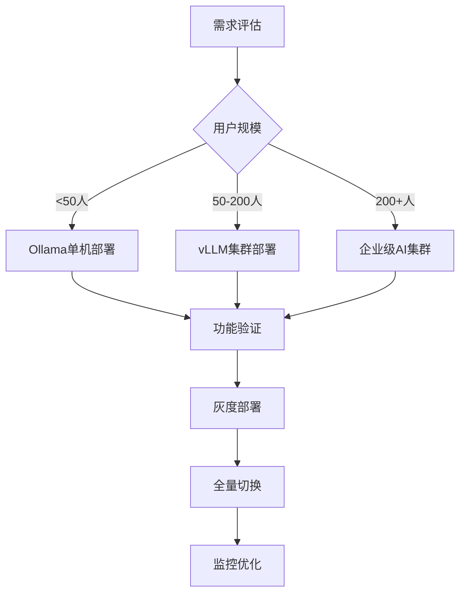

# FastGPT AI模型服务深度分析与本地化替代方案

## 🎯 分析目标

针对企业IT部门"禁止随意外网访问"的政策要求，本文档深度分析FastGPT中AI模型服务的依赖关系，并提供完整的本地化替代方案，确保在私有化部署中能够完全脱离外部AI服务依赖。

## 🏗️ AI服务架构分析

### 1. 核心架构设计

FastGPT采用了**模型分离的部署方案**，具备以下核心特性：

```typescript
interface AIServiceArchitecture {
  standardization: {
    protocol: 'OpenAI API兼容标准',
    interface: '统一AI调用接口层',
    plugin: '插件化模型扩展架构'
  },
  
  callchain: {
    flow: 'createChatCompletion() → getAIApi() → OpenAI SDK → AI服务',
    abstraction: '完全基于标准OpenAI API封装',
    flexibility: '支持任意OpenAI兼容服务'
  },
  
  keyFiles: [
    '/packages/service/core/ai/config.ts',    // AI服务配置与调用
    '/packages/global/core/ai/index.ts',      // OpenAI SDK封装
    '/packages/service/core/ai/model.ts'      // 模型管理
  ]
}
```

### 2. 支持的AI模型类型

```typescript
enum ModelTypeEnum {
  llm = 'llm',              // 大语言模型 - 对话生成
  embedding = 'embedding',   // 向量嵌入模型 - 文本向量化
  tts = 'tts',              // 文本转语音 - 语音合成
  stt = 'stt',              // 语音识别 - 语音转文本
  rerank = 'rerank'         // 重排序模型 - 结果优化
}

interface SupportedProviders {
  cloudServices: [
    'OpenAI', 'Claude', 'Gemini', 'Meta'
  ],
  domesticServices: [
    'Qwen', 'Doubao', 'DeepSeek', 'ChatGLM', 'Ernie'
  ],
  localDeployment: [
    'Ollama', 'Other(自定义)', 'vLLM', 'LocalAI'
  ]
}
```

## 🔧 本地化兼容性分析

### 1. OpenAI API完全兼容

FastGPT的设计优势在于**完全基于OpenAI API标准**，这为本地化部署提供了极大便利：

```typescript
// 核心配置 - 仅需修改URL即可切换服务
const aiServiceConfig = {
  baseUrl: process.env.OPENAI_BASE_URL || 'https://api.openai.com/v1',
  apiKey: process.env.CHAT_API_KEY || 'sk-xxxxxxxx',
  compatibility: {
    chatCompletions: '✅ 完全支持',
    streamResponse: '✅ 流式响应支持',
    functionCalling: '✅ 函数调用支持', 
    toolChoice: '✅ 工具选择支持',
    embeddings: '✅ 向量化接口支持'
  }
}
```

### 2. 本地模型集成方案

#### 方案A: 直接替换 (推荐 ⭐⭐⭐⭐⭐)

```yaml
# 最简单的本地化方案
environment:
  - OPENAI_BASE_URL=http://your-local-llm:11434/v1
  - CHAT_API_KEY=sk-placeholder
  
advantages:
  - "零代码修改"
  - "配置极其简单"
  - "部署时间最短"
  - "风险最低"
```

#### 方案B: OneAPI网关统一管理 (推荐 ⭐⭐⭐⭐)

```yaml
# 多模型统一管理方案
services:
  oneapi:
    image: justsong/one-api:latest
    ports: ["3000:3000"]
    
  fastgpt:
    environment:
      - OPENAI_BASE_URL=http://oneapi:3000/v1
      - CHAT_API_KEY=sk-oneapi-token
      
advantages:
  - "多模型统一管理"
  - "负载均衡支持"
  - "使用统计和配额控制"
  - "多种模型源支持"
```

#### 方案C: AI Proxy代理服务 (推荐 ⭐⭐⭐)

```yaml
# FastGPT官方代理方案
services:
  aiproxy:
    image: ghcr.io/labring/aiproxy:v0.2.2
    
  fastgpt:
    environment:
      - AIPROXY_API_ENDPOINT=http://aiproxy:3000
      - AIPROXY_API_TOKEN=aiproxy-token
```

## 🚀 私有化AI服务部署方案

### 1. Ollama本地部署方案 (企业首选)

#### 1.1 基础部署架构

```yaml
# docker-compose-ai.yml
version: '3.8'
services:
  ollama:
    image: ollama/ollama:latest
    container_name: fastgpt-ollama
    restart: always
    ports:
      - "11434:11434"
    volumes:
      - ./ollama-data:/root/.ollama
    environment:
      - OLLAMA_ORIGINS=*
      - OLLAMA_HOST=0.0.0.0
    deploy:
      resources:
        reservations:
          devices:
            - driver: nvidia
              count: 1
              capabilities: [gpu]
              
  # FastGPT集成配置
  fastgpt:
    depends_on:
      - ollama
    environment:
      - OPENAI_BASE_URL=http://ollama:11434/v1
      - CHAT_API_KEY=sk-placeholder
```

#### 1.2 模型管理命令

```bash
# 核心模型部署
docker exec fastgpt-ollama ollama pull qwen2:7b           # 中文LLM
docker exec fastgpt-ollama ollama pull llama3.1:8b       # 英文LLM  
docker exec fastgpt-ollama ollama pull nomic-embed-text  # 向量化模型

# 专业模型部署
docker exec fastgpt-ollama ollama pull qwen2:14b         # 高性能中文模型
docker exec fastgpt-ollama ollama pull codellama:7b      # 代码生成模型

# 查看已部署模型
docker exec fastgpt-ollama ollama list

# 监控资源使用
docker exec fastgpt-ollama nvidia-smi
```

#### 1.3 企业级配置优化

```json
// FastGPT模型配置 (JSON格式)
{
  "model": "qwen2:7b",
  "name": "通义千问 7B (本地)",
  "provider": "Ollama",
  "maxContext": 32768,
  "maxResponse": 4096,
  "type": "llm",
  "vision": false,
  "toolChoice": true,
  "functionCall": true,
  "defaultConfig": {
    "temperature": 0.7,
    "top_p": 0.9,
    "max_tokens": 2048
  }
}
```

### 2. vLLM高性能推理服务 (高并发场景)

#### 2.1 GPU集群部署

```yaml
# vllm-cluster.yml
version: '3.8'
services:
  vllm-qwen:
    image: vllm/vllm-openai:latest
    container_name: vllm-qwen
    ports:
      - "8000:8000"
    command: >
      --model /models/Qwen2-7B-Instruct
      --served-model-name qwen2-7b
      --host 0.0.0.0
      --port 8000
      --tensor-parallel-size 2
      --max-model-len 8192
      --gpu-memory-utilization 0.8
    volumes:
      - ./models:/models
    deploy:
      resources:
        reservations:
          devices:
            - driver: nvidia
              count: 2  # 多GPU部署
              capabilities: [gpu]
              
  nginx-lb:
    image: nginx:alpine
    ports:
      - "80:80"
    configs:
      - source: nginx_vllm
        target: /etc/nginx/nginx.conf
    depends_on:
      - vllm-qwen
```

#### 2.2 负载均衡配置

```nginx
# nginx配置
upstream vllm_backend {
    server vllm-qwen:8000;
    server vllm-qwen-2:8001;  # 多实例负载均衡
}

server {
    listen 80;
    location /v1/ {
        proxy_pass http://vllm_backend;
        proxy_set_header Host $host;
        proxy_set_header X-Real-IP $remote_addr;
        proxy_buffering off;  # 支持流式响应
    }
}
```

### 3. LocalAI全功能方案 (多模态支持)

#### 3.1 多模态服务部署

```yaml
# localai-full.yml
version: '3.8'
services:
  localai:
    image: quay.io/go-skynet/local-ai:latest
    container_name: localai-full
    ports:
      - "8080:8080"
    environment:
      - MODELS_PATH=/models
      - DEBUG=false
      - GALLERIES=https://raw.githubusercontent.com/mudler/LocalAI/master/examples/configurations/gallery_simple.yaml
    volumes:
      - ./models:/models
      - ./localai-config:/build/models
    deploy:
      resources:
        reservations:
          devices:
            - driver: nvidia
              count: 1
              capabilities: [gpu]
```

#### 3.2 模型配置示例

```yaml
# /models/qwen2-chat.yaml
name: qwen2-7b-instruct
backend: llama-cpp
parameters:
  model: qwen2-7b-instruct.gguf
  temperature: 0.7
  top_k: 40
  top_p: 0.95
  context_size: 8192
  threads: 4
  f16: true
  
# /models/text-embedding.yaml  
name: text-embedding-ada-002
backend: bert-embeddings
parameters:
  model: sentence-transformers/all-MiniLM-L6-v2
```

## 🎛️ 配置管理深度分析

### 1. 环境变量配置体系

```typescript
interface AIServiceEnvironment {
  // 核心AI服务配置
  core: {
    OPENAI_BASE_URL: string,      // AI服务基础URL
    CHAT_API_KEY: string,         // API密钥
    AIPROXY_API_ENDPOINT: string, // AI代理端点
    AIPROXY_API_TOKEN: string     // AI代理令牌
  },
  
  // 系统性能配置
  performance: {
    vectorMaxProcess: number,     // 向量处理线程数
    qaMaxProcess: number,         // 问答处理线程数  
    vlmMaxProcess: number,        // 视觉模型处理线程数
    tokenWorkers: number          // Token计算线程数
  },
  
  // 高级功能配置
  advanced: {
    oneapiUrl?: string,           // OneAPI服务地址
    chatApiKey?: string,          // 统一聊天API密钥
    customModelConfig?: string    // 自定义模型配置路径
  }
}
```

### 2. 动态模型配置系统

```typescript
// 模型配置数据结构
interface ModelConfiguration {
  model: string,              // 模型标识符
  name: string,               // 显示名称
  provider: string,           // 服务提供商
  maxContext: number,         // 最大上下文长度
  maxResponse: number,        // 最大响应长度
  type: ModelTypeEnum,        // 模型类型
  vision: boolean,            // 视觉能力支持
  toolChoice: boolean,        // 工具选择支持
  functionCall: boolean,      // 函数调用支持
  defaultConfig: {            // 默认推理参数
    temperature?: number,
    top_p?: number,
    max_tokens?: number,
    presence_penalty?: number,
    frequency_penalty?: number
  }
}

// 动态加载机制
export const getLLMModel = (model?: string): LLMModelItemType => {
  if (!model) return getDefaultLLMModel();
  return global.llmModelMap.get(model) || getDefaultLLMModel();
};
```

### 3. 流式响应处理机制

```typescript
// 流式响应核心实现
async function streamResponse({
  res, stream, workflowStreamResponse
}: StreamResponseProps) {
  try {
    for await (const part of stream) {
      const { reasoningContent, responseContent } = parsePart({
        part, parseThinkTag, retainDatasetCite
      });
      
      // 推理内容流式输出
      if (reasoningContent) {
        workflowStreamResponse?.({
          event: SseResponseEventEnum.answer,
          data: textAdaptGptResponse({ 
            reasoning_content: reasoningContent 
          })
        });
      }
      
      // 响应内容流式输出
      if (responseContent) {
        workflowStreamResponse?.({
          event: SseResponseEventEnum.answer,
          data: textAdaptGptResponse({ 
            text: responseContent 
          })
        });
      }
    }
  } catch (error) {
    console.error('Stream response error:', error);
    throw error;
  }
}
```

## 📊 性能与功能对比分析

### 1. 本地化方案性能对比

| 方案 | 推理速度 | 资源占用 | 部署复杂度 | 功能完整度 | 推荐指数 |
|------|---------|---------|-----------|-----------|---------|
| Ollama | 中等 | 中等 | ⭐⭐ | ⭐⭐⭐⭐ | ⭐⭐⭐⭐⭐ |
| vLLM | 快 | 高 | ⭐⭐⭐ | ⭐⭐⭐⭐ | ⭐⭐⭐⭐ |
| LocalAI | 中等 | 中等 | ⭐⭐⭐⭐ | ⭐⭐⭐⭐⭐ | ⭐⭐⭐⭐ |
| 自建集群 | 快 | 高 | ⭐⭐⭐⭐⭐ | ⭐⭐⭐⭐⭐ | ⭐⭐⭐ |

### 2. 硬件资源需求评估

```typescript
interface HardwareRequirements {
  minimal: {
    description: "基础功能验证",
    gpu: "RTX 3090 (24GB) x1",
    ram: "32GB",
    storage: "500GB SSD",
    concurrent_users: "1-5",
    estimated_cost: "$3,000-5,000"
  },
  
  production: {
    description: "企业生产环境",
    gpu: "A100 (80GB) x2 或 H100 (80GB) x1",
    ram: "128GB",
    storage: "2TB NVMe SSD",
    concurrent_users: "20-50",
    estimated_cost: "$30,000-80,000"
  },
  
  enterprise: {
    description: "大规模企业部署",
    gpu: "H100 (80GB) x4+",
    ram: "256GB+",
    storage: "10TB+ 企业级存储",
    concurrent_users: "100+",
    estimated_cost: "$200,000+"
  }
}
```

## 🛠️ 迁移实施指导

### 1. 分阶段迁移策略

#### Phase 1: 基础替换 (1-2周)

```bash
# 第一阶段：核心LLM替换
# 1. 部署Ollama服务
docker run -d --name ollama --gpus all \
  -p 11434:11434 \
  -v ./ollama:/root/.ollama \
  ollama/ollama

# 2. 下载基础模型
docker exec ollama ollama pull qwen2:7b
docker exec ollama ollama pull nomic-embed-text

# 3. 修改FastGPT配置
echo "OPENAI_BASE_URL=http://ollama:11434/v1" > .env.local
echo "CHAT_API_KEY=sk-placeholder" >> .env.local

# 4. 功能验证
curl -X POST "http://localhost:11434/v1/chat/completions" \
  -H "Content-Type: application/json" \
  -d '{"model": "qwen2:7b", "messages": [{"role": "user", "content": "你好"}]}'
```

#### Phase 2: 能力增强 (2-4周)

```yaml
# 第二阶段：多模态和高级功能
version: '3.8'
services:
  # LLM服务
  ollama-llm:
    image: ollama/ollama
    deploy:
      resources:
        reservations:
          devices: [{"driver": "nvidia", "count": 1, "capabilities": ["gpu"]}]
  
  # Embedding服务
  text-embeddings:
    image: ghcr.io/huggingface/text-embeddings-inference:cpu-1.2
    command: --model-id BAAI/bge-small-en-v1.5 --port 3000
    
  # Rerank服务
  rerank-service:
    image: registry.cn-hangzhou.aliyuncs.com/fastgpt/rerank:latest
    environment:
      - MODEL_NAME=BAAI/bge-reranker-base
      
  # OneAPI统一网关
  oneapi:
    image: justsong/one-api:latest
    environment:
      - SQL_DSN=root:123456@tcp(mysql:3306)/oneapi
```

#### Phase 3: 优化完善 (4-8周)

```yaml
# 第三阶段：企业级高可用部署
version: '3.8'
services:
  # 负载均衡
  haproxy:
    image: haproxy:alpine
    ports: ["80:80", "443:443"]
    volumes:
      - ./haproxy.cfg:/usr/local/etc/haproxy/haproxy.cfg:ro
      
  # AI服务集群
  vllm-1:
    image: vllm/vllm-openai
    deploy:
      replicas: 2
      resources:
        reservations:
          devices: [{"driver": "nvidia", "count": 2, "capabilities": ["gpu"]}]
          
  # 监控系统
  prometheus:
    image: prom/prometheus
    volumes:
      - ./prometheus.yml:/etc/prometheus/prometheus.yml
      
  grafana:
    image: grafana/grafana
    environment:
      - GF_SECURITY_ADMIN_PASSWORD=admin123
```

### 2. 风险缓解策略

#### 服务降级机制
```typescript
// 智能降级策略实现
class AIServiceManager {
  private services: AIService[] = [
    new LocalOllamaService(),
    new LocalVLLMService(), 
    new FallbackCloudService()  // 紧急备用
  ];
  
  async chat(params: ChatParams): Promise<ChatResponse> {
    for (const service of this.services) {
      try {
        if (await service.isHealthy()) {
          return await service.chat(params);
        }
      } catch (error) {
        console.warn(`Service ${service.name} failed:`, error);
        continue;  // 尝试下一个服务
      }
    }
    throw new Error('All AI services unavailable');
  }
}
```

#### 监控预警系统
```yaml
# prometheus监控配置
groups:
  - name: ai_services
    rules:
      - alert: AIServiceDown
        expr: up{job="ai-service"} == 0
        for: 1m
        annotations:
          summary: "AI服务不可用"
          
      - alert: HighGPUUtilization  
        expr: nvidia_gpu_utilization > 90
        for: 5m
        annotations:
          summary: "GPU使用率过高"
          
      - alert: SlowResponse
        expr: ai_request_duration_seconds > 10
        for: 3m
        annotations:
          summary: "AI响应时间过长"
```

## 📈 成本效益分析

### 1. 总拥有成本(TCO)对比

```typescript
interface CostAnalysis {
  // 云服务成本 (年度)
  cloudService: {
    apiCosts: "$50,000 - $200,000/年",
    dataTransfer: "$5,000 - $20,000/年", 
    compliance: "数据出境合规成本",
    total: "$55,000 - $220,000/年"
  },
  
  // 私有化部署成本 (一次性 + 年度)
  privateDeployment: {
    hardware: "$30,000 - $200,000 (一次性)",
    implementation: "$20,000 - $50,000 (一次性)",
    maintenance: "$10,000 - $30,000/年",
    total_year1: "$60,000 - $280,000",
    total_year3: "$80,000 - $340,000"
  },
  
  // 投资回报分析
  roi: {
    breakeven: "18-24个月",
    year3_savings: "$65,000 - $320,000",
    additional_benefits: [
      "数据安全可控",
      "无网络依赖风险",
      "满足合规要求",
      "技术自主可控"
    ]
  }
}
```

### 2. 推荐实施路径



---

*通过本分析文档的指导，企业可以系统性地将FastGPT的AI服务从外部依赖迁移到完全私有化部署，实现数据安全、成本优化和技术自主可控的目标。*