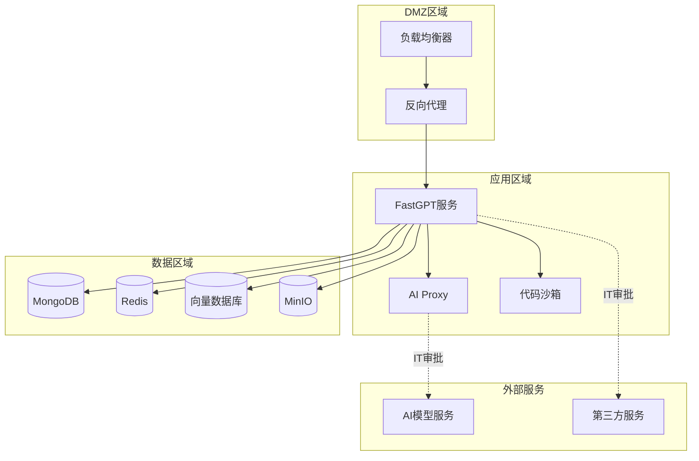

# FastGPT 网络依赖和外部服务调用完整分析

## 📊 分析概述

基于深度代码分析和配置文件扫描，FastGPT项目涉及多类型的网络依赖和外部服务调用。本分析为私有化部署的网络访问控制提供技术基础，结合用户已有的商业版授权研究，形成完整的私有化部署技术方案。

## 🎯 核心发现摘要

- **总计网络依赖**: 30+ 个外部服务类型
- **必需依赖**: 7个核心服务（AI模型、数据库、存储）
- **功能性依赖**: 12个特定功能服务
- **可选依赖**: 11个增强功能服务
- **Docker镜像依赖**: 15+ 个公共镜像
- **高频网络调用**: AI模型API、数据库连接、缓存操作

## 🔍 网络依赖详细分析

### 1. 必需的外部依赖（系统无法正常运行）

#### 1.1 AI模型服务 [⚠️ 高优先级IT审批]

```typescript
interface AIModelDependencies {
  openai: {
    baseUrl: 'https://api.openai.com/v1',
    envVars: ['OPENAI_BASE_URL', 'CHAT_API_KEY'],
    frequency: '运行时高频',
    businessImpact: '核心功能完全依赖',
    localAlternative: '支持本地LLM API兼容服务'
  },
  
  aiProxy: {
    endpoint: 'http://aiproxy:3000',
    envVars: ['AIPROXY_API_ENDPOINT', 'AIPROXY_API_TOKEN'],
    frequency: '运行时中频',
    businessImpact: 'AI模型统一管理',
    localAlternative: '内网部署AI Proxy服务'
  },
  
  multipleProviders: {
    services: ['Azure OpenAI', 'Claude', 'Gemini', '百度文心', '阿里通义'],
    configuration: '通过环境变量和配置文件管理',
    businessImpact: '多模型支持能力',
    localAlternative: '本地LLM部署（Ollama、vLLM、LocalAI）'
  }
}
```

#### 1.2 数据存储服务 [✅ 内网部署优先]

```typescript
interface DatabaseDependencies {
  mongodb: {
    port: 27017,
    frequency: '运行时持续',
    businessImpact: '业务数据存储',
    clusterSupport: true,
    localDeployment: '完全支持内网部署'
  },
  
  redis: {
    port: 6379,
    frequency: '运行时高频',
    businessImpact: '缓存和会话管理',
    localDeployment: '完全支持内网部署'
  },
  
  vectorDatabases: {
    postgresql: {
      extension: 'pgvector',
      envVar: 'PG_URL',
      localDeployment: '完全支持'
    },
    milvus: {
      envVars: ['MILVUS_ADDRESS', 'MILVUS_TOKEN'],
      clusterSupport: true,
      localDeployment: '完全支持'
    },
    zillizCloud: {
      type: '云向量数据库',
      itApprovalRequired: true,
      localAlternative: '本地Milvus集群'
    }
  }
}
```

#### 1.3 文件存储服务 [✅ 内网替代完善]

```typescript
interface FileStorageDependencies {
  minio: {
    ports: [9000, 9001],
    envVars: ['MINIO_ENDPOINT', 'MINIO_ACCESS_KEY', 'MINIO_SECRET_KEY'],
    frequency: '按需访问',
    businessImpact: '文件上传下载功能',
    localDeployment: '完全支持内网部署',
    s3Compatibility: true
  }
}
```

### 2. 功能性外部依赖（特定功能需要）

#### 2.1 外部工具服务 [⚠️ 需要IT审批控制]

```typescript
interface ExternalToolDependencies {
  lafCloudFunction: {
    defaultUrls: ['https://laf.dev', 'https://laf.run'],
    configKey: 'feConfigs.lafEnv',
    frequency: '按需调用',
    businessImpact: 'HTTP工具节点、自定义函数执行',
    itApprovalLevel: 'MEDIUM',
    localAlternative: '私有化Laf环境或内网HTTP服务'
  },
  
  sandboxService: {
    endpoint: 'http://sandbox:3000',
    envVar: 'SANDBOX_URL',
    frequency: '代码执行时',
    businessImpact: '安全代码执行沙箱',
    localDeployment: '支持内网部署'
  },
  
  customPdfParse: {
    configPath: 'systemEnv.customPdfParse.url',
    doc2xService: 'systemEnv.customPdfParse.doc2xKey',
    frequency: '文档解析时',
    businessImpact: '增强文档解析能力',
    itApprovalLevel: 'MEDIUM',
    localAlternative: '内网PDF解析服务'
  }
}
```

#### 2.2 搜索引擎集成 [⚠️ 高敏感度IT审批]

```typescript
interface SearchEngineDependencies {
  webCrawler: {
    services: ['SearxNG', 'Puppeteer网页抓取'],
    frequency: '搜索功能使用时',
    businessImpact: '在线信息检索能力',
    itApprovalLevel: 'HIGH',
    securityRisk: '可能访问任意外部网站',
    controlStrategy: '白名单域名 + 代理服务器'
  },
  
  googleSearchAPI: {
    integration: '通过Laf函数',
    frequency: '搜索时',
    itApprovalLevel: 'HIGH',
    localAlternative: '内网搜索引擎或禁用功能'
  },
  
  baiduSearch: {
    integration: '百度搜索引擎API',
    itApprovalLevel: 'HIGH',
    complianceNote: '需要考虑数据出境合规性'
  }
}
```

#### 2.3 第三方平台集成 [⚠️ 企业集成需要审批]

```typescript
interface ThirdPartyIntegrations {
  enterpriseIM: {
    platforms: ['企业微信', '钉钉', '飞书'],
    mechanism: 'Webhook集成',
    frequency: '消息推送时',
    businessImpact: '企业内部机器人发布',
    itApprovalLevel: 'MEDIUM',
    dataFlow: 'FastGPT -> 企业IM平台'
  },
  
  wechatOfficialAccount: {
    purpose: 'H5应用发布',
    frequency: '按需',
    itApprovalLevel: 'MEDIUM'
  }
}
```

### 3. 可选的外部依赖（可通过配置禁用）

#### 3.1 监控和日志服务 [💡 可选择内网部署]

```typescript
interface MonitoringDependencies {
  openTelemetry: {
    service: 'Signoz',
    envVars: ['SIGNOZ_BASE_URL', 'SIGNOZ_SERVICE_NAME'],
    frequency: '运行时持续',
    businessImpact: '性能监控和链路追踪',
    disableOption: true,
    localAlternative: '内网Signoz部署'
  },
  
  externalLogging: {
    envVar: 'CHAT_LOG_URL',
    frequency: '聊天时',
    businessImpact: '聊天日志外部存储',
    disableOption: true,
    securityRisk: '敏感对话数据外传'
  }
}
```

#### 3.2 认证服务 [💡 SSO可配置为内网]

```typescript
interface AuthenticationDependencies {
  oauthProviders: {
    services: ['GitHub', 'Google', 'Microsoft', 'WeChat'],
    frequency: '用户登录时',
    businessImpact: '第三方登录便利性',
    disableOption: true,
    alternative: '内网AD/LDAP集成'
  },
  
  ssoIntegration: {
    configKey: 'feConfigs.sso',
    customProviders: true,
    localSupport: '支持企业内网SSO'
  }
}
```

#### 3.3 支付服务 [💡 企业版通常不需要]

```typescript
interface PaymentDependencies {
  paymentGateways: {
    services: ['支付宝', '微信支付', '银行支付'],
    configKey: 'feConfigs.payConfig',
    frequency: '交易时',
    businessImpact: 'SaaS运营收费功能',
    enterpriseNote: '私有部署通常不需要支付功能',
    disableOption: true
  }
}
```

## 📦 Docker镜像依赖分析

### 镜像源依赖

```yaml
# 官方镜像源
primarySources:
  - Docker Hub (docker.io)
  - GitHub Container Registry (ghcr.io)
  - Quay.io

# 国内镜像源  
domesticSources:
  - 阿里云容器镜像服务 (registry.cn-hangzhou.aliyuncs.com)
  - 腾讯云容器镜像服务
  - 华为云容器镜像服务

# IT审批建议
itApprovalStrategy:
  approach: "建立内网Docker Registry"
  security: "镜像安全扫描和漏洞检测"
  version: "锁定特定版本，避免自动更新"
```

### 核心镜像清单

```yaml
fastgptImages:
  - ghcr.io/labring/fastgpt:v4.11.0
  - ghcr.io/labring/fastgpt-sandbox:v4.10.1  
  - ghcr.io/labring/fastgpt-mcp_server:v4.10.1
  - ghcr.io/labring/fastgpt-plugin:v0.1.5
  - ghcr.io/labring/aiproxy:v0.2.2

thirdPartyImages:
  - mongo:5.0.18
  - redis:7.2-alpine  
  - pgvector/pgvector:0.8.0-pg15
  - milvusdb/milvus:v2.4.3
  - minio/minio:latest
  - quay.io/coreos/etcd:v3.5.5
```

## 🛡️ IT审批分级建议

### 审批等级定义

```typescript
enum ITApprovalLevel {
  LOW = "低风险，技术团队审批",
  MEDIUM = "中风险，IT安全团队审批", 
  HIGH = "高风险，IT安全委员会审批",
  CRITICAL = "关键风险，CISO级别审批"
}

interface ApprovalMatrix {
  AI_MODEL_SERVICES: {
    level: ITApprovalLevel.CRITICAL,
    reason: "核心业务功能，涉及数据传输到外部AI服务",
    recommendation: "优先考虑内网LLM部署"
  },
  
  SEARCH_ENGINES: {
    level: ITApprovalLevel.HIGH,
    reason: "可能访问任意外部网站，存在数据泄露风险",
    recommendation: "白名单域名控制或禁用功能"
  },
  
  ENTERPRISE_INTEGRATIONS: {
    level: ITApprovalLevel.MEDIUM,
    reason: "企业内部系统集成，风险相对可控",
    recommendation: "配置内网端点"
  },
  
  MONITORING_SERVICES: {
    level: ITApprovalLevel.LOW,
    reason: "可选功能，支持内网部署",
    recommendation: "部署内网监控系统"
  }
}
```

## 🎯 私有化部署网络控制策略

### 1. 网络隔离架构



### 2. 访问控制矩阵

| 服务类型 | 访问频率 | 业务影响 | IT审批级别 | 控制策略 |
|---------|---------|---------|-----------|---------|
| AI模型API | 高频 | 关键 | CRITICAL | 内网LLM优先 |
| 搜索引擎 | 中频 | 重要 | HIGH | 白名单+代理 |
| 企业集成 | 低频 | 重要 | MEDIUM | 内网端点 |
| 监控服务 | 持续 | 一般 | LOW | 内网部署 |
| 认证服务 | 登录时 | 一般 | LOW | 内网SSO |

### 3. 实施建议

#### 阶段1: 核心服务内网化
- ✅ 数据库服务完全内网部署
- ✅ 文件存储使用内网MinIO
- ⚠️ AI模型服务评估本地化可行性

#### 阶段2: 功能服务审批控制  
- 🔍 外部工具服务建立审批流程
- 🔍 搜索功能配置白名单域名
- 🔍 第三方集成限制内网访问

#### 阶段3: 监控和合规
- 📊 部署内网监控系统
- 📋 建立访问审计日志
- 🔒 实施网络安全策略

---

*本分析为FastGPT私有化部署提供了全面的网络依赖技术基础，结合商业版授权方案，可以实现符合企业IT政策要求的安全部署。*