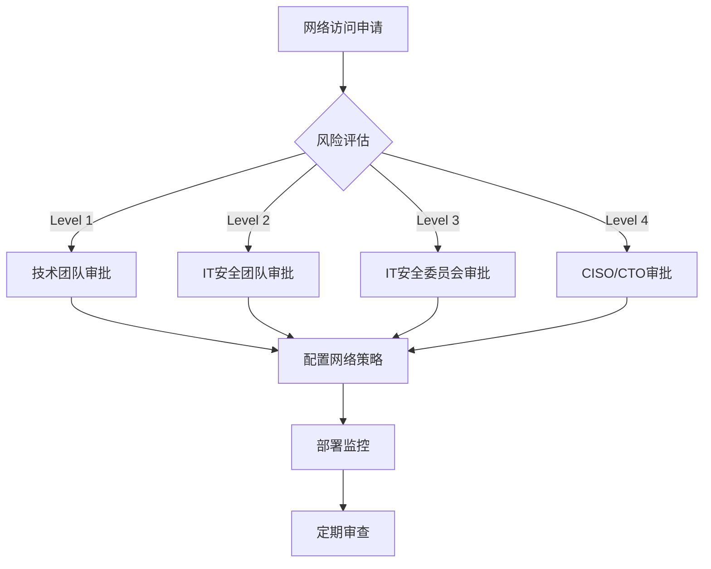

# FastGPT IT审批网络访问点识别和分级管理

## 🎯 IT审批目标

基于企业"所有外部网络访问需要IT审批"的政策要求，本文档识别FastGPT系统中所有需要外网访问的具体端点，并提供分级审批管理策略，确保网络访问的可控性和可审计性。

## 📋 IT审批分级标准

### 审批等级定义

```typescript
enum ITApprovalLevel {
  LEVEL_1_TECHNICAL = "技术团队内部审批 (1-2天)",
  LEVEL_2_SECURITY = "IT安全团队审批 (3-5天)", 
  LEVEL_3_COMMITTEE = "IT安全委员会审批 (1-2周)",
  LEVEL_4_EXECUTIVE = "CISO/CTO级别审批 (2-4周)"
}

interface ApprovalCriteria {
  dataClassification: '涉及的数据敏感级别',
  accessFrequency: '访问频率和业务关键度',
  securityRisk: '潜在安全风险评估',
  complianceImpact: '合规性影响程度',
  businessImpact: '对业务功能的影响'
}
```

## 🔍 需要IT审批的网络访问点详细清单

### LEVEL 4 - CISO/CTO级别审批 (关键风险)

#### A4.1 AI模型服务API访问

```yaml
accessPoint: "AI Large Language Model APIs"
approvalLevel: LEVEL_4_EXECUTIVE
riskCategory: "数据出境 + 商业机密"

specificEndpoints:
  openai:
    - https://api.openai.com/v1/*
    - https://api.openai.com/v1/chat/completions
    - https://api.openai.com/v1/embeddings
  
  azure_openai:
    - https://*.openai.azure.com/openai/deployments/*
  
  anthropic:
    - https://api.anthropic.com/v1/*
  
  google_gemini:
    - https://generativelanguage.googleapis.com/v1/*

dataFlowRisks:
  - "用户输入的所有对话内容"
  - "企业知识库内容片段" 
  - "内部文档和数据"
  - "商业机密和敏感信息"

businessJustification:
  - "核心AI功能完全依赖外部LLM服务"
  - "无此访问系统无法提供智能问答"

recommendedControls:
  - "数据脱敏和内容过滤"
  - "API调用日志和审计"
  - "优先考虑内网LLM部署"
  - "建立数据分类和访问策略"

approvalProcess:
  duration: "2-4周"
  requiredDocumentation:
    - "详细的数据流图"
    - "安全风险评估报告"
    - "数据保护措施方案"
    - "业务连续性计划"
```

#### A4.2 Web搜索和爬虫服务

```yaml
accessPoint: "Internet Search and Web Crawling"
approvalLevel: LEVEL_4_EXECUTIVE
riskCategory: "任意外网访问 + 数据泄露"

specificServices:
  searxng:
    description: "分布式搜索引擎"
    endpoints: "动态，可访问任意搜索引擎"
    
  puppeteer:
    description: "网页抓取服务"
    endpoints: "任意互联网网站"
    
  google_search_api:
    endpoint: "https://www.googleapis.com/customsearch/v1"
    
  baidu_search_api:
    endpoint: "https://aip.baidubce.com/rest/2.0/solution/v1/searchbox"

securityRisks:
  - "可能访问恶意网站"
  - "下载恶意内容到内网"
  - "IP地址和访问模式暴露"
  - "搜索关键词泄露企业意图"

businessJustification:
  - "知识库内容补充和验证"
  - "实时信息检索能力"

recommendedControls:
  - "白名单域名严格控制"
  - "代理服务器和内容过滤"
  - "访问日志详细记录"
  - "考虑禁用此功能"

approvalDecisionMatrix:
  highRisk: "建议拒绝或严格限制"
  mediumRisk: "白名单 + 代理访问"
  lowRisk: "内网搜索引擎替代"
```

### LEVEL 3 - IT安全委员会审批 (高风险)

#### A3.1 云服务和SaaS平台

```yaml
accessPoints:
  laf_cloud_functions:
    endpoints:
      - "https://laf.dev/api/*"
      - "https://laf.run/api/*"
    riskCategory: "第三方云服务执行"
    dataRisk: "自定义函数代码和执行结果"
    
  zilliz_cloud:
    endpoint: "https://cloud.zilliz.com/*" 
    riskCategory: "向量数据云存储"
    dataRisk: "企业文档向量化数据"
    
  doc2x_service:
    endpoint: "https://v2.doc2x.noedgeai.com/*"
    riskCategory: "文档解析云服务"
    dataRisk: "上传的PDF和文档内容"

approvalRequirements:
  - "云服务商安全资质审查"
  - "数据处理协议审核"
  - "服务可用性SLA评估"
  - "数据迁移和退出策略"

controlMeasures:
  - "数据加密传输和存储"
  - "定期安全评估"
  - "访问权限最小化"
  - "优先考虑私有化部署"
```

#### A3.2 第三方AI服务提供商

```yaml
alternativeAIProviders:
  huggingface:
    endpoint: "https://api-inference.huggingface.co/*"
    risk: "开源模型推理服务"
    
  cohere:
    endpoint: "https://api.cohere.ai/v1/*"
    risk: "商业AI服务"
    
  together_ai:
    endpoint: "https://api.together.xyz/v1/*"
    risk: "多模型聚合服务"

dataGovernanceRequirements:
  - "明确数据处理边界"
  - "确定数据保留政策" 
  - "建立数据删除机制"
  - "合规性审计准备"
```

### LEVEL 2 - IT安全团队审批 (中风险)

#### A2.1 企业系统集成

```yaml
enterpriseIntegrations:
  feishu:
    webhookEndpoint: "https://open.feishu.cn/open-apis/*"
    riskCategory: "企业IM集成"
    dataRisk: "机器人消息内容"
    
  dingtalk:
    webhookEndpoint: "https://oapi.dingtalk.com/robot/send/*"
    riskCategory: "企业IM集成"
    dataRisk: "通知消息内容"
    
  wechat_work:
    webhookEndpoint: "https://qyapi.weixin.qq.com/cgi-bin/*"
    riskCategory: "企业微信集成"
    dataRisk: "企业内部通信"

approvalProcess:
  duration: "3-5天"
  requirements:
    - "企业IM平台安全策略确认"
    - "消息内容脱敏方案"
    - "访问权限和范围限制"
    
controlStrategy:
  - "配置内网企业IM端点"
  - "消息内容审查机制"
  - "访问日志监控"
```

#### A2.2 外部认证服务

```yaml
oauthProviders:
  github:
    endpoint: "https://github.com/login/oauth/*"
    dataRisk: "用户身份信息"
    
  google:
    endpoint: "https://accounts.google.com/oauth2/*"
    dataRisk: "Google账户信息"
    
  microsoft:
    endpoint: "https://login.microsoftonline.com/*"
    dataRisk: "企业Azure AD信息"

securityConsiderations:
  - "OAuth应用注册审核"
  - "权限范围最小化原则"
  - "定期访问令牌审查"
  
recommendedAlternative:
  - "企业内网AD/LDAP集成"
  - "自建OAuth2服务"
  - "SAML SSO配置"
```

### LEVEL 1 - 技术团队审批 (低风险)

#### A1.1 监控和运维服务

```yaml
monitoringServices:
  signoz:
    endpoint: "可配置为内网地址"
    dataRisk: "系统性能和日志数据"
    
  external_logging:
    endpoint: "可配置的日志收集服务"
    dataRisk: "应用日志信息"

approvalRationale:
  - "不涉及业务敏感数据"
  - "支持内网部署"
  - "有明确的禁用选项"

quickApprovalProcess:
  duration: "1-2天"
  requirements:
    - "确认数据脱敏措施"
    - "日志保留周期设置"
```

#### A1.2 开发和构建依赖

```yaml
developmentDependencies:
  npm_registry:
    endpoint: "https://registry.npmjs.org/*"
    purpose: "Node.js包依赖下载"
    timing: "构建时访问"
    
  docker_registry:
    endpoints:
      - "https://registry-1.docker.io/*"
      - "https://ghcr.io/*"
    purpose: "容器镜像拉取"
    timing: "部署时访问"

controlMeasures:
  - "建立内网包缓存"
  - "镜像安全扫描"
  - "版本锁定策略"
```

## 🔒 IT审批控制机制设计

### 1. 审批工作流程



### 2. 审批决策矩阵

| 数据敏感度 | 访问频率 | 安全风险 | 业务影响 | 审批等级 | 处理时间 |
|-----------|---------|---------|---------|---------|---------|
| 机密 | 高频 | 高 | 关键 | Level 4 | 2-4周 |
| 机密 | 低频 | 中 | 重要 | Level 3 | 1-2周 |
| 敏感 | 中频 | 中 | 重要 | Level 2 | 3-5天 |
| 一般 | 低频 | 低 | 一般 | Level 1 | 1-2天 |

### 3. 技术控制措施

#### 网络层控制
```yaml
networkControls:
  firewallRules:
    - "默认拒绝所有外网访问"
    - "基于审批结果开放特定端点"
    - "定时审查和清理规则"
    
  proxyServer:
    - "所有外网访问通过企业代理"
    - "URL过滤和内容检查"
    - "访问日志详细记录"
    
  dnsControl:
    - "内网DNS服务器配置"
    - "恶意域名黑名单"
    - "DNS查询日志监控"
```

#### 应用层控制
```yaml
applicationControls:
  configurationManagement:
    - "集中化配置管理"
    - "环境变量严格控制"
    - "配置变更审计"
    
  dataLossPrevention:
    - "敏感数据识别和标记"
    - "出站数据内容检查"
    - "数据脱敏处理"
    
  accessLogging:
    - "所有外网请求详细日志"
    - "异常访问模式检测"
    - "实时告警机制"
```

## 📊 IT审批实施检查清单

### 部署前检查 ✅

- [ ] 完成所有网络访问点的风险评估
- [ ] 获得相应级别的IT审批文档
- [ ] 配置网络安全策略和防火墙规则
- [ ] 建立访问监控和日志系统
- [ ] 准备应急响应和访问撤销机制

### 运行时监控 📊

- [ ] 外网访问实时监控仪表板
- [ ] 异常访问模式告警设置
- [ ] 定期访问日志审核（月度）
- [ ] 网络安全策略有效性评估（季度）

### 合规性维护 🔍

- [ ] 审批文档定期更新（年度）
- [ ] 网络访问权限定期审查（季度）
- [ ] 安全事件响应流程测试（半年度）
- [ ] IT政策合规性审计（年度）

---

*本IT审批矩阵确保FastGPT私有化部署中的所有网络访问都在IT部门的严格控制和审计之下，满足企业网络安全政策要求。*