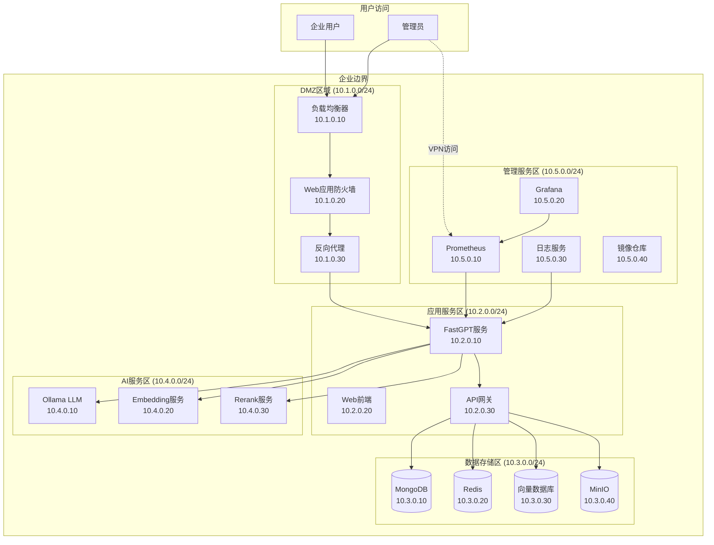

# FastGPT 网络隔离架构设计方案

## 🎯 架构设计目标

基于企业"禁止随意外网访问，需要IT审批"的政策要求，本文档设计了完整的FastGPT网络隔离架构，实现**零外网依赖**的私有化部署方案，确保所有数据和服务完全在企业内网边界内运行。

## 📐 整体架构设计原则

### 核心设计原则

```typescript
interface NetworkIsolationPrinciples {
  zeroExternalDependency: "完全消除外网依赖",
  layeredSecurity: "多层次安全防护",
  minimumPrivilege: "最小权限访问原则", 
  auditableAccess: "所有访问可审计追踪",
  businessContinuity: "业务功能完整性保证",
  scalableArchitecture: "可扩展的架构设计"
}
```

### 安全边界定义

```typescript
interface SecurityBoundaries {
  // 网络边界层级
  networkLayers: {
    dmz: "DMZ隔离区 - 面向用户访问",
    application: "应用服务区 - FastGPT核心服务",
    data: "数据存储区 - 数据库和存储服务", 
    management: "管理服务区 - 运维和监控服务",
    isolation: "隔离服务区 - 内网替代服务"
  },
  
  // 访问控制策略
  accessControl: {
    userAccess: "用户 → DMZ → 应用区",
    serviceAccess: "应用区 ← → 数据区",
    managementAccess: "管理区 → 所有区域(审计)",
    externalAccess: "完全禁止直接外网访问"
  }
}
```

## 🏗️ 网络隔离架构总览

### 1. 五层网络隔离模型



### 2. 网络分段详细规划

```yaml
# 网络分段配置
networkSegments:
  # DMZ区域 - 用户访问入口
  dmz_zone:
    cidr: "10.1.0.0/24"
    purpose: "用户访问入口和安全过滤"
    services:
      load_balancer:
        ip: "10.1.0.10"
        ports: [80, 443]
        function: "流量分发和SSL终止"
      waf:
        ip: "10.1.0.20" 
        ports: [8080]
        function: "Web应用安全防护"
      reverse_proxy:
        ip: "10.1.0.30"
        ports: [8090]
        function: "请求代理和缓存"
        
  # 应用服务区 - FastGPT核心服务
  application_zone:
    cidr: "10.2.0.0/24"
    purpose: "FastGPT应用服务运行"
    services:
      fastgpt_backend:
        ip: "10.2.0.10"
        ports: [3000]
        function: "FastGPT后端服务"
      fastgpt_web:
        ip: "10.2.0.20"
        ports: [3001]
        function: "Web前端服务"
      api_gateway:
        ip: "10.2.0.30"
        ports: [8000]
        function: "API统一网关"
      sandbox:
        ip: "10.2.0.40"
        ports: [3030]
        function: "代码执行沙箱"
        
  # 数据存储区 - 数据库和存储
  data_zone:
    cidr: "10.3.0.0/24"
    purpose: "数据存储和持久化"
    services:
      mongodb:
        ip: "10.3.0.10"
        ports: [27017]
        function: "业务数据存储"
      redis:
        ip: "10.3.0.20"
        ports: [6379]
        function: "缓存和会话存储"
      vector_db:
        ip: "10.3.0.30"
        ports: [19530, 5432]
        function: "向量数据库"
      minio:
        ip: "10.3.0.40"
        ports: [9000, 9001]
        function: "对象存储服务"
        
  # AI服务区 - 本地AI模型服务
  ai_zone:
    cidr: "10.4.0.0/24"
    purpose: "AI模型推理服务"
    services:
      ollama:
        ip: "10.4.0.10"
        ports: [11434]
        function: "大语言模型服务"
      embedding:
        ip: "10.4.0.20"
        ports: [8080]
        function: "文本向量化服务"
      rerank:
        ip: "10.4.0.30"
        ports: [8081]
        function: "重排序模型服务"
      tts_stt:
        ip: "10.4.0.40"
        ports: [8082, 8083]
        function: "语音合成和识别"
        
  # 管理服务区 - 运维和监控
  management_zone:
    cidr: "10.5.0.0/24"
    purpose: "系统监控和运维管理"
    services:
      prometheus:
        ip: "10.5.0.10"
        ports: [9090]
        function: "指标采集和监控"
      grafana:
        ip: "10.5.0.20"
        ports: [3000]
        function: "监控面板"
      logging:
        ip: "10.5.0.30"
        ports: [3100, 9200]
        function: "日志收集和分析"
      registry:
        ip: "10.5.0.40"
        ports: [5000]
        function: "内网镜像仓库"
```

## 🔥 防火墙规则设计

### 1. 网络访问控制矩阵

```yaml
# 防火墙规则配置
firewall_rules:
  # 入站规则 - 用户访问
  inbound_rules:
    - name: "用户HTTP访问"
      source: "any"
      destination: "10.1.0.10"
      ports: [80, 443]
      protocol: "tcp"
      action: "allow"
      logging: true
      
    - name: "管理员VPN访问"
      source: "vpn_pool:192.168.100.0/24"
      destination: "10.5.0.0/24"
      ports: [22, 3000, 9090]
      protocol: "tcp"
      action: "allow"
      logging: true
      
  # 区域间访问规则
  inter_zone_rules:
    - name: "DMZ到应用区"
      source: "10.1.0.0/24"
      destination: "10.2.0.0/24"
      ports: [3000, 3001, 8000]
      protocol: "tcp"
      action: "allow"
      
    - name: "应用区到数据区"
      source: "10.2.0.0/24"
      destination: "10.3.0.0/24"
      ports: [27017, 6379, 19530, 5432, 9000]
      protocol: "tcp"
      action: "allow"
      
    - name: "应用区到AI区"
      source: "10.2.0.0/24"
      destination: "10.4.0.0/24"
      ports: [11434, 8080, 8081, 8082, 8083]
      protocol: "tcp"
      action: "allow"
      
    - name: "管理区到所有区域"
      source: "10.5.0.0/24"
      destination: "10.1.0.0/16"
      ports: [22, 9100, 8080]
      protocol: "tcp"
      action: "allow"
      
  # 出站规则 - 严格控制
  outbound_rules:
    - name: "默认拒绝所有外网访问"
      source: "10.1.0.0/16"
      destination: "any"
      action: "deny"
      logging: true
      
    - name: "时间同步服务"
      source: "10.1.0.0/16"
      destination: "ntp.internal.com"
      ports: [123]
      protocol: "udp"
      action: "allow"
      comment: "内网NTP服务器"
      
    - name: "DNS解析服务"
      source: "10.1.0.0/16"
      destination: "dns.internal.com"
      ports: [53]
      protocol: "udp"
      action: "allow"
      comment: "内网DNS服务器"
```

### 2. 网络安全策略

```typescript
interface NetworkSecurityPolicy {
  // 默认拒绝策略
  defaultPolicy: {
    inbound: "DENY_ALL",
    outbound: "DENY_ALL", 
    inter_zone: "EXPLICIT_ALLOW_ONLY"
  },
  
  // 深度数据包检测
  deepPacketInspection: {
    enabled: true,
    protocols: ["HTTP", "HTTPS", "WebSocket", "gRPC"],
    contentFiltering: true,
    malwareScanning: true
  },
  
  // 入侵检测系统
  intrusionDetection: {
    enabled: true,
    realTimeAlert: true,
    automaticBlocking: true,
    logRetention: "90天"
  },
  
  // 网络流量监控
  trafficMonitoring: {
    bandwidthMonitoring: true,
    connectionTracking: true,
    anomalyDetection: true,
    reporting: "实时仪表板"
  }
}
```

## 🛡️ 安全加固措施

### 1. 网络层安全

```yaml
# 网络层安全配置
network_security:
  # VLAN隔离
  vlan_configuration:
    dmz_vlan:
      vlan_id: 100
      description: "DMZ区域隔离"
    app_vlan:
      vlan_id: 200  
      description: "应用服务隔离"
    data_vlan:
      vlan_id: 300
      description: "数据存储隔离"
    ai_vlan:
      vlan_id: 400
      description: "AI服务隔离"
    mgmt_vlan:
      vlan_id: 500
      description: "管理服务隔离"
      
  # 网络访问控制列表
  access_control_lists:
    - name: "block_external_access"
      type: "extended"
      rules:
        - "deny ip any any eq 80"
        - "deny ip any any eq 443"
        - "deny ip any any eq 22"
        - "permit ip 10.0.0.0 0.255.255.255 10.0.0.0 0.255.255.255"
        
  # 网络地址转换
  nat_configuration:
    internal_to_dmz:
      enabled: true
      source_range: "10.2.0.0/24,10.3.0.0/24,10.4.0.0/24"
      destination_range: "10.1.0.0/24"
    hide_internal_structure: true
```

### 2. 应用层安全

```yaml
# 应用层安全配置
application_security:
  # Web应用防火墙
  waf_configuration:
    owasp_rules: true
    sql_injection_protection: true
    xss_protection: true
    csrf_protection: true
    rate_limiting:
      requests_per_minute: 100
      burst_limit: 20
      
  # SSL/TLS配置
  ssl_configuration:
    certificate_authority: "内网CA证书"
    protocols: ["TLSv1.2", "TLSv1.3"]
    cipher_suites: "强加密套件"
    hsts_enabled: true
    
  # API安全
  api_security:
    authentication: "JWT + 内网认证"
    rate_limiting: true
    request_validation: true
    response_filtering: true
```

### 3. 数据层安全

```yaml
# 数据层安全配置
data_security:
  # 数据库安全
  database_security:
    mongodb:
      authentication: "SCRAM-SHA-256"
      authorization: "RBAC"
      encryption_at_rest: true
      ssl_enabled: true
    redis:
      auth_password: true
      ssl_enabled: true
      acl_rules: true
      
  # 存储安全  
  storage_security:
    minio:
      access_key_rotation: "30天"
      bucket_policy: "最小权限"
      encryption: "AES-256"
      audit_logging: true
      
  # 备份安全
  backup_security:
    encryption: true
    offline_storage: true
    access_control: "双人授权"
    retention_policy: "3年"
```

## 🔧 内网服务替代架构

### 1. AI服务本地化架构

```yaml
# AI服务集群配置
ai_services_cluster:
  # 大语言模型服务
  llm_services:
    ollama_cluster:
      instances: 3
      load_balancing: "round_robin"
      models:
        - name: "qwen2:7b"
          replicas: 2
          gpu_allocation: "1 GPU per replica"
        - name: "llama3.1:8b"
          replicas: 1
          gpu_allocation: "1 GPU per replica"
      health_check: "/api/health"
      
  # 向量化服务
  embedding_services:
    text_embeddings:
      model: "BAAI/bge-small-zh-v1.5"
      instances: 2
      cpu_allocation: "4 cores per instance"
      
  # 重排序服务  
  rerank_services:
    bge_reranker:
      model: "BAAI/bge-reranker-base"
      instances: 1
      cpu_allocation: "2 cores"
      
  # 服务发现和负载均衡
  service_mesh:
    istio:
      enabled: true
      mtls: true
      traffic_management: true
      observability: true
```

### 2. 企业服务集成架构

```yaml
# 企业服务集成配置
enterprise_integration:
  # 企业IM集成
  im_integration:
    feishu_proxy:
      endpoint: "https://feishu.internal.com"
      proxy_service: "nginx"
      ssl_verification: true
      
    dingtalk_proxy:
      endpoint: "https://dingtalk.internal.com"
      proxy_service: "nginx"
      ssl_verification: true
      
  # 认证服务集成
  authentication:
    ldap_integration:
      server: "ldaps://ldap.internal.com:636"
      base_dn: "dc=company,dc=com"
      search_filter: "(uid={username})"
      ssl_certificate: "/etc/ssl/ldap-ca.crt"
      
    oauth2_proxy:
      provider: "internal-oauth"
      client_id: "fastgpt-client"
      redirect_url: "https://fastgpt.internal.com/oauth/callback"
      
  # 文档处理服务
  document_processing:
    pdf_parser:
      service_endpoint: "http://pdf-parser.internal:8080"
      supported_formats: ["pdf", "docx", "pptx", "xlsx"]
      max_file_size: "100MB"
      
    office_converter:
      libreoffice_service: "http://libreoffice.internal:8080"
      pandoc_service: "http://pandoc.internal:8080"
```

### 3. 开发运维架构

```yaml
# 开发运维基础设施
devops_infrastructure:
  # 容器镜像仓库
  container_registry:
    harbor:
      endpoint: "https://harbor.internal.com"
      projects:
        - name: "fastgpt"
          public: false
          vulnerability_scanning: true
        - name: "ai-models"
          public: false
          storage_quota: "1TB"
          
  # 监控系统
  monitoring_stack:
    prometheus:
      retention: "30天"
      alert_manager: true
      service_discovery: "kubernetes"
      
    grafana:
      dashboards:
        - "FastGPT业务监控"
        - "AI服务性能监控"
        - "基础设施监控"
        - "安全事件监控"
        
  # 日志系统
  logging_stack:
    loki:
      retention: "90天"
      compression: true
      
    promtail:
      targets:
        - "fastgpt服务日志"
        - "nginx访问日志"
        - "系统安全日志"
        
  # CI/CD流水线
  cicd_pipeline:
    gitlab:
      endpoint: "https://gitlab.internal.com"
      runners: "kubernetes"
      security_scanning: true
```

## 📦 部署实施方案

### 1. 分阶段部署策略

```typescript
interface DeploymentPhases {
  // 第一阶段：基础设施部署
  phase1_infrastructure: {
    duration: "1-2周",
    scope: [
      "网络基础设施配置",
      "防火墙规则部署",
      "内网DNS/NTP服务",
      "证书颁发机构建设"
    ],
    deliverables: [
      "网络隔离环境就绪",
      "基础安全策略生效",
      "监控基础设施就位"  
    ]
  },
  
  // 第二阶段：数据服务部署
  phase2_data_services: {
    duration: "1周", 
    scope: [
      "MongoDB集群部署",
      "Redis高可用配置",
      "向量数据库部署",
      "MinIO对象存储部署"
    ],
    deliverables: [
      "数据存储服务就绪",
      "数据备份策略实施",
      "存储安全加固完成"
    ]
  },
  
  // 第三阶段：AI服务部署
  phase3_ai_services: {
    duration: "2-3周",
    scope: [
      "Ollama LLM服务部署",
      "Embedding服务部署", 
      "Rerank服务部署",
      "AI服务负载均衡配置"
    ],
    deliverables: [
      "本地AI服务集群就绪",
      "AI服务性能验证通过",
      "AI API兼容性测试完成"
    ]
  },
  
  // 第四阶段：应用服务部署
  phase4_application_services: {
    duration: "1-2周",
    scope: [
      "FastGPT应用部署",
      "Web前端部署",
      "API网关配置",
      "企业服务集成"
    ],
    deliverables: [
      "FastGPT应用正常运行",
      "用户访问功能验证",
      "企业集成测试通过"
    ]
  },
  
  // 第五阶段：安全加固和验收
  phase5_security_hardening: {
    duration: "1周",
    scope: [
      "安全策略验证",
      "渗透测试",
      "性能压力测试",
      "业务功能验收"
    ],
    deliverables: [
      "安全合规验证通过",
      "性能指标达标",
      "业务功能完整验收"
    ]
  }
}
```

### 2. 技术实施检查清单

```yaml
# 部署前准备检查清单
pre_deployment_checklist:
  infrastructure:
    - name: "网络规划完成"
      status: "pending"
      description: "IP地址分配、VLAN规划、路由配置"
      
    - name: "硬件资源就位"
      status: "pending" 
      description: "服务器、存储、网络设备、GPU资源"
      
    - name: "安全策略制定"
      status: "pending"
      description: "防火墙规则、访问控制策略、审计要求"
      
  software:
    - name: "镜像仓库建设"
      status: "pending"
      description: "内网Docker Registry、镜像同步"
      
    - name: "证书体系建设"
      status: "pending"
      description: "内网CA、SSL证书、服务认证"
      
    - name: "监控系统部署"
      status: "pending"
      description: "Prometheus、Grafana、告警配置"
      
# 部署中验证检查清单  
deployment_validation:
  network_connectivity:
    - name: "区域间网络连通性"
      validation: "ping测试、端口连通性测试"
      
    - name: "防火墙规则验证"
      validation: "访问控制测试、安全边界验证"
      
    - name: "负载均衡功能"
      validation: "流量分发测试、故障转移测试"
      
  service_functionality:
    - name: "AI服务可用性"
      validation: "模型推理测试、API兼容性测试"
      
    - name: "数据服务可用性"
      validation: "数据读写测试、备份恢复测试"
      
    - name: "应用功能完整性"
      validation: "业务流程测试、用户场景验证"
      
# 部署后运维检查清单
post_deployment_checklist:
  security_compliance:
    - name: "安全基线检查"
      frequency: "每月"
      description: "系统配置、权限设置、补丁状态"
      
    - name: "访问日志审计"
      frequency: "每周"
      description: "用户访问、系统调用、异常行为"
      
    - name: "渗透测试"
      frequency: "每季度"
      description: "外部安全评估、漏洞扫描"
      
  performance_monitoring:
    - name: "系统性能监控"
      frequency: "实时"
      description: "CPU、内存、磁盘、网络使用率"
      
    - name: "应用性能监控"
      frequency: "实时"
      description: "响应时间、并发用户、错误率"
      
    - name: "AI服务性能"
      frequency: "实时"
      description: "推理速度、GPU利用率、模型准确性"
```

## 🎯 架构优化建议

### 1. 性能优化策略

```typescript
interface PerformanceOptimization {
  // 网络层优化
  network: {
    contentDelivery: "内网CDN部署",
    compression: "gzip/brotli压缩",
    caching: "多层缓存策略",
    loadBalancing: "智能负载均衡算法"
  },
  
  // 应用层优化
  application: {
    codeOptimization: "应用代码优化",
    databaseOptimization: "数据库查询优化",
    cacheStrategy: "Redis缓存策略优化",
    asyncProcessing: "异步任务处理"
  },
  
  // AI服务优化
  aiServices: {
    modelQuantization: "模型量化压缩",
    batchProcessing: "批量推理优化", 
    gpuSharing: "GPU资源共享",
    modelCaching: "模型缓存策略"
  }
}
```

### 2. 扩展性设计

```yaml
# 水平扩展配置
horizontal_scaling:
  # 应用服务扩展
  application_scaling:
    fastgpt_backend:
      min_replicas: 2
      max_replicas: 10
      cpu_threshold: 70%
      memory_threshold: 80%
      
    web_frontend:
      min_replicas: 2
      max_replicas: 6
      auto_scaling: true
      
  # AI服务扩展
  ai_service_scaling:
    ollama_service:
      gpu_nodes: 4
      max_concurrent_requests: 100
      queue_management: true
      
    embedding_service:
      cpu_nodes: 3
      max_batch_size: 50
      
  # 数据服务扩展
  data_service_scaling:
    mongodb:
      replica_set: 3
      sharding: "按业务分片"
      
    redis:
      cluster_mode: true
      nodes: 6
      
# 垂直扩展配置      
vertical_scaling:
  resource_limits:
    cpu_over_provisioning: "20%"
    memory_over_provisioning: "30%"
    storage_growth_planning: "100%年增长"
```

---

*本网络隔离架构设计方案为FastGPT私有化部署提供了完整的技术蓝图，确保在满足企业安全合规要求的同时，保持系统的高性能和可扩展性。*