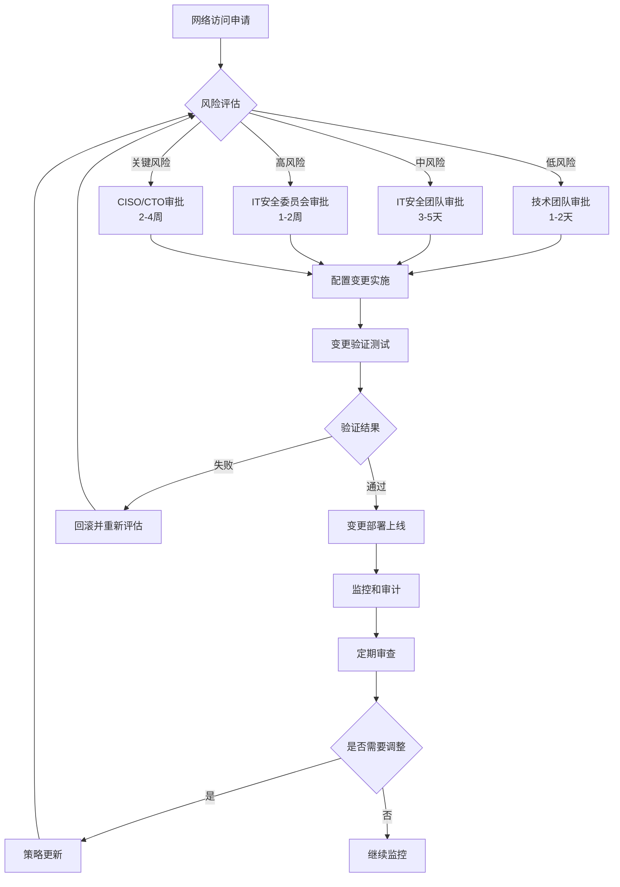
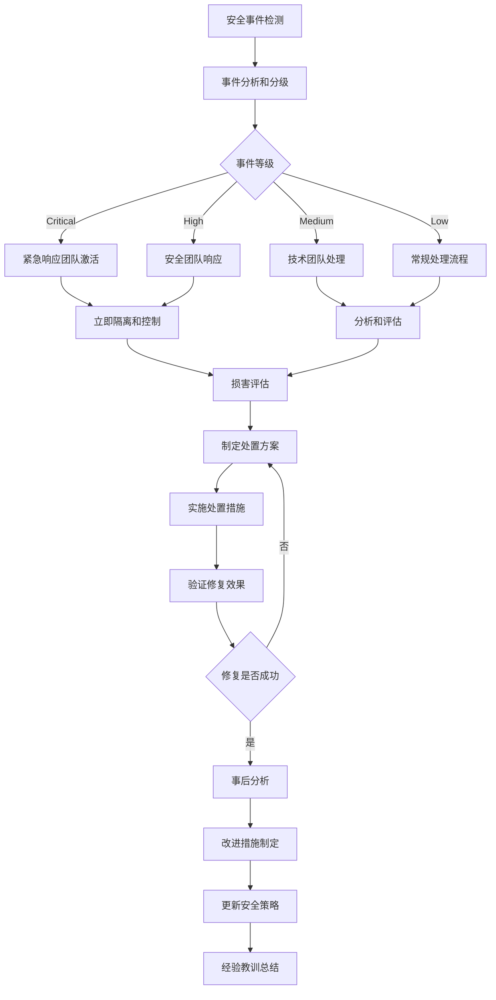

# FastGPT IT审批和控制机制设计框架

## 🎯 IT治理目标

基于企业"所有外网访问需要IT审批"的政策要求，本文档设计了完整的IT治理框架，建立了从申请、审批、实施到审计的全流程管控机制，确保FastGPT私有化部署中的所有网络访问都在IT部门的严格控制和监督之下。

## 📋 IT治理体系架构

### 治理层级结构

```typescript
interface ITGovernanceHierarchy {
  // 决策层
  executiveLevel: {
    ciso: "首席信息安全官 - 最终决策权",
    cto: "首席技术官 - 技术架构决策",
    itDirector: "IT总监 - 运营管理决策"
  },
  
  // 管理层  
  managementLevel: {
    securityTeam: "安全团队 - 安全策略制定和审核",
    infrastructureTeam: "基础设施团队 - 技术实施和维护",
    operationsTeam: "运维团队 - 日常运营和监控"
  },
  
  // 执行层
  executionLevel: {
    systemAdmins: "系统管理员 - 具体操作执行",
    networkAdmins: "网络管理员 - 网络配置实施", 
    securityAnalysts: "安全分析师 - 安全事件处理"
  }
}
```

### 权责分离矩阵

```yaml
# 权责分离配置
responsibility_matrix:
  # 网络访问申请
  network_access_request:
    requestor: "业务部门/项目团队"
    reviewer: "IT安全团队"
    approver: "IT总监/CISO"
    implementer: "网络管理员"
    auditor: "合规审计团队"
    
  # 服务部署变更
  service_deployment:
    requestor: "DevOps团队"
    reviewer: "基础设施团队"
    approver: "IT总监"
    implementer: "系统管理员"
    auditor: "技术审计团队"
    
  # 安全策略变更
  security_policy_change:
    requestor: "安全团队"
    reviewer: "法务/合规团队"
    approver: "CISO"
    implementer: "安全管理员"
    auditor: "内部审计部门"
```

## 🔄 IT审批流程设计

### 1. 分层审批工作流



### 2. 审批流程详细设计

#### 2.1 申请阶段

```typescript
interface NetworkAccessRequest {
  // 基本信息
  requestInfo: {
    requestId: string,
    requestor: string,
    department: string,
    requestDate: Date,
    urgency: "低" | "中" | "高" | "紧急"
  },
  
  // 技术信息
  technicalDetails: {
    serviceType: string,
    networkEndpoints: string[],
    ports: number[],
    protocols: string[],
    dataFlow: "入站" | "出站" | "双向",
    expectedTraffic: string
  },
  
  // 业务信息
  businessJustification: {
    purpose: string,
    businessImpact: string,
    alternatives: string,
    riskAssessment: string,
    complianceRequirements: string[]
  },
  
  // 安全信息
  securityDetails: {
    dataClassification: "公开" | "内部" | "敏感" | "机密",
    encryptionRequired: boolean,
    authenticationMethod: string,
    accessDuration: string,
    monitoringRequirements: string[]
  }
}
```

#### 2.2 审核阶段

```yaml
# 审核标准和检查清单
review_criteria:
  # 技术合规性检查
  technical_compliance:
    - name: "网络架构符合性"
      check: "是否符合企业网络架构标准"
      reviewer: "基础设施团队"
      
    - name: "安全配置验证"
      check: "安全配置是否满足企业安全基线"
      reviewer: "安全团队"
      
    - name: "性能影响评估"
      check: "对现有系统性能的潜在影响"
      reviewer: "性能工程团队"
      
  # 安全风险评估
  security_risk_assessment:
    - name: "数据泄露风险"
      evaluation: "评估数据出境和泄露可能性"
      score: "1-10分制"
      
    - name: "攻击面分析"
      evaluation: "新增网络访问带来的攻击面扩大"
      mitigation: "相应的缓解措施"
      
    - name: "合规影响评估"
      evaluation: "对相关法规和政策的符合性"
      documentation: "合规证明文档"
      
  # 业务价值评估
  business_value_assessment:
    - name: "业务必要性"
      evaluation: "业务功能的必要性和重要性"
      alternatives: "替代方案的可行性"
      
    - name: "成本效益分析"
      evaluation: "实施成本vs业务收益"
      roi: "投资回报分析"
```

#### 2.3 批准阶段

```typescript
interface ApprovalDecision {
  // 审批结果
  decision: "批准" | "有条件批准" | "拒绝" | "需要更多信息",
  
  // 批准条件
  conditions?: {
    timeLimit: string,           // 时间限制
    scopeRestriction: string[],  // 范围限制
    monitoringRequirement: string[], // 监控要求
    reviewSchedule: string       // 定期审查计划
  },
  
  // 实施要求
  implementationRequirements: {
    securityMeasures: string[],  // 必须的安全措施
    testingRequirements: string[], // 测试要求
    documentationRequirements: string[], // 文档要求
    rollbackPlan: string         // 回滚计划
  },
  
  // 审批记录
  approvalRecord: {
    approver: string,
    approvalDate: Date,
    approvalReason: string,
    riskAcceptance: string,
    nextReviewDate: Date
  }
}
```

## 🔒 访问控制机制设计

### 1. 多层访问控制模型

```typescript
interface MultiLayerAccessControl {
  // 网络层访问控制
  networkLayer: {
    firewallRules: "基于IP和端口的访问控制",
    vlanSegmentation: "网络分段隔离",
    intrustionPrevention: "入侵防护系统",
    trafficAnalysis: "网络流量深度分析"
  },
  
  // 应用层访问控制
  applicationLayer: {
    authentication: "多因素身份认证",
    authorization: "基于角色的权限控制",
    sessionManagement: "会话管理和超时控制",
    apiGateway: "API网关统一鉴权"
  },
  
  // 数据层访问控制
  dataLayer: {
    databaseAcl: "数据库访问控制列表",
    fieldLevelSecurity: "字段级别安全控制",
    dataEncryption: "数据加密存储",
    auditLogging: "数据访问审计日志"
  }
}
```

### 2. 访问权限管理

```yaml
# 权限管理配置
access_permission_management:
  # 用户角色定义
  user_roles:
    system_admin:
      permissions:
        - "system_configuration"
        - "user_management"
        - "audit_log_access"
      network_access:
        - "management_zone_full_access"
        - "all_zones_read_access"
        
    security_admin:
      permissions:
        - "security_policy_management"
        - "firewall_rule_management"
        - "security_monitoring"
      network_access:
        - "security_tools_access"
        - "monitoring_systems_access"
        
    application_admin:
      permissions:
        - "application_deployment"
        - "configuration_management"
        - "service_monitoring"
      network_access:
        - "application_zone_full_access"
        - "data_zone_read_access"
        
    end_user:
      permissions:
        - "application_usage"
        - "data_query"
      network_access:
        - "dmz_zone_access_only"
        
  # 权限生命周期管理
  permission_lifecycle:
    grant_process:
      - "业务申请"
      - "管理员审批"
      - "权限配置"
      - "确认测试"
      
    review_process:
      frequency: "季度"
      procedure:
        - "权限使用情况分析"
        - "业务需求变化评估"
        - "权限调整或回收"
        
    revoke_process:
      triggers:
        - "员工离职"
        - "角色变更"
        - "安全事件"
        - "合规要求"
```

### 3. 动态访问控制

```typescript
interface DynamicAccessControl {
  // 基于风险的访问控制
  riskBasedAccess: {
    userBehaviorAnalysis: "用户行为模式分析",
    anomalyDetection: "异常访问检测",
    riskScoring: "实时风险评分",
    adaptiveAuthentication: "自适应认证强度调整"
  },
  
  // 基于上下文的访问控制
  contextualAccess: {
    timeBasedAccess: "基于时间的访问控制",
    locationBasedAccess: "基于位置的访问限制",
    deviceBasedAccess: "基于设备的访问验证",
    networkContextAccess: "基于网络环境的访问控制"
  },
  
  // 零信任访问模型
  zeroTrustAccess: {
    neverTrust: "从不信任，总是验证",
    alwaysVerify: "每次访问都进行验证",
    minimumPrivilege: "最小权限原则",
    continuousMonitoring: "持续监控和验证"
  }
}
```

## 📊 监控和审计框架

### 1. 实时监控体系

```yaml
# 监控体系配置
monitoring_framework:
  # 网络监控
  network_monitoring:
    traffic_analysis:
      tools: ["Wireshark", "ntopng", "SolarWinds"]
      metrics:
        - "带宽使用率"
        - "连接数统计"
        - "协议分布"
        - "异常流量检测"
        
    security_monitoring:
      tools: ["Suricata", "Snort", "Security Onion"]
      alerts:
        - "入侵尝试检测"
        - "恶意软件通信"
        - "数据泄露检测"
        - "异常访问行为"
        
  # 应用监控
  application_monitoring:
    performance_monitoring:
      metrics:
        - "响应时间"
        - "并发用户数"
        - "错误率"
        - "资源利用率"
        
    security_monitoring:
      audit_events:
        - "用户登录/登出"
        - "权限变更"
        - "敏感操作"
        - "配置修改"
        
  # 基础设施监控
  infrastructure_monitoring:
    system_metrics:
      - "CPU使用率"
      - "内存使用率"
      - "磁盘空间"
      - "网络连接状态"
      
    service_health:
      - "服务可用性"
      - "数据库连接"
      - "AI服务状态"
      - "存储服务状态"
```

### 2. 审计日志管理

```typescript
interface AuditLogManagement {
  // 日志分类
  logCategories: {
    securityLogs: {
      authentication: "身份认证日志",
      authorization: "权限访问日志",
      networkAccess: "网络访问日志",
      securityEvents: "安全事件日志"
    },
    
    operationalLogs: {
      systemOperations: "系统操作日志",
      configurationChanges: "配置变更日志",
      serviceOperations: "服务操作日志",
      dataAccess: "数据访问日志"
    },
    
    businessLogs: {
      userActivities: "用户活动日志",
      businessTransactions: "业务交易日志",
      apiCalls: "API调用日志",
      workflowExecution: "工作流执行日志"
    }
  },
  
  // 日志处理流程
  logProcessing: {
    collection: "分布式日志收集",
    normalization: "日志格式标准化",
    correlation: "事件关联分析",
    alerting: "异常事件告警",
    retention: "日志保留和归档",
    reporting: "审计报告生成"
  }
}
```

### 3. 合规性审计

```yaml
# 合规性审计配置
compliance_audit:
  # 审计范围
  audit_scope:
    network_security:
      - "防火墙规则有效性"
      - "网络分段合规性"
      - "访问控制实施"
      - "加密通信验证"
      
    access_management:
      - "用户权限合规性"
      - "特权账户管理"
      - "访问审查记录"
      - "权限分离执行"
      
    data_protection:
      - "数据分类标识"
      - "敏感数据保护"
      - "数据备份验证"
      - "数据销毁记录"
      
  # 审计频率
  audit_frequency:
    continuous_monitoring: "实时监控"
    daily_reviews: "日常检查"
    weekly_assessments: "周度评估"
    monthly_reports: "月度报告"
    quarterly_audits: "季度审计"
    annual_assessments: "年度综合评估"
    
  # 审计报告
  audit_reporting:
    executive_dashboard: "管理层仪表板"
    compliance_reports: "合规性报告"
    risk_assessments: "风险评估报告"
    incident_reports: "安全事件报告"
```

## 🚨 事件响应和处置

### 1. 安全事件分级

```typescript
interface SecurityIncidentClassification {
  // 事件等级定义
  incidentLevels: {
    level1_critical: {
      description: "严重安全事件",
      examples: ["数据泄露", "系统入侵", "恶意软件感染"],
      responseTime: "15分钟内",
      escalation: "立即上报CISO",
      businessImpact: "重大业务影响"
    },
    
    level2_high: {
      description: "高风险安全事件", 
      examples: ["异常访问行为", "权限滥用", "服务异常"],
      responseTime: "1小时内",
      escalation: "上报IT安全团队",
      businessImpact: "显著业务影响"
    },
    
    level3_medium: {
      description: "中等风险事件",
      examples: ["配置错误", "性能异常", "日志异常"],
      responseTime: "4小时内", 
      escalation: "通知相关技术团队",
      businessImpact: "轻微业务影响"
    },
    
    level4_low: {
      description: "低风险事件",
      examples: ["信息收集", "扫描行为", "误操作"],
      responseTime: "24小时内",
      escalation: "记录跟踪",
      businessImpact: "无显著影响"
    }
  }
}
```

### 2. 事件响应流程



### 3. 应急响应预案

```yaml
# 应急响应预案
emergency_response_plan:
  # 响应团队组织
  response_team:
    incident_commander:
      role: "事件指挥官"
      responsibilities: ["整体协调", "决策制定", "外部沟通"]
      contact: "24/7待命"
      
    technical_lead:
      role: "技术负责人"
      responsibilities: ["技术分析", "修复实施", "系统恢复"]
      expertise: ["网络安全", "系统管理", "应用架构"]
      
    communication_lead:
      role: "沟通协调人"
      responsibilities: ["内部通报", "用户通知", "媒体应对"]
      skills: ["危机沟通", "公关处理"]
      
  # 响应程序
  response_procedures:
    detection_and_analysis:
      - "事件确认和初步分析"
      - "影响范围评估"
      - "事件分级和优先级确定"
      - "响应团队通知"
      
    containment_and_mitigation:
      - "威胁隔离和控制"
      - "系统保护措施实施"
      - "证据保全和收集"
      - "临时修复措施"
      
    eradication_and_recovery:
      - "威胁彻底清除"
      - "系统安全加固"
      - "服务逐步恢复"
      - "功能验证测试"
      
    post_incident_analysis:
      - "事件原因分析"
      - "响应效果评估"
      - "改进措施制定"
      - "预防措施更新"
      
  # 沟通机制
  communication_protocols:
    internal_communication:
      - "管理层通报"
      - "技术团队协调"
      - "业务部门通知"
      - "员工信息发布"
      
    external_communication:
      - "客户通知"
      - "监管机构报告"
      - "合作伙伴通知"
      - "媒体声明"
```

## 📈 持续改进机制

### 1. 效果评估体系

```typescript
interface ContinuousImprovement {
  // 关键绩效指标
  kpis: {
    securityMetrics: {
      incidentResponseTime: "平均事件响应时间",
      falsePositiveRate: "误报率",
      detectionAccuracy: "检测准确率",
      complianceScore: "合规性评分"
    },
    
    operationalMetrics: {
      systemAvailability: "系统可用性",
      networkPerformance: "网络性能",
      userSatisfaction: "用户满意度",
      costEffectiveness: "成本效益"
    }
  },
  
  // 改进驱动因素
  improvementDrivers: {
    threatLandscape: "威胁环境变化",
    technologyEvolution: "技术发展趋势",
    regulatoryChanges: "法规政策变化", 
    businessRequirements: "业务需求变化",
    lessonLearned: "经验教训总结"
  }
}
```

### 2. 定期审查机制

```yaml
# 定期审查配置
periodic_review:
  # 策略审查
  policy_review:
    frequency: "年度"
    scope:
      - "IT治理策略有效性"
      - "安全控制措施适用性"
      - "合规要求变化影响"
      - "业务需求对齐度"
    participants:
      - "IT管理团队"
      - "安全专家"
      - "业务代表"
      - "合规官员"
      
  # 流程审查
  process_review:
    frequency: "半年度"
    focus:
      - "审批流程效率"
      - "响应时间优化"
      - "用户体验改善"
      - "自动化程度提升"
    methodology:
      - "流程映射分析"
      - "瓶颈识别"
      - "最佳实践对比"
      - "改进建议制定"
      
  # 技术审查
  technical_review:
    frequency: "季度"
    areas:
      - "安全工具有效性"
      - "监控系统覆盖度"
      - "技术栈更新需求"
      - "性能优化机会"
    assessment:
      - "技术评估"
      - "成本效益分析"
      - "实施计划制定"
      - "资源需求评估"
```

## 🎯 实施路线图

### 阶段化实施计划

```typescript
interface ImplementationRoadmap {
  phase1_foundation: {
    duration: "4-6周",
    objectives: [
      "建立IT治理组织架构",
      "制定基础政策和流程",
      "部署基础监控工具",
      "培训关键人员"
    ],
    deliverables: [
      "IT治理章程",
      "审批流程文档",
      "监控仪表板",
      "培训完成证书"
    ]
  },
  
  phase2_deployment: {
    duration: "6-8周",
    objectives: [
      "实施访问控制机制",
      "部署审计日志系统", 
      "建立事件响应流程",
      "开展试点运行"
    ],
    deliverables: [
      "访问控制系统",
      "审计日志平台",
      "事件响应预案",
      "试点评估报告"
    ]
  },
  
  phase3_optimization: {
    duration: "4-6周",
    objectives: [
      "优化审批流程效率",
      "完善监控告警机制",
      "建立持续改进体系",
      "全面推广应用"
    ],
    deliverables: [
      "优化流程文档",
      "完整监控体系",
      "改进机制框架",
      "全面部署完成"
    ]
  }
}
```

---

*本IT审批和控制机制设计框架为FastGPT私有化部署提供了完整的治理体系，确保在满足业务需求的同时，严格控制网络访问风险，实现安全合规的运营目标。*