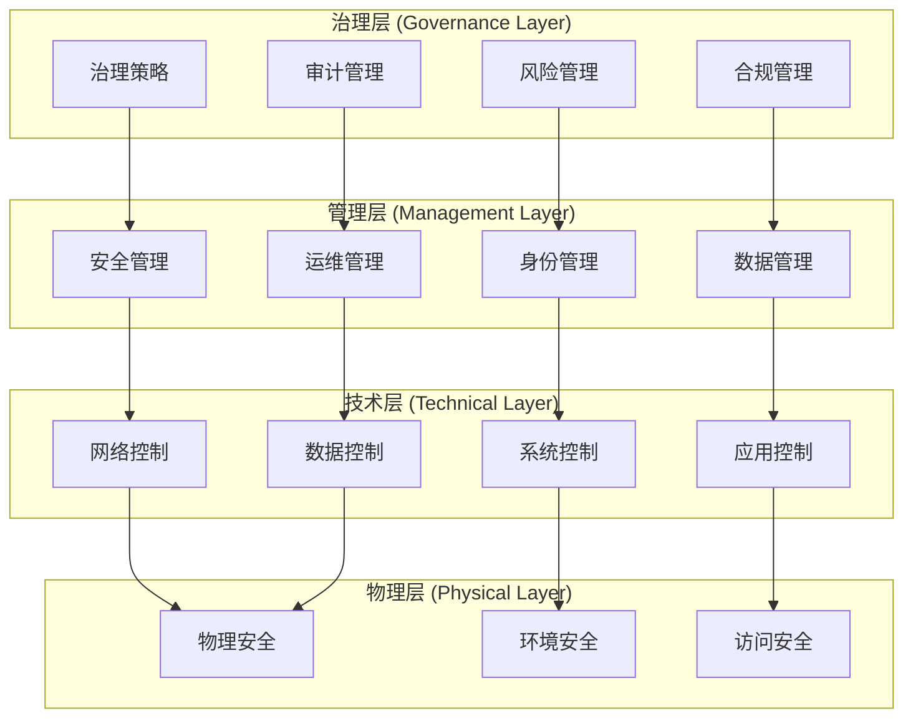
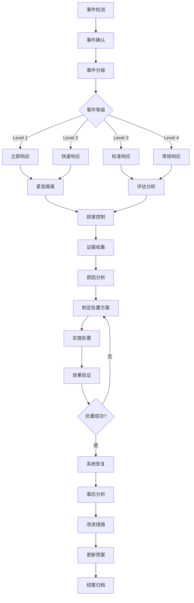

# FastGPT 安全合规框架

## 🎯 合规目标与范围

本安全合规框架确保FastGPT私有化部署满足企业安全政策、行业标准和法规要求，建立完整的安全治理体系，实现**可审计、可控制、可监督**的安全合规运营。

### 适用范围

```typescript
interface ComplianceScope {
  // 系统范围
  systemScope: {
    infrastructure: "网络基础设施、服务器、存储系统",
    applications: "FastGPT应用系统及相关组件",
    data: "业务数据、用户数据、系统配置数据",
    personnel: "系统管理员、运维人员、终端用户"
  },
  
  // 合规标准
  complianceStandards: {
    international: ["ISO 27001", "SOC 2", "NIST Cybersecurity Framework"],
    national: ["等保2.0", "数据安全法", "个人信息保护法"],
    industry: ["金融行业信息安全标准", "医疗数据保护标准"],
    enterprise: ["企业信息安全政策", "IT治理制度"]
  },
  
  // 风险等级
  riskLevels: {
    critical: "关键业务系统和核心数据",
    high: "重要系统组件和敏感数据", 
    medium: "一般业务系统和内部数据",
    low: "辅助系统和公开信息"
  }
}
```

## 🛡️ 安全控制框架

### 1. 分层安全控制模型



### 2. 安全控制矩阵

```yaml
# 安全控制分类和实施要求
security_controls:
  # AC - 访问控制 (Access Control)
  access_control:
    AC-1:
      control: "访问控制策略和程序"
      implementation: "mandatory"
      description: "建立和维护访问控制政策"
      
    AC-2:
      control: "账户管理"
      implementation: "mandatory"
      description: "用户账户生命周期管理"
      
    AC-3:
      control: "访问权限实施"
      implementation: "mandatory"
      description: "基于批准的授权实施访问控制"
      
    AC-4:
      control: "信息流控制"
      implementation: "mandatory"
      description: "控制系统内和系统间的信息流"
      
    AC-6:
      control: "最小权限原则"
      implementation: "mandatory"
      description: "仅提供执行任务所需的最小权限"
      
  # AU - 审计和问责 (Audit and Accountability)
  audit_accountability:
    AU-1:
      control: "审计和问责策略"
      implementation: "mandatory"
      description: "建立审计政策和程序"
      
    AU-2:
      control: "审计事件"
      implementation: "mandatory"
      description: "确定可审计事件"
      
    AU-3:
      control: "审计记录内容"
      implementation: "mandatory"
      description: "生成包含必要信息的审计记录"
      
    AU-6:
      control: "审计审查、分析和报告"
      implementation: "mandatory"
      description: "定期审查和分析审计记录"
      
    AU-9:
      control: "审计信息保护"
      implementation: "mandatory"
      description: "保护审计信息和审计工具"
      
  # CM - 配置管理 (Configuration Management)
  configuration_management:
    CM-1:
      control: "配置管理策略"
      implementation: "mandatory"
      description: "建立配置管理政策和程序"
      
    CM-2:
      control: "基线配置"
      implementation: "mandatory"
      description: "建立和维护系统基线配置"
      
    CM-3:
      control: "配置变更控制"
      implementation: "mandatory"
      description: "控制配置项的变更"
      
    CM-6:
      control: "配置设置"
      implementation: "mandatory"
      description: "建立和记录配置设置"
      
    CM-8:
      control: "信息系统组件清单"
      implementation: "mandatory"
      description: "维护系统组件的准确清单"
      
  # IA - 识别和认证 (Identification and Authentication)
  identification_authentication:
    IA-1:
      control: "识别和认证策略"
      implementation: "mandatory"
      description: "建立身份识别和认证政策"
      
    IA-2:
      control: "用户识别和认证"
      implementation: "mandatory"
      description: "唯一识别和认证系统用户"
      
    IA-4:
      control: "标识符管理"
      implementation: "mandatory"
      description: "管理系统标识符"
      
    IA-5:
      control: "认证器管理"
      implementation: "mandatory"
      description: "管理系统认证器"
      
    IA-8:
      control: "非组织用户的识别和认证"
      implementation: "mandatory"
      description: "唯一识别和认证非组织用户"
      
  # SC - 系统和通信保护 (System and Communications Protection)
  system_communications_protection:
    SC-1:
      control: "系统和通信保护策略"
      implementation: "mandatory"
      description: "建立系统通信保护政策"
      
    SC-7:
      control: "边界保护"
      implementation: "mandatory"
      description: "监控和控制系统外部边界通信"
      
    SC-8:
      control: "传输保密性和完整性"
      implementation: "mandatory"
      description: "保护传输信息的保密性和完整性"
      
    SC-13:
      control: "密码保护"
      implementation: "mandatory"
      description: "实施符合要求的密码机制"
      
    SC-20:
      control: "安全名称/地址解析服务"
      implementation: "mandatory"
      description: "提供安全的名称/地址解析服务"
```

## 📋 合规实施清单

### 1. ISO 27001合规要求

```yaml
# ISO 27001 信息安全管理体系要求
iso27001_requirements:
  # A.5 信息安全政策
  information_security_policies:
    A5.1.1:
      requirement: "信息安全政策集"
      implementation:
        - "制定FastGPT信息安全总体政策"
        - "制定各专项安全管理制度"
        - "建立政策审查和更新机制"
      status: "required"
      
    A5.1.2:
      requirement: "信息安全政策的评审"
      implementation:
        - "建立政策定期评审流程"
        - "设立政策评审委员会"
        - "记录政策变更历史"
      status: "required"
      
  # A.6 信息安全组织
  organization_information_security:
    A6.1.1:
      requirement: "信息安全角色和职责"
      implementation:
        - "定义信息安全角色职责矩阵"
        - "建立信息安全组织架构"
        - "明确安全责任分工"
      status: "required"
      
    A6.1.2:
      requirement: "职责分离"
      implementation:
        - "实施关键职责分离原则"
        - "建立双人操作机制"
        - "防止权限集中风险"
      status: "required"
      
  # A.7 人力资源安全
  human_resource_security:
    A7.1.1:
      requirement: "安全筛选"
      implementation:
        - "建立人员安全背景调查制度"
        - "实施人员安全培训"
        - "签署保密协议"
      status: "required"
      
    A7.2.2:
      requirement: "信息安全意识、教育和培训"
      implementation:
        - "制定安全意识培训计划"
        - "定期开展安全培训"
        - "建立培训效果评估机制"
      status: "required"
      
  # A.8 资产管理
  asset_management:
    A8.1.1:
      requirement: "资产责任"
      implementation:
        - "建立资产清单管理制度"
        - "指定资产责任人"
        - "实施资产分类分级"
      status: "required"
      
    A8.2.1:
      requirement: "信息分类"
      implementation:
        - "建立信息分类标准"
        - "实施信息标识机制"
        - "制定分类处理规程"
      status: "required"
```

### 2. 等保2.0合规要求

```yaml
# 等保2.0 网络安全等级保护要求
gb_t_22239_requirements:
  # 安全物理环境
  physical_security:
    requirement: "物理位置选择、物理访问控制、防盗窃和防破坏"
    controls:
      - "机房物理安全防护"
      - "环境监控系统"
      - "访问控制系统"
      - "视频监控系统"
    level: "三级"
    
  # 安全通信网络  
  network_security:
    requirement: "网络架构、通信传输、可信验证"
    controls:
      - "网络边界防护"
      - "访问控制策略"
      - "入侵检测系统"
      - "恶意代码防范"
    level: "三级"
    
  # 安全区域边界
  zone_boundary:
    requirement: "边界防护、访问控制、入侵防范"
    controls:
      - "防火墙配置管理"
      - "网络访问控制"
      - "安全审计系统"
      - "可信验证机制"
    level: "三级"
    
  # 安全计算环境
  computing_environment:
    requirement: "身份鉴别、访问控制、安全审计"
    controls:
      - "用户身份标识和鉴别"
      - "用户权限管理"
      - "安全标记"
      - "系统资源访问控制"
    level: "三级"
    
  # 安全管理中心
  management_center:
    requirement: "系统管理、审计管理、安全管理"
    controls:
      - "系统管理员身份鉴别"
      - "审计进程保护"
      - "集中管控"
      - "安全管理员"
    level: "三级"
```

### 3. 数据安全合规要求

```yaml
# 数据安全法合规要求
data_security_compliance:
  # 数据分类分级
  data_classification:
    requirement: "根据数据重要程度对数据进行分类分级保护"
    implementation:
      - classification_standards:
          - "机密数据：核心业务数据、用户敏感信息"
          - "敏感数据：业务数据、用户个人信息"
          - "内部数据：内部管理数据、系统配置"
          - "公开数据：可公开的产品信息"
      - protection_measures:
          - "机密数据：加密存储、访问控制、审计日志"
          - "敏感数据：访问控制、传输加密、定期备份"
          - "内部数据：基础访问控制、日志记录"
          - "公开数据：完整性保护"
    status: "mandatory"
    
  # 数据安全保护义务
  data_protection_obligations:
    requirement: "建立数据安全管理制度，采取相应安全技术措施"
    implementation:
      - policy_establishment:
          - "数据安全管理制度"
          - "数据处理操作规程"
          - "数据安全事件应急预案"
      - technical_measures:
          - "数据加密技术"
          - "访问控制机制"
          - "数据备份恢复"
          - "数据脱敏技术"
    status: "mandatory"
    
  # 重要数据保护
  important_data_protection:
    requirement: "重要数据的处理者应明确数据安全负责人和管理机构"
    implementation:
      - governance_structure:
          - "设立数据安全负责人"
          - "建立数据安全管理委员会"
          - "明确数据保护责任"
      - management_measures:
          - "定期安全风险评估"
          - "数据安全审计"
          - "安全事件报告"
    status: "mandatory"
```

## 🔍 风险评估框架

### 1. 风险识别矩阵

```typescript
interface RiskAssessmentMatrix {
  // 威胁类型
  threatTypes: {
    external: {
      cyberAttacks: "外部网络攻击",
      malware: "恶意软件感染",
      ddos: "分布式拒绝服务攻击",
      dataTheft: "数据窃取"
    },
    internal: {
      privilegeAbuse: "权限滥用",
      dataLeakage: "内部数据泄露",
      operationalError: "操作失误",
      systemFailure: "系统故障"
    },
    environmental: {
      naturalDisaster: "自然灾害",
      powerFailure: "电力故障",
      networkDisruption: "网络中断",
      facilityDamage: "设施损坏"
    }
  },
  
  // 脆弱性评估
  vulnerabilities: {
    technical: {
      softwareFlaws: "软件漏洞",
      configurationErrors: "配置错误",
      patchManagement: "补丁管理不当",
      weakEncryption: "加密强度不足"
    },
    organizational: {
      policyGaps: "政策缺失",
      trainingDeficiency: "培训不足",
      processWeakness: "流程缺陷",
      oversightLack: "监督不力"
    },
    physical: {
      accessControl: "物理访问控制薄弱",
      environmentalControl: "环境控制不足",
      equipmentSecurity: "设备安全防护不当"
    }
  },
  
  // 风险评估标准
  riskCriteria: {
    likelihood: {
      veryHigh: "90%-100%",
      high: "70%-89%", 
      medium: "30%-69%",
      low: "10%-29%",
      veryLow: "0%-9%"
    },
    impact: {
      catastrophic: "系统完全瘫痪，业务停止",
      major: "系统严重受损，业务严重影响",
      moderate: "系统部分受损，业务部分影响",
      minor: "系统轻微受损，业务轻微影响",
      negligible: "系统基本无损，业务基本无影响"
    }
  }
}
```

### 2. 风险评估流程

```yaml
# 风险评估实施流程
risk_assessment_process:
  # 阶段1：资产识别
  asset_identification:
    duration: "1周"
    activities:
      - "识别系统资产清单"
      - "确定资产价值等级"
      - "分析资产依赖关系"
      - "评估资产业务重要性"
    deliverables:
      - "资产清单"
      - "资产价值评估报告"
      
  # 阶段2：威胁识别
  threat_identification:
    duration: "1周"
    activities:
      - "分析外部威胁环境"
      - "识别内部威胁因素"
      - "评估环境威胁影响"
      - "建立威胁模型"
    deliverables:
      - "威胁分析报告"
      - "威胁模型"
      
  # 阶段3：脆弱性评估
  vulnerability_assessment:
    duration: "2周"
    activities:
      - "技术脆弱性扫描"
      - "管理脆弱性分析"
      - "物理脆弱性检查"
      - "人员脆弱性评估"
    deliverables:
      - "脆弱性评估报告"
      - "修复建议清单"
      
  # 阶段4：风险分析
  risk_analysis:
    duration: "1周"
    activities:
      - "风险场景构建"
      - "可能性评估"
      - "影响程度分析"
      - "风险等级计算"
    deliverables:
      - "风险分析报告"
      - "风险矩阵"
      
  # 阶段5：风险评价
  risk_evaluation:
    duration: "1周"
    activities:
      - "风险接受度评估"
      - "风险优先级排序"
      - "风险应对策略制定"
      - "残余风险评估"
    deliverables:
      - "风险评价报告"
      - "风险处置计划"
```

### 3. 风险处置策略

```yaml
# 风险处置策略矩阵
risk_treatment_strategies:
  # 高风险处置
  high_risk_treatment:
    strategy: "风险缓解 + 风险转移"
    measures:
      - "立即实施安全控制措施"
      - "购买网络安全保险"
      - "建立应急响应机制"
      - "加强监控和检测"
    timeline: "1个月内完成"
    
  # 中风险处置
  medium_risk_treatment:
    strategy: "风险缓解"
    measures:
      - "实施适当安全控制"
      - "定期风险监控"
      - "制定应对预案"
      - "提高安全意识"
    timeline: "3个月内完成"
    
  # 低风险处置
  low_risk_treatment:
    strategy: "风险接受 + 监控"
    measures:
      - "接受现有风险水平"
      - "定期监控变化"
      - "建立预警机制"
      - "制定应对准备"
    timeline: "持续监控"
```

## 📊 合规监控与审计

### 1. 合规监控体系

```yaml
# 合规监控配置
compliance_monitoring:
  # 实时监控指标
  realtime_metrics:
    access_control:
      - metric: "非授权访问尝试次数"
        threshold: ">5次/小时"
        alert_level: "high"
      - metric: "特权账户使用频率"
        threshold: "异常增长>50%"
        alert_level: "medium"
        
    network_security:
      - metric: "防火墙规则违规"
        threshold: ">0次"
        alert_level: "critical"
      - metric: "异常网络流量"
        threshold: ">基线的200%"
        alert_level: "high"
        
    data_protection:
      - metric: "数据泄露检测"
        threshold: ">0次"
        alert_level: "critical"
      - metric: "敏感数据访问异常"
        threshold: "超出正常模式"
        alert_level: "high"
        
  # 定期检查项目
  periodic_checks:
    daily_checks:
      - "系统安全状态检查"
      - "审计日志完整性验证"
      - "备份状态确认"
      - "安全事件回顾"
      
    weekly_checks:
      - "访问权限审查"
      - "安全配置验证"
      - "漏洞扫描结果分析"
      - "合规偏差识别"
      
    monthly_checks:
      - "风险评估更新"
      - "政策合规性审查"
      - "安全培训效果评估"
      - "第三方安全评估"
      
    quarterly_checks:
      - "全面合规审计"
      - "安全体系有效性评估"
      - "应急响应演练"
      - "管理层安全评审"
```

### 2. 审计计划与实施

```typescript
interface AuditPlan {
  // 内部审计
  internal_audit: {
    frequency: "quarterly",
    scope: [
      "访问控制有效性",
      "数据保护措施",
      "系统安全配置",
      "操作程序合规性"
    ],
    auditors: "内部审计团队",
    methodology: "基于风险的审计方法",
    reporting: "审计报告 + 整改计划"
  },
  
  // 外部审计
  external_audit: {
    frequency: "annually",
    scope: [
      "信息安全管理体系",
      "合规性验证",
      "安全控制有效性",
      "风险管理体系"
    ],
    auditors: "第三方审计机构",
    standards: ["ISO 27001", "等保2.0"],
    certification: "合规认证证书"
  },
  
  // 专项审计
  special_audit: {
    triggers: [
      "重大安全事件",
      "系统重大变更",
      "合规要求变化",
      "管理层要求"
    ],
    scope: "根据触发原因确定",
    timeline: "事件发生后30天内",
    reporting: "专项审计报告"
  }
}
```

### 3. 审计证据管理

```yaml
# 审计证据收集和管理
audit_evidence_management:
  # 证据类型
  evidence_types:
    policy_documents:
      - "安全政策文件"
      - "操作程序文档"
      - "培训记录"
      - "会议纪要"
      
    technical_evidence:
      - "系统配置快照"
      - "日志文件"
      - "扫描结果报告"
      - "监控数据"
      
    operational_evidence:
      - "操作记录"
      - "变更管理记录"
      - "事件处置记录"
      - "测试结果"
      
  # 证据保存要求
  retention_requirements:
    retention_period: "7年"
    storage_location: "安全存储系统"
    access_control: "仅授权审计人员访问"
    backup_strategy: "3-2-1备份原则"
    
  # 证据完整性保护
  integrity_protection:
    - "数字签名技术"
    - "哈希值验证"
    - "时间戳服务"
    - "访问日志记录"
```

## 🚨 事件响应与处置

### 1. 安全事件分类

```yaml
# 安全事件分类和响应等级
security_incident_classification:
  # 等级1：严重事件
  level_1_critical:
    definition: "对业务造成严重影响的安全事件"
    examples:
      - "大规模数据泄露"
      - "系统被完全入侵"
      - "关键服务完全中断"
      - "恶意软件大范围感染"
    response_time: "15分钟内"
    escalation: "立即上报CISO和高管"
    team: "全体应急响应团队"
    
  # 等级2：重要事件
  level_2_major:
    definition: "对业务造成重要影响的安全事件"
    examples:
      - "部分系统被入侵"
      - "敏感数据小规模泄露"
      - "重要服务部分中断"
      - "内部恶意行为"
    response_time: "1小时内"
    escalation: "上报IT安全经理"
    team: "核心应急响应团队"
    
  # 等级3：一般事件
  level_3_moderate:
    definition: "对业务造成一般影响的安全事件"
    examples:
      - "单一系统异常"
      - "非敏感数据泄露"
      - "非关键服务中断"
      - "安全策略违规"
    response_time: "4小时内"
    escalation: "通知安全团队"
    team: "值班安全人员"
    
  # 等级4：轻微事件
  level_4_minor:
    definition: "对业务造成轻微影响的安全事件"
    examples:
      - "安全告警"
      - "配置错误"
      - "用户操作异常"
      - "日志异常"
    response_time: "24小时内"
    escalation: "记录备案"
    team: "系统管理员"
```

### 2. 应急响应流程



### 3. 应急响应预案

```yaml
# 应急响应预案模板
emergency_response_plan:
  # 数据泄露事件响应
  data_breach_response:
    immediate_actions:
      - "立即隔离受影响系统"
      - "停止数据泄露源头"
      - "保护现场证据"
      - "通知应急响应团队"
      
    assessment_phase:
      - "评估泄露数据类型和规模"
      - "分析泄露原因和路径"
      - "确定影响范围"
      - "评估业务影响"
      
    containment_phase:
      - "修复安全漏洞"
      - "加强访问控制"
      - "更新安全配置"
      - "监控异常活动"
      
    recovery_phase:
      - "恢复系统正常运行"
      - "验证安全措施有效性"
      - "更新安全策略"
      - "加强监控覆盖"
      
    communication_plan:
      internal:
        - "通知管理层"
        - "通知相关业务部门"
        - "通知法务部门"
      external:
        - "通知监管机构（如需要）"
        - "通知受影响用户（如需要）"
        - "媒体沟通（如需要）"
        
  # 系统入侵事件响应
  system_intrusion_response:
    detection_indicators:
      - "异常网络流量"
      - "未授权访问尝试"
      - "系统性能异常"
      - "异常进程或服务"
      
    immediate_response:
      - "隔离受感染系统"
      - "收集内存和磁盘镜像"
      - "分析攻击路径"
      - "识别攻击者身份"
      
    eradication_steps:
      - "清除恶意代码"
      - "关闭攻击路径"
      - "修复系统漏洞"
      - "更新安全配置"
      
    recovery_verification:
      - "系统完整性检查"
      - "安全配置验证"
      - "功能测试"
      - "性能测试"
```

## 📈 持续改进机制

### 1. 合规成熟度评估

```typescript
interface ComplianceMaturityModel {
  // 成熟度等级
  maturityLevels: {
    level1_initial: {
      description: "合规活动是临时的、反应性的",
      characteristics: [
        "缺乏正式的合规流程",
        "依赖个人经验",
        "合规活动不一致",
        "缺乏文档化"
      ]
    },
    
    level2_managed: {
      description: "基本的合规流程已建立",
      characteristics: [
        "制定了基本政策",
        "建立了基础流程",
        "有专人负责合规",
        "开始文档化"
      ]
    },
    
    level3_defined: {
      description: "标准化的合规流程和程序",
      characteristics: [
        "完整的政策体系",
        "标准化流程",
        "定期培训",
        "持续监控"
      ]
    },
    
    level4_quantitatively_managed: {
      description: "量化管理的合规体系",
      characteristics: [
        "量化的合规指标",
        "数据驱动决策",
        "预测性分析",
        "风险量化管理"
      ]
    },
    
    level5_optimizing: {
      description: "持续优化的合规体系",
      characteristics: [
        "持续改进文化",
        "创新技术应用",
        "预防性控制",
        "最佳实践分享"
      ]
    }
  }
}
```

### 2. 关键绩效指标(KPI)

```yaml
# 合规KPI监控
compliance_kpis:
  # 安全控制有效性
  security_control_effectiveness:
    - metric: "安全事件检测率"
      target: ">95%"
      calculation: "检测到事件数 / 实际发生事件数"
      
    - metric: "平均事件响应时间"
      target: "<15分钟"
      calculation: "总响应时间 / 事件数量"
      
    - metric: "误报率"
      target: "<10%"
      calculation: "误报数量 / 总告警数量"
      
  # 合规覆盖度
  compliance_coverage:
    - metric: "控制措施实施率"
      target: "100%"
      calculation: "已实施控制数 / 要求控制总数"
      
    - metric: "政策覆盖率"
      target: "100%"
      calculation: "有政策覆盖的业务 / 总业务数"
      
    - metric: "审计发现整改率"
      target: ">98%"
      calculation: "已整改问题数 / 发现问题总数"
      
  # 培训有效性
  training_effectiveness:
    - metric: "安全培训完成率"
      target: "100%"
      calculation: "完成培训人数 / 应培训人数"
      
    - metric: "培训考试通过率"
      target: ">90%"
      calculation: "考试通过人数 / 参考人数"
      
    - metric: "安全意识提升度"
      target: ">20%"
      calculation: "培训后测试分数 - 培训前测试分数"
```

### 3. 改进建议实施

```yaml
# 持续改进实施流程
continuous_improvement:
  # 改进来源识别
  improvement_sources:
    - "内部审计发现"
    - "外部审计建议"
    - "安全事件教训"
    - "行业最佳实践"
    - "法规要求变化"
    - "技术发展趋势"
    
  # 改进评估标准
  improvement_evaluation:
    cost_benefit_analysis:
      - "实施成本评估"
      - "预期收益分析"
      - "风险降低程度"
      - "合规提升效果"
      
    feasibility_assessment:
      - "技术可行性"
      - "资源可获得性"
      - "时间周期合理性"
      - "组织接受度"
      
  # 改进实施管理
  implementation_management:
    planning_phase:
      - "制定详细实施计划"
      - "分配资源和责任"
      - "设定里程碑"
      - "建立监控机制"
      
    execution_phase:
      - "按计划执行改进"
      - "监控实施进度"
      - "处理实施问题"
      - "调整实施策略"
      
    evaluation_phase:
      - "评估改进效果"
      - "测量KPI变化"
      - "收集反馈意见"
      - "总结经验教训"
```

## 📋 合规文档管理

### 1. 文档体系架构

```yaml
# 合规文档分层管理
document_hierarchy:
  # 第一层：政策文件
  policy_level:
    - document_type: "信息安全总体政策"
      approval_authority: "CEO/董事会"
      review_cycle: "年度"
      
    - document_type: "数据保护政策"
      approval_authority: "CISO"
      review_cycle: "年度"
      
    - document_type: "访问控制政策"
      approval_authority: "CISO"
      review_cycle: "年度"
      
  # 第二层：标准规范
  standard_level:
    - document_type: "信息安全标准"
      approval_authority: "IT总监"
      review_cycle: "半年度"
      
    - document_type: "系统配置标准"
      approval_authority: "技术经理"
      review_cycle: "季度"
      
  # 第三层：程序指南
  procedure_level:
    - document_type: "事件响应程序"
      approval_authority: "安全经理"
      review_cycle: "季度"
      
    - document_type: "变更管理程序"
      approval_authority: "运维经理"
      review_cycle: "季度"
      
  # 第四层：操作手册
  guideline_level:
    - document_type: "系统操作手册"
      approval_authority: "技术主管"
      review_cycle: "月度"
      
    - document_type: "用户使用指南"
      approval_authority: "产品经理"
      review_cycle: "季度"
```

### 2. 文档版本控制

```typescript
interface DocumentVersionControl {
  // 版本编号规则
  versioningScheme: {
    format: "V[主版本].[次版本].[修订版本]",
    majorVersion: "重大修改，影响整体架构",
    minorVersion: "功能增加或重要修改",
    patchVersion: "错误修正或小幅调整"
  },
  
  // 变更管理流程
  changeManagement: {
    initiationPhase: [
      "提出变更申请",
      "变更影响评估",
      "变更批准决策"
    ],
    implementationPhase: [
      "文档修订",
      "内部审查",
      "正式发布"
    ],
    communicationPhase: [
      "变更通知",
      "培训更新",
      "执行确认"
    ]
  },
  
  // 文档生命周期
  lifecycle: {
    draft: "草稿状态，内部编辑",
    review: "审查状态，等待批准",
    approved: "已批准，正式生效",
    archived: "已归档，历史版本",
    obsolete: "已废止，不再使用"
  }
}
```

## 🎯 合规认证管理

### 1. 认证获取计划

```yaml
# 合规认证获取时间表
certification_roadmap:
  # ISO 27001 认证
  iso27001_certification:
    phase1_preparation:
      duration: "6个月"
      activities:
        - "建立ISMS体系"
        - "制定政策文件"
        - "实施安全控制"
        - "培训相关人员"
        
    phase2_implementation:
      duration: "6个月"
      activities:
        - "运行ISMS体系"
        - "收集运行证据"
        - "内部审计"
        - "管理评审"
        
    phase3_certification:
      duration: "3个月"
      activities:
        - "选择认证机构"
        - "第一阶段审核"
        - "第二阶段审核"
        - "获得认证证书"
        
  # 等保三级认证
  djbh_level3_certification:
    phase1_system_definition:
      duration: "2个月"
      activities:
        - "系统定级备案"
        - "安全建设整改"
        - "产品选型部署"
        - "系统调试优化"
        
    phase2_testing_evaluation:
      duration: "2个月"
      activities:
        - "委托测评机构"
        - "现场测评"
        - "问题整改"
        - "复测验收"
        
    phase3_supervision_inspection:
      duration: "1个月"
      activities:
        - "公安机关检查"
        - "问题整改"
        - "通过验收"
        - "获得证书"
```

### 2. 认证维护管理

```yaml
# 认证维护要求
certification_maintenance:
  # ISO 27001 维护
  iso27001_maintenance:
    surveillance_audit:
      frequency: "年度"
      scope: "ISMS体系有效性"
      requirements:
        - "持续改进证据"
        - "内部审计报告"
        - "管理评审记录"
        - "不符合项处理"
        
    recertification:
      frequency: "3年"
      scope: "完整体系重新评估"
      preparation:
        - "体系更新"
        - "文档整理"
        - "人员培训"
        - "模拟审核"
        
  # 等保维护
  djbh_maintenance:
    annual_testing:
      frequency: "年度"
      scope: "安全控制有效性"
      requirements:
        - "技术测试"
        - "管理检查"
        - "问题整改"
        - "报告提交"
        
    system_changes:
      triggers:
        - "系统重大变更"
        - "安全需求变化"
        - "法规标准更新"
      process:
        - "变更影响评估"
        - "重新定级备案"
        - "安全措施调整"
        - "重新测评"
```

---

*本安全合规框架为FastGPT私有化部署提供了全面的合规治理体系，确保系统在满足业务需求的同时，符合各项安全法规和标准要求，实现可持续的安全合规运营。*