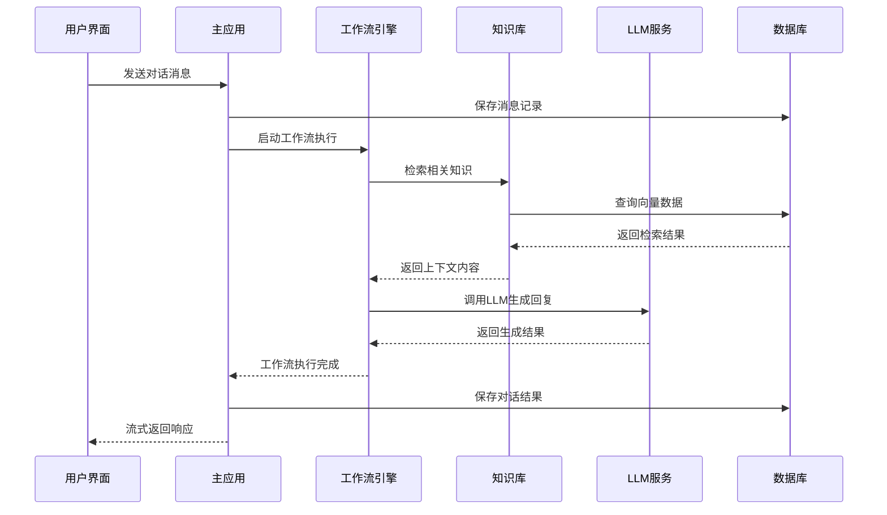
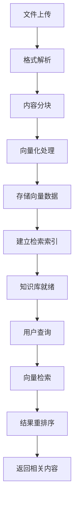

# FastGPT 整体架构分析

## 🏗️ 架构设计理念

FastGPT 采用**分层式微服务架构**，遵循现代云原生应用的设计原则，具备高可扩展性、高可维护性的特征。整体架构设计体现了以下核心理念：

### 设计原则
- **关注点分离** - 业务逻辑、数据访问、用户界面严格分层
- **模块化解耦** - 各功能模块独立开发、测试、部署
- **数据驱动** - 以工作流和知识库为核心的数据建模
- **API优先** - 前后端分离，完整的 REST API 体系
- **云原生就绪** - 容器化、微服务、可水平扩展

## 🏛️ 整体架构图

```
┌─────────────────────────────────────────────────────────────────┐
│                         前端层 (Frontend Layer)                   │
├─────────────────────────────────────────────────────────────────┤
│  Next.js App (projects/app/)                                    │
│  ├── 用户界面 (React + Chakra UI)                                │
│  ├── 工作流编辑器 (React Flow)                                    │
│  ├── 实时聊天 (WebSocket + SSE)                                  │
│  └── 状态管理 (React Query + Zustand)                            │
└─────────────────────────────────────────────────────────────────┘
                                  ↕ HTTP/WebSocket
┌─────────────────────────────────────────────────────────────────┐
│                        服务层 (Service Layer)                     │
├─────────────────────────────────────────────────────────────────┤
│  核心服务 (packages/service/)                                    │
│  ├── AI 服务管理                                                 │
│  ├── 工作流引擎                                                  │
│  ├── 知识库检索                                                  │
│  ├── 用户权限管理                                                │
│  └── 任务队列处理                                                │
├─────────────────────────────────────────────────────────────────┤
│  辅助服务                                                         │
│  ├── MCP Server (projects/mcp_server/) - 工具协议服务             │
│  ├── Sandbox (projects/sandbox/) - 代码执行沙箱                  │
│  └── 插件服务 (plugins/) - 扩展功能                              │
└─────────────────────────────────────────────────────────────────┘
                                  ↕ Database/Queue
┌─────────────────────────────────────────────────────────────────┐
│                        数据层 (Data Layer)                       │
├─────────────────────────────────────────────────────────────────┤
│  数据存储                                                         │
│  ├── MongoDB - 业务数据 (用户、应用、对话等)                      │
│  ├── PostgreSQL+pgvector - 向量数据 (知识库嵌入)                 │
│  ├── Milvus - 高性能向量检索 (可选)                              │
│  └── Redis - 缓存和会话 (任务队列、实时数据)                      │
├─────────────────────────────────────────────────────────────────┤
│  外部集成                                                         │
│  ├── LLM 提供商 (OpenAI, Claude, 国产模型等)                     │
│  ├── 向量化模型 (Embedding APIs)                                  │
│  └── 第三方服务 (语音、文件处理等)                               │
└─────────────────────────────────────────────────────────────────┘
```

## 🧩 架构分层详解

### 1. 前端表现层 (Presentation Layer)

**技术栈**: Next.js 14 + TypeScript + Chakra UI + React Flow

**核心职责**:
- **工作流可视化编辑器** - 基于 React Flow 的拖拽式节点编排
- **实时聊天界面** - WebSocket 和 SSE 双向通信
- **知识库管理界面** - 文件上传、数据预览、检索测试
- **用户权限管理** - 团队协作、角色管理、资源授权

**架构特点**:
- **SSR + CSR 混合渲染** - 首屏服务端渲染，交互客户端渲染
- **模块化组件设计** - 可复用的 UI 组件库 (packages/web/)
- **状态管理分层** - React Query (服务端状态) + Zustand (客户端状态)
- **国际化支持** - i18next 多语言方案

### 2. 业务服务层 (Business Service Layer)

**技术栈**: Node.js + MongoDB + BullMQ + OpenAI SDK

**核心模块**:

#### 🤖 AI 服务管理 (packages/service/core/ai/)
- **多模型适配器** - 统一的 LLM 调用接口
- **流式响应处理** - Server-Sent Events 实现
- **音频处理** - 语音转文字、文字转语音
- **重排序服务** - 检索结果优化

#### 🔄 工作流引擎 (packages/service/core/workflow/) 
- **节点执行器** - 各类工作流节点的具体实现
- **上下文管理** - 节点间数据传递和状态维护
- **错误处理** - 工作流异常捕获和回滚机制
- **调试支持** - 执行日志记录和断点调试

#### 📚 知识库系统 (packages/service/core/dataset/)
- **数据预处理** - 文档解析、分块、清洗
- **向量化流程** - 嵌入模型调用和向量存储
- **混合检索** - BM25 + 向量检索 + 重排序
- **增量更新** - 数据变更的增量处理

#### 💬 对话管理 (packages/service/core/chat/)
- **多轮对话** - 上下文维护和历史管理
- **流式响应** - 实时消息推送
- **插件调用** - 工具和函数调用机制
- **内容审核** - 输入输出内容过滤

### 3. 数据持久化层 (Data Persistence Layer)

**混合数据库策略**:

#### MongoDB (主数据库)
```
核心业务数据:
├── users - 用户账户信息
├── teams - 团队和组织数据
├── apps - 应用配置和工作流定义
├── chats - 对话历史记录
├── datasets - 知识库元数据
└── plugins - 插件配置信息
```

#### PostgreSQL + pgvector (向量数据库)
```
向量检索数据:
├── dataset_data - 知识库向量数据
├── embeddings - 文档块嵌入向量
└── search_indexes - 检索索引优化
```

#### Redis (缓存和队列)
```
临时数据:
├── sessions - 用户会话管理
├── cache - 查询结果缓存
├── queues - 任务队列数据
└── real-time - 实时通信数据
```

## 🔄 数据流向分析

### 典型用户交互流程



### 知识库处理流程



## 🌐 微服务架构设计

### 服务拆分策略

#### 主应用服务 (projects/app/)
- **用户管理** - 认证、授权、团队管理
- **应用编排** - 工作流设计和管理
- **对话服务** - 实时聊天和历史管理
- **知识库管理** - 数据上传和配置

#### MCP 协议服务 (projects/mcp_server/)
- **工具调用** - Model Context Protocol 实现
- **插件管理** - 第三方工具集成
- **协议适配** - 标准化工具接口

#### 代码沙箱服务 (projects/sandbox/)
- **代码执行** - 安全的代码运行环境
- **环境隔离** - 防护恶意代码执行
- **结果返回** - 执行结果标准化输出

### 服务间通信

#### 同步通信
- **HTTP API** - RESTful 接口调用
- **GraphQL** - 复杂查询场景 (计划中)

#### 异步通信  
- **消息队列** - BullMQ 任务分发
- **事件总线** - 领域事件发布订阅
- **WebSocket** - 实时数据推送

## 🔧 架构优势与挑战

### 架构优势

1. **高可扩展性**
   - 微服务架构支持独立扩容
   - 数据库分片和读写分离就绪
   - CDN 和缓存策略完善

2. **高可维护性**
   - 模块化设计降低耦合度
   - TypeScript 提供类型安全
   - 完整的测试覆盖体系

3. **高性能**
   - 向量数据库优化检索速度
   - 流式响应降低延迟感知
   - 多层缓存策略

4. **企业级特性**
   - 完整的权限管理体系
   - 多租户数据隔离
   - 审计日志和合规支持

### 面临挑战

1. **复杂度管理**
   - 微服务间依赖关系复杂
   - 分布式事务处理挑战
   - 调试和故障排查难度增加

2. **性能优化**  
   - 大规模向量检索性能
   - 实时通信连接数限制
   - 多模型调用的延迟控制

3. **运维成本**
   - 多服务部署和监控
   - 数据一致性保障
   - 版本升级协调复杂度

## 🚀 架构演进方向

### 短期优化 (3-6个月)
- [ ] 引入 API Gateway 统一入口
- [ ] 完善分布式链路追踪
- [ ] 优化数据库查询性能
- [ ] 增强错误处理和重试机制

### 中期规划 (6-12个月)  
- [ ] 引入服务网格 (Service Mesh)
- [ ] 实现动态配置管理
- [ ] 构建完整的可观测性体系
- [ ] 支持多区域部署

### 长期愿景 (1-2年)
- [ ] 云原生全面改造
- [ ] 智能化运维和自愈能力
- [ ] 边缘计算支持
- [ ] 无服务器架构探索

---

这个架构设计充分体现了现代企业级应用的最佳实践，既保证了功能的完整性，又具备了良好的扩展性和维护性，为 FastGPT 的持续发展奠定了坚实的技术基础。